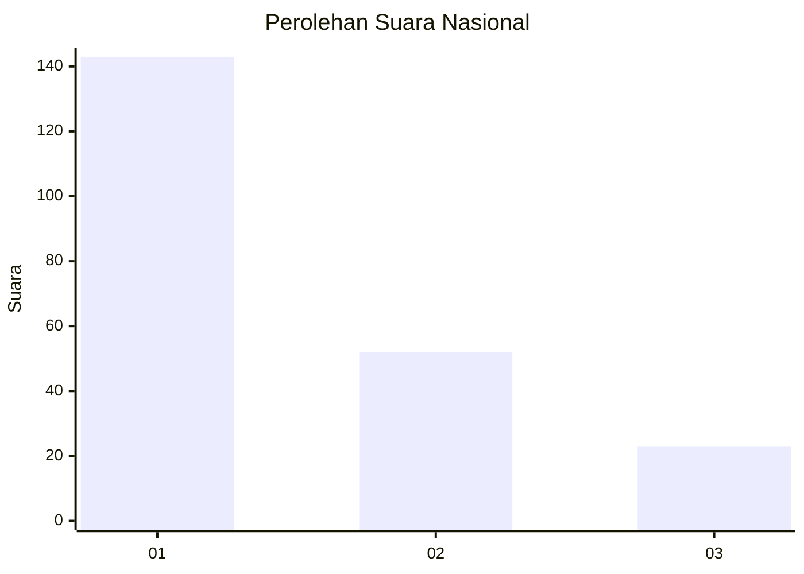
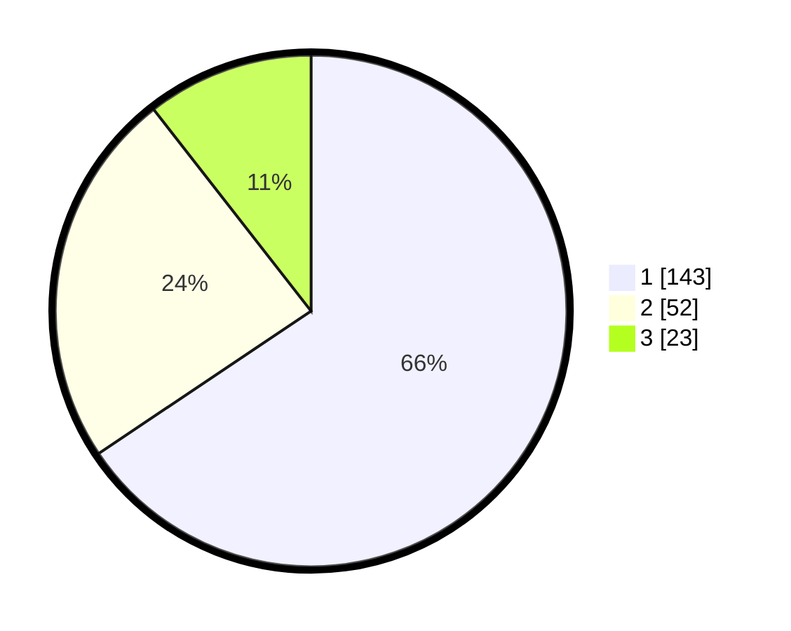

# Hasil

## Grafik

## Tabel

| No.    | Nama Paslon    | Suara | Suara (raw) | Persentase |
|:------ |:-------------- | -----:| -----------:| ----------:|
| 100025 | ANIES MUHAIMIN | 143   | [143][p-1]  | 65,60      |
| 100026 | PRABOWO GIBRAN | 52    | [52][p-2]   | 23,85      |
| 100027 | GANJAR MAHFUD  | 23    | [23][p-3]   | 10,55      |

[p-1]: https://github.com/gigit-pemilu/pemilu-2024/blob/main/pilpres/hitung-suara/sub/31-dki-jakarta/sub/75-jakarta-timur/sub/03-jatinegara/sub/1002-bidara-cina/sub/020-tps/sub/paslon-1.txt
[p-2]: https://github.com/gigit-pemilu/pemilu-2024/blob/main/pilpres/hitung-suara/sub/31-dki-jakarta/sub/75-jakarta-timur/sub/03-jatinegara/sub/1002-bidara-cina/sub/020-tps/sub/paslon-2.txt
[p-3]: https://github.com/gigit-pemilu/pemilu-2024/blob/main/pilpres/hitung-suara/sub/31-dki-jakarta/sub/75-jakarta-timur/sub/03-jatinegara/sub/1002-bidara-cina/sub/020-tps/sub/paslon-3.txt

## Foto C Plano

https://sirekap-obj-formc.kpu.go.id/314c/pemilu/ppwp/31/75/03/10/02/3175031002020-20240214-230545--5a5cb2ae-9f3b-44bb-aca6-703bd1d679c4.jpg

https://sirekap-obj-formc.kpu.go.id/314c/pemilu/ppwp/31/75/03/10/02/3175031002020-20240214-230810--ae7f6f7c-2f30-4b30-94c3-cea2af651b50.jpg

https://sirekap-obj-formc.kpu.go.id/314c/pemilu/ppwp/31/75/03/10/02/3175031002020-20240214-230955--07262c02-cfbb-4f6d-91e7-2a5f6ddd9681.jpg

## Metadata

| Key        | Value               |
| ---------- | ------------------- |
| Time Stamp | 2024-02-16 00:30:27 |

