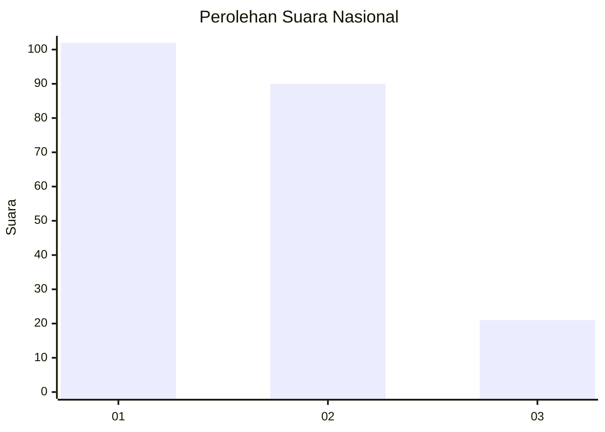
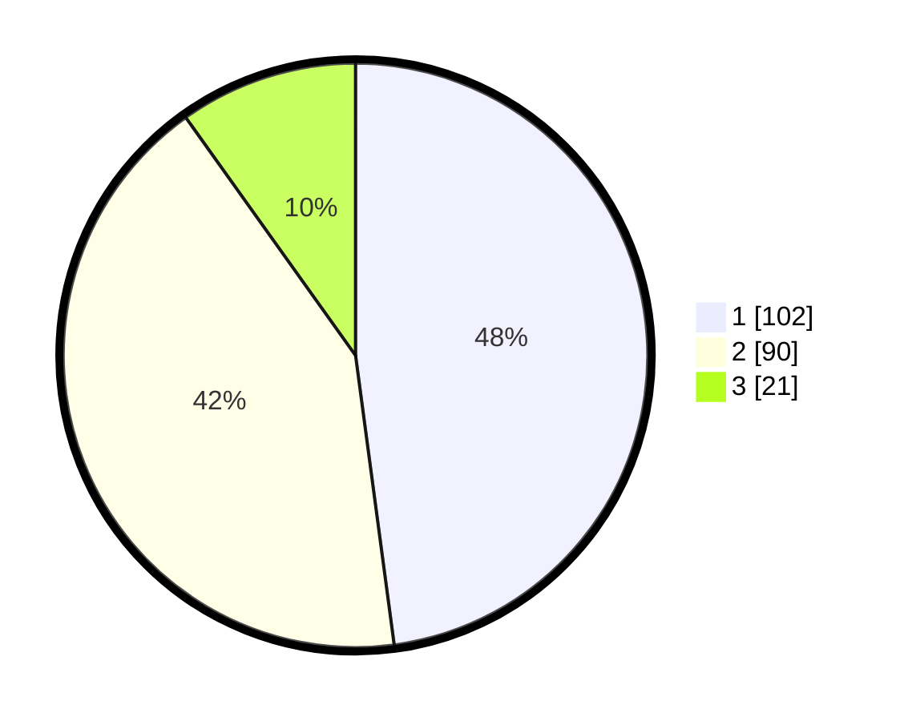

# Hasil

## Grafik

## Tabel

| No.    | Nama Paslon    | Suara | Suara (raw) | Persentase |
|:------ |:-------------- | -----:| -----------:| ----------:|
| 100025 | ANIES MUHAIMIN | 102   | [102][p-1]  | 47,89      |
| 100026 | PRABOWO GIBRAN | 90    | [90][p-2]   | 42,25      |
| 100027 | GANJAR MAHFUD  | 21    | [21][p-3]   | 9,86       |

[p-1]: https://github.com/gigit-pemilu/pemilu-2024/blob/main/pilpres/hitung-suara/sub/31-dki-jakarta/sub/75-jakarta-timur/sub/03-jatinegara/sub/1002-bidara-cina/sub/023-tps/sub/paslon-1.txt
[p-2]: https://github.com/gigit-pemilu/pemilu-2024/blob/main/pilpres/hitung-suara/sub/31-dki-jakarta/sub/75-jakarta-timur/sub/03-jatinegara/sub/1002-bidara-cina/sub/023-tps/sub/paslon-2.txt
[p-3]: https://github.com/gigit-pemilu/pemilu-2024/blob/main/pilpres/hitung-suara/sub/31-dki-jakarta/sub/75-jakarta-timur/sub/03-jatinegara/sub/1002-bidara-cina/sub/023-tps/sub/paslon-3.txt

## Foto C Plano

https://sirekap-obj-formc.kpu.go.id/7afa/pemilu/ppwp/31/75/03/10/02/3175031002023-20240214-200023--580a225f-065f-4a0f-af68-72e9ffdfb90d.jpg

https://sirekap-obj-formc.kpu.go.id/7afa/pemilu/ppwp/31/75/03/10/02/3175031002023-20240214-200108--f4180b7f-2ac6-49b3-9491-a2b4779c3231.jpg

https://sirekap-obj-formc.kpu.go.id/7afa/pemilu/ppwp/31/75/03/10/02/3175031002023-20240214-201300--62d9a406-e27a-4ad4-a9fa-ba42a1ea46e3.jpg

## Metadata

| Key        | Value               |
| ---------- | ------------------- |
| Time Stamp | 2024-02-15 22:40:13 |

