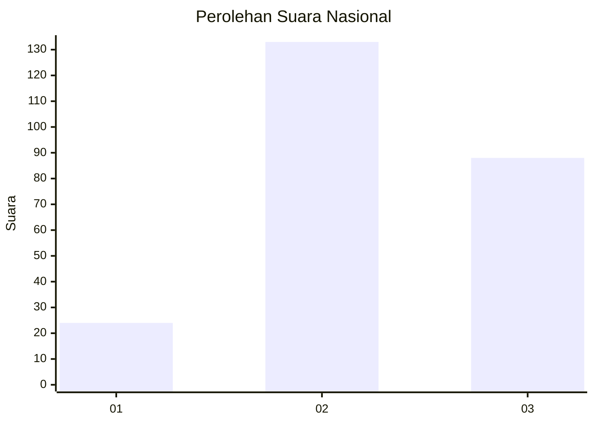
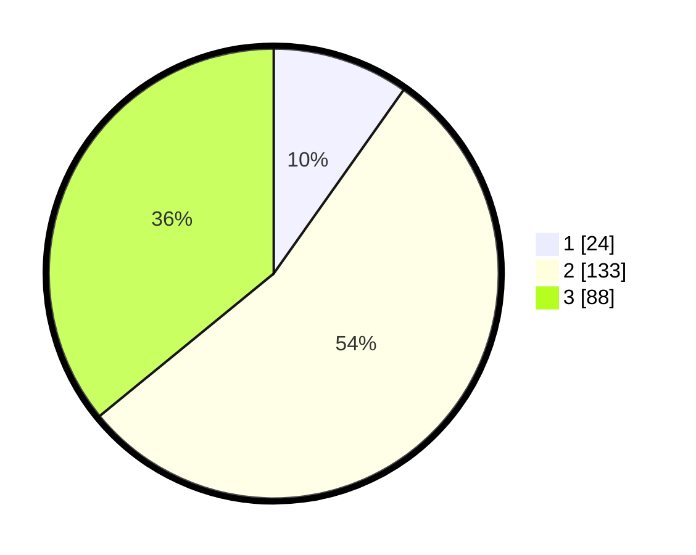

# Hasil

## Grafik

## Tabel

| No.    | Nama Paslon    | Suara | Suara (raw) | Persentase |
|:------ |:-------------- | -----:| -----------:| ----------:|
| 100025 | ANIES MUHAIMIN | 24    | [24][p-1]   | 9,80       |
| 100026 | PRABOWO GIBRAN | 133   | [133][p-2]  | 54,29      |
| 100027 | GANJAR MAHFUD  | 88    | [88][p-3]   | 35,92      |

[p-1]: https://github.com/gigit-pemilu/pemilu-2024/blob/main/pilpres/hitung-suara/sub/31-dki-jakarta/sub/75-jakarta-timur/sub/03-jatinegara/sub/1002-bidara-cina/sub/042-tps/sub/paslon-1.txt
[p-2]: https://github.com/gigit-pemilu/pemilu-2024/blob/main/pilpres/hitung-suara/sub/31-dki-jakarta/sub/75-jakarta-timur/sub/03-jatinegara/sub/1002-bidara-cina/sub/042-tps/sub/paslon-2.txt
[p-3]: https://github.com/gigit-pemilu/pemilu-2024/blob/main/pilpres/hitung-suara/sub/31-dki-jakarta/sub/75-jakarta-timur/sub/03-jatinegara/sub/1002-bidara-cina/sub/042-tps/sub/paslon-3.txt

## Foto C Plano

https://sirekap-obj-formc.kpu.go.id/2fbc/pemilu/ppwp/31/75/03/10/02/3175031002042-20240214-220757--1404f5f3-771b-4cf6-a300-c340b7bcb0bb.jpg

https://sirekap-obj-formc.kpu.go.id/2fbc/pemilu/ppwp/31/75/03/10/02/3175031002042-20240214-220836--71007a6d-ed9c-4dde-a400-3ff888a608fd.jpg

https://sirekap-obj-formc.kpu.go.id/2fbc/pemilu/ppwp/31/75/03/10/02/3175031002042-20240214-221000--f9a45549-06a8-4b08-a2a0-f33eb33b29fb.jpg

## Metadata

| Key        | Value               |
| ---------- | ------------------- |
| Time Stamp | 2024-02-15 22:40:13 |

