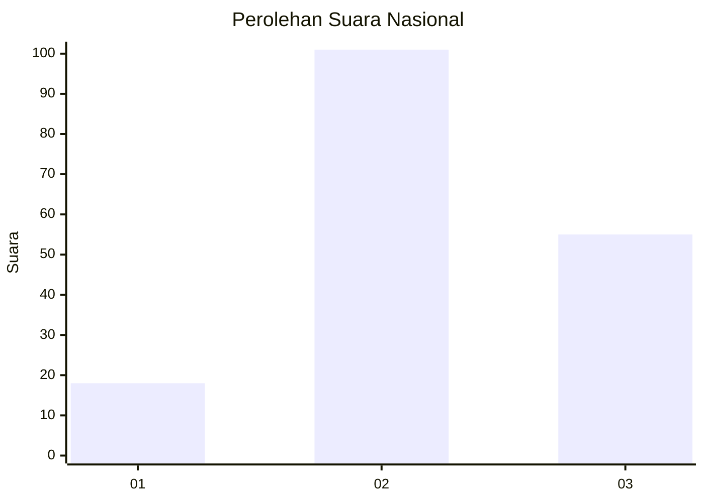
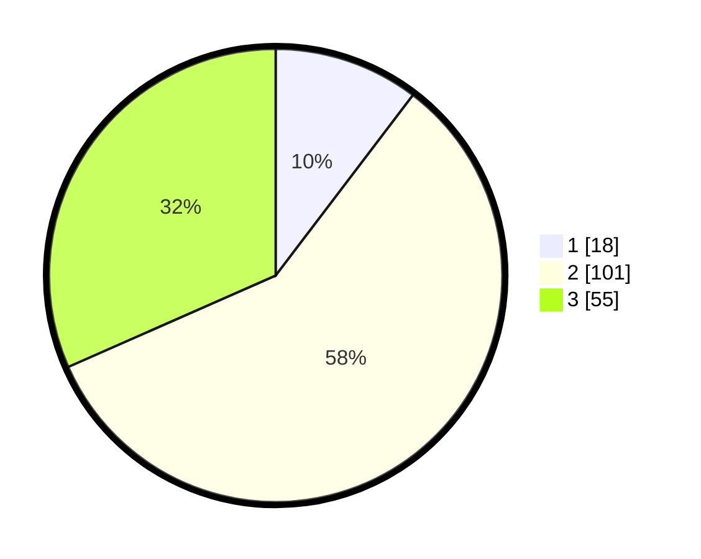

# Hasil

## Grafik

## Tabel

| No.    | Nama Paslon    | Suara | Suara (raw) | Persentase |
|:------ |:-------------- | -----:| -----------:| ----------:|
| 100025 | ANIES MUHAIMIN | 18    | [18][p-1]   | 10,34      |
| 100026 | PRABOWO GIBRAN | 101   | [101][p-2]  | 58,05      |
| 100027 | GANJAR MAHFUD  | 55    | [55][p-3]   | 31,61      |

[p-1]: https://github.com/gigit-pemilu/pemilu-2024/blob/main/pilpres/hitung-suara/sub/31-dki-jakarta/sub/75-jakarta-timur/sub/03-jatinegara/sub/1002-bidara-cina/sub/048-tps/sub/paslon-1.txt
[p-2]: https://github.com/gigit-pemilu/pemilu-2024/blob/main/pilpres/hitung-suara/sub/31-dki-jakarta/sub/75-jakarta-timur/sub/03-jatinegara/sub/1002-bidara-cina/sub/048-tps/sub/paslon-2.txt
[p-3]: https://github.com/gigit-pemilu/pemilu-2024/blob/main/pilpres/hitung-suara/sub/31-dki-jakarta/sub/75-jakarta-timur/sub/03-jatinegara/sub/1002-bidara-cina/sub/048-tps/sub/paslon-3.txt

## Foto C Plano

https://sirekap-obj-formc.kpu.go.id/4010/pemilu/ppwp/31/75/03/10/02/3175031002048-20240214-231909--386a2c1a-aa66-40a5-a5cb-065b850fbaf6.jpg

https://sirekap-obj-formc.kpu.go.id/4010/pemilu/ppwp/31/75/03/10/02/3175031002048-20240214-233709--a02be667-a517-403e-a96d-6055aeb2b1c3.jpg

https://sirekap-obj-formc.kpu.go.id/4010/pemilu/ppwp/31/75/03/10/02/3175031002048-20240214-232957--7d7b796c-1ab3-4fce-aead-2fd3ed1194e9.jpg

## Metadata

| Key        | Value               |
| ---------- | ------------------- |
| Time Stamp | 2024-02-15 23:29:50 |

