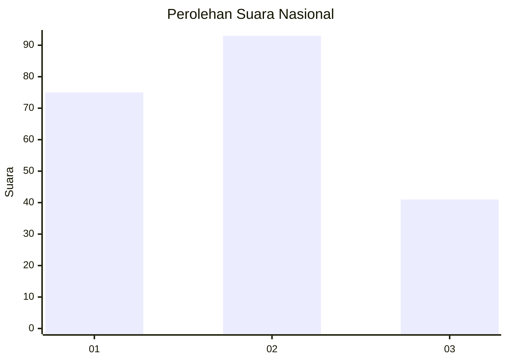
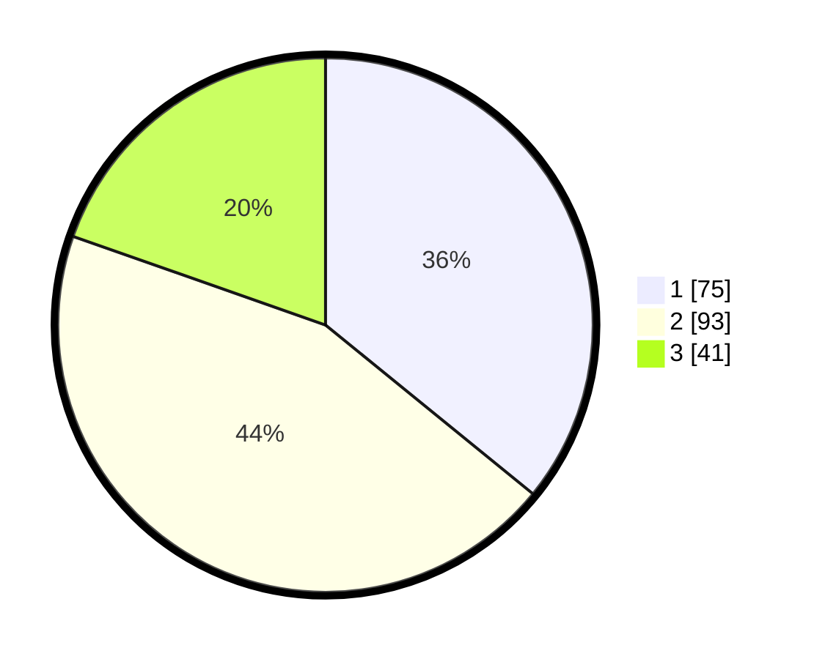

# Hasil

## Grafik

## Tabel

| No.    | Nama Paslon    | Suara | Suara (raw) | Persentase |
|:------ |:-------------- | -----:| -----------:| ----------:|
| 100025 | ANIES MUHAIMIN | 75    | [75][p-1]   | 35,89      |
| 100026 | PRABOWO GIBRAN | 93    | [93][p-2]   | 44,50      |
| 100027 | GANJAR MAHFUD  | 41    | [41][p-3]   | 19,62      |

[p-1]: https://github.com/gigit-pemilu/pemilu-2024/blob/main/pilpres/hitung-suara/sub/31-dki-jakarta/sub/75-jakarta-timur/sub/03-jatinegara/sub/1002-bidara-cina/sub/052-tps/sub/paslon-1.txt
[p-2]: https://github.com/gigit-pemilu/pemilu-2024/blob/main/pilpres/hitung-suara/sub/31-dki-jakarta/sub/75-jakarta-timur/sub/03-jatinegara/sub/1002-bidara-cina/sub/052-tps/sub/paslon-2.txt
[p-3]: https://github.com/gigit-pemilu/pemilu-2024/blob/main/pilpres/hitung-suara/sub/31-dki-jakarta/sub/75-jakarta-timur/sub/03-jatinegara/sub/1002-bidara-cina/sub/052-tps/sub/paslon-3.txt

## Foto C Plano

https://sirekap-obj-formc.kpu.go.id/4ea0/pemilu/ppwp/31/75/03/10/02/3175031002052-20240214-231113--2b11962d-b4fc-4014-88c5-86f34b1f40fd.jpg

https://sirekap-obj-formc.kpu.go.id/4ea0/pemilu/ppwp/31/75/03/10/02/3175031002052-20240214-231132--b0d4f48a-24bd-42f1-a121-e581542e898a.jpg

https://sirekap-obj-formc.kpu.go.id/4ea0/pemilu/ppwp/31/75/03/10/02/3175031002052-20240214-231152--a4e88966-733a-4fee-bc1b-0fca6461a2c6.jpg

## Metadata

| Key        | Value               |
| ---------- | ------------------- |
| Time Stamp | 2024-02-16 16:25:10 |

