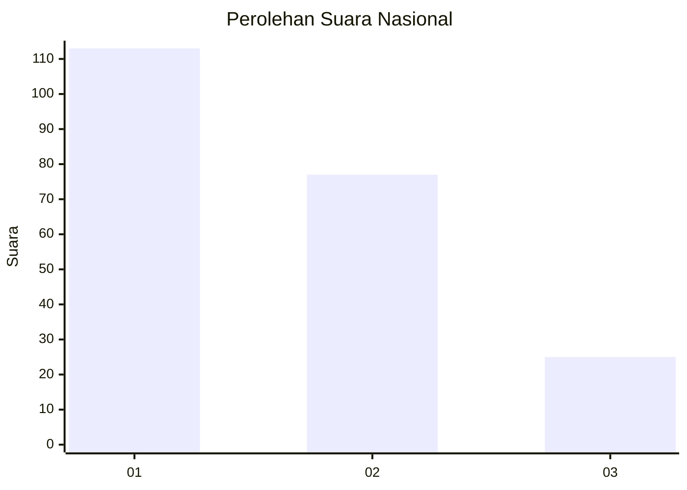
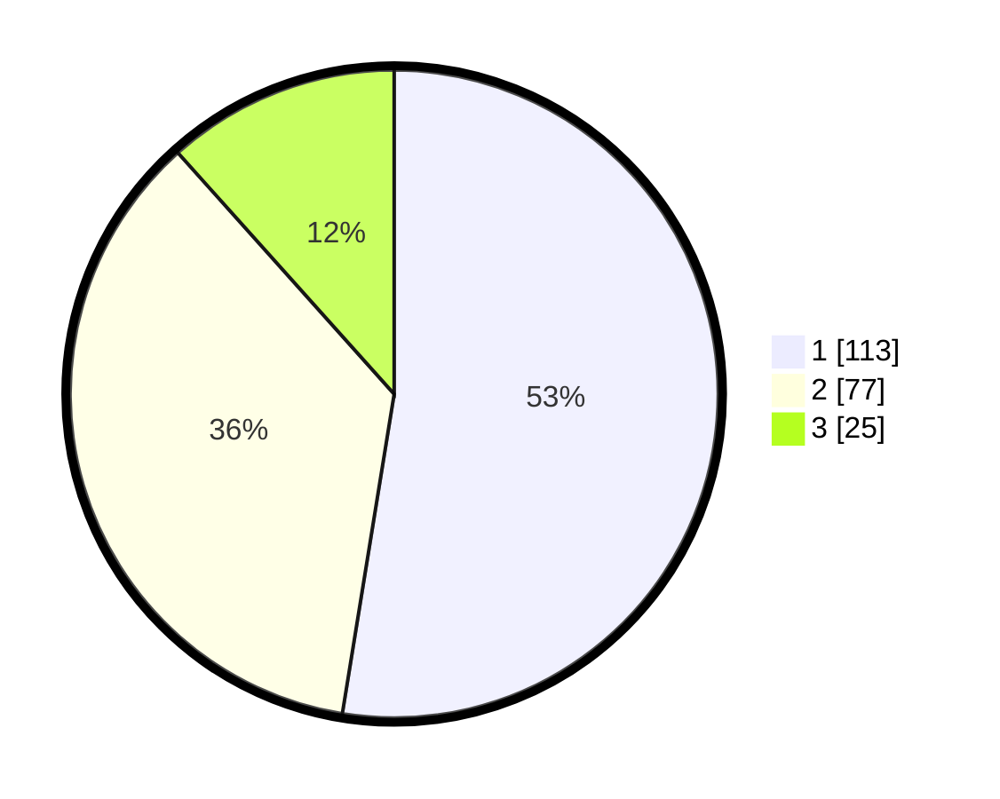

# Hasil

## Grafik

## Tabel

| No.    | Nama Paslon    | Suara | Suara (raw) | Persentase |
|:------ |:-------------- | -----:| -----------:| ----------:|
| 100025 | ANIES MUHAIMIN | 113   | [113][p-1]  | 52,56      |
| 100026 | PRABOWO GIBRAN | 77    | [77][p-2]   | 35,81      |
| 100027 | GANJAR MAHFUD  | 25    | [25][p-3]   | 11,63      |

[p-1]: https://github.com/gigit-pemilu/pemilu-2024/blob/main/pilpres/hitung-suara/sub/31-dki-jakarta/sub/75-jakarta-timur/sub/03-jatinegara/sub/1002-bidara-cina/sub/059-tps/sub/paslon-1.txt
[p-2]: https://github.com/gigit-pemilu/pemilu-2024/blob/main/pilpres/hitung-suara/sub/31-dki-jakarta/sub/75-jakarta-timur/sub/03-jatinegara/sub/1002-bidara-cina/sub/059-tps/sub/paslon-2.txt
[p-3]: https://github.com/gigit-pemilu/pemilu-2024/blob/main/pilpres/hitung-suara/sub/31-dki-jakarta/sub/75-jakarta-timur/sub/03-jatinegara/sub/1002-bidara-cina/sub/059-tps/sub/paslon-3.txt

## Foto C Plano

https://sirekap-obj-formc.kpu.go.id/b481/pemilu/ppwp/31/75/03/10/02/3175031002059-20240214-230050--d021fb5e-e3c3-43e6-ac45-b29c168abe80.jpg

https://sirekap-obj-formc.kpu.go.id/b481/pemilu/ppwp/31/75/03/10/02/3175031002059-20240214-225558--79237e16-7fbe-41e2-b69c-2397b58591a2.jpg

https://sirekap-obj-formc.kpu.go.id/b481/pemilu/ppwp/31/75/03/10/02/3175031002059-20240214-230359--3b776960-1ee7-4d81-9083-2f4c5929898f.jpg

## Metadata

| Key        | Value               |
| ---------- | ------------------- |
| Time Stamp | 2024-02-15 19:30:26 |

