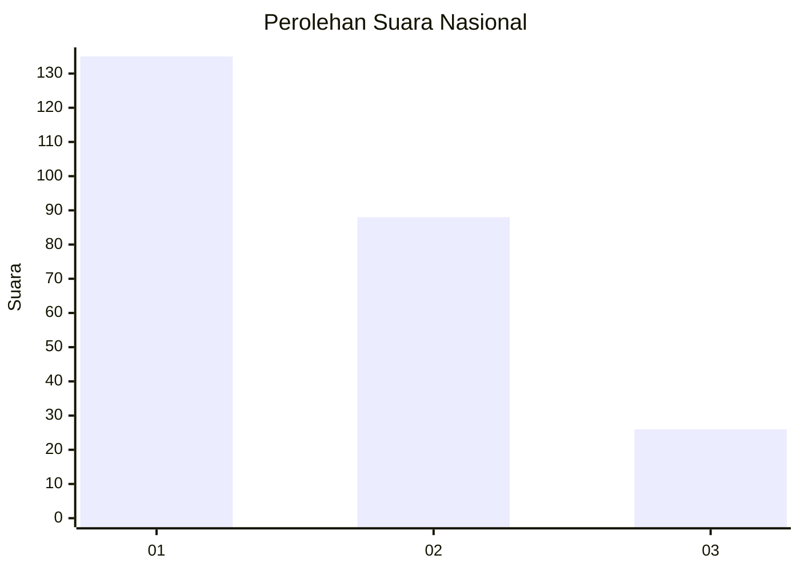
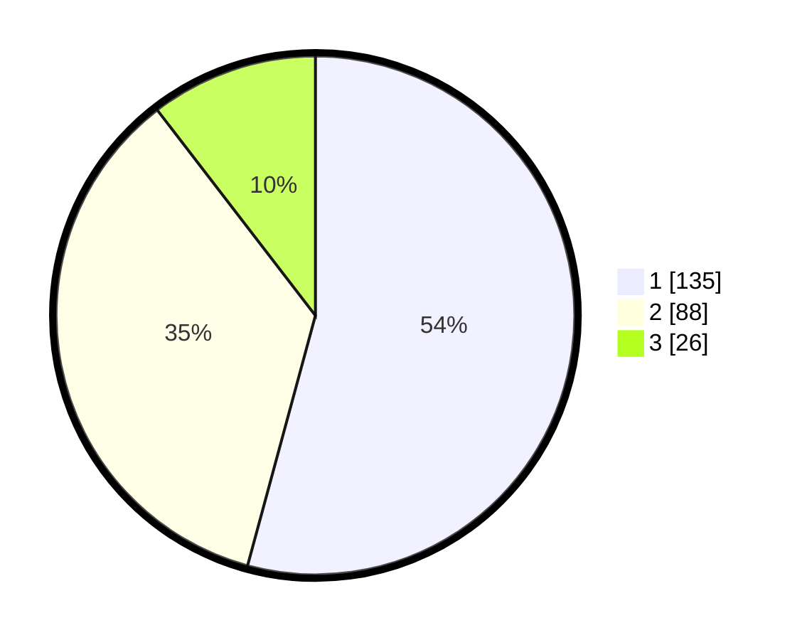

# Hasil

## Grafik

## Tabel

| No.    | Nama Paslon    | Suara | Suara (raw) | Persentase |
|:------ |:-------------- | -----:| -----------:| ----------:|
| 100025 | ANIES MUHAIMIN | 135   | [135][p-1]  | 54,22      |
| 100026 | PRABOWO GIBRAN | 88    | [88][p-2]   | 35,34      |
| 100027 | GANJAR MAHFUD  | 26    | [26][p-3]   | 10,44      |

[p-1]: https://github.com/gigit-pemilu/pemilu-2024/blob/main/pilpres/hitung-suara/sub/31-dki-jakarta/sub/75-jakarta-timur/sub/03-jatinegara/sub/1002-bidara-cina/sub/061-tps/sub/paslon-1.txt
[p-2]: https://github.com/gigit-pemilu/pemilu-2024/blob/main/pilpres/hitung-suara/sub/31-dki-jakarta/sub/75-jakarta-timur/sub/03-jatinegara/sub/1002-bidara-cina/sub/061-tps/sub/paslon-2.txt
[p-3]: https://github.com/gigit-pemilu/pemilu-2024/blob/main/pilpres/hitung-suara/sub/31-dki-jakarta/sub/75-jakarta-timur/sub/03-jatinegara/sub/1002-bidara-cina/sub/061-tps/sub/paslon-3.txt

## Foto C Plano

https://sirekap-obj-formc.kpu.go.id/a9a8/pemilu/ppwp/31/75/03/10/02/3175031002061-20240214-230344--f9d1b306-8039-4a77-b14f-66db4598a03f.jpg

https://sirekap-obj-formc.kpu.go.id/a9a8/pemilu/ppwp/31/75/03/10/02/3175031002061-20240214-230601--5ad2de75-58b2-437e-b298-797346753cbe.jpg

https://sirekap-obj-formc.kpu.go.id/a9a8/pemilu/ppwp/31/75/03/10/02/3175031002061-20240214-230705--f99f6785-e2a3-4c24-a860-82736cac1f88.jpg

## Metadata

| Key        | Value               |
| ---------- | ------------------- |
| Time Stamp | 2024-02-15 23:29:50 |

