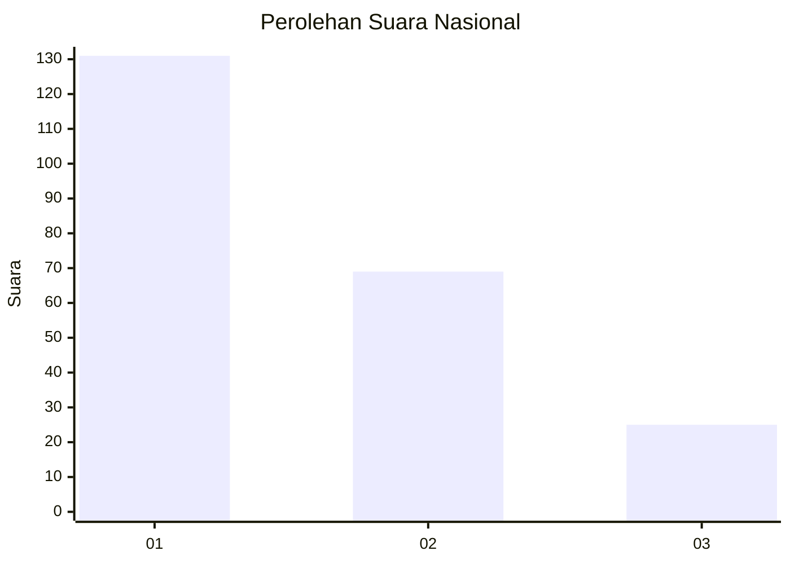
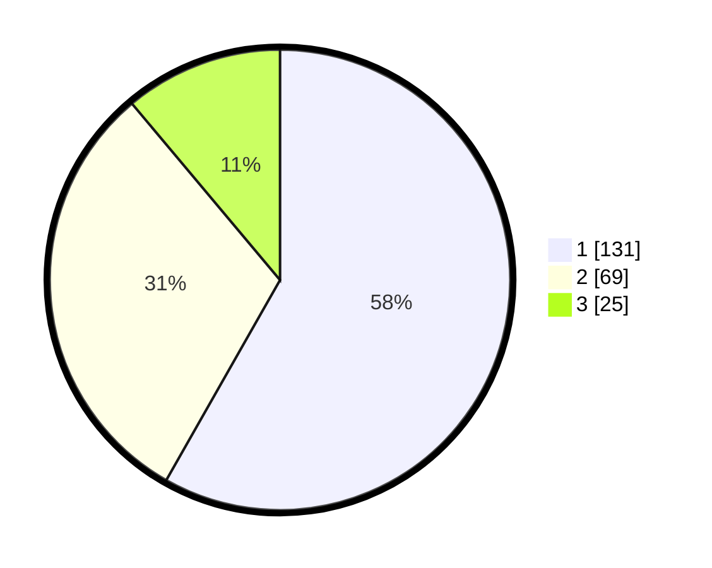

# Hasil

## Grafik

## Tabel

| No.    | Nama Paslon    | Suara | Suara (raw) | Persentase |
|:------ |:-------------- | -----:| -----------:| ----------:|
| 100025 | ANIES MUHAIMIN | 131   | [131][p-1]  | 58,22      |
| 100026 | PRABOWO GIBRAN | 69    | [69][p-2]   | 30,67      |
| 100027 | GANJAR MAHFUD  | 25    | [25][p-3]   | 11,11      |

[p-1]: https://github.com/gigit-pemilu/pemilu-2024/blob/main/pilpres/hitung-suara/sub/31-dki-jakarta/sub/75-jakarta-timur/sub/03-jatinegara/sub/1002-bidara-cina/sub/072-tps/sub/paslon-1.txt
[p-2]: https://github.com/gigit-pemilu/pemilu-2024/blob/main/pilpres/hitung-suara/sub/31-dki-jakarta/sub/75-jakarta-timur/sub/03-jatinegara/sub/1002-bidara-cina/sub/072-tps/sub/paslon-2.txt
[p-3]: https://github.com/gigit-pemilu/pemilu-2024/blob/main/pilpres/hitung-suara/sub/31-dki-jakarta/sub/75-jakarta-timur/sub/03-jatinegara/sub/1002-bidara-cina/sub/072-tps/sub/paslon-3.txt

## Foto C Plano

https://sirekap-obj-formc.kpu.go.id/7bd2/pemilu/ppwp/31/75/03/10/02/3175031002072-20240214-215207--5d6d0a18-e28c-4693-b2ea-24ed4ea4bf9e.jpg

https://sirekap-obj-formc.kpu.go.id/7bd2/pemilu/ppwp/31/75/03/10/02/3175031002072-20240214-215241--86ad8bef-a4e5-467e-af05-1deee5c0d977.jpg

https://sirekap-obj-formc.kpu.go.id/7bd2/pemilu/ppwp/31/75/03/10/02/3175031002072-20240214-215424--3f57bc3b-bfca-43fe-9b68-ae5ab09081e3.jpg

## Metadata

| Key        | Value               |
| ---------- | ------------------- |
| Time Stamp | 2024-02-25 12:00:00 |

