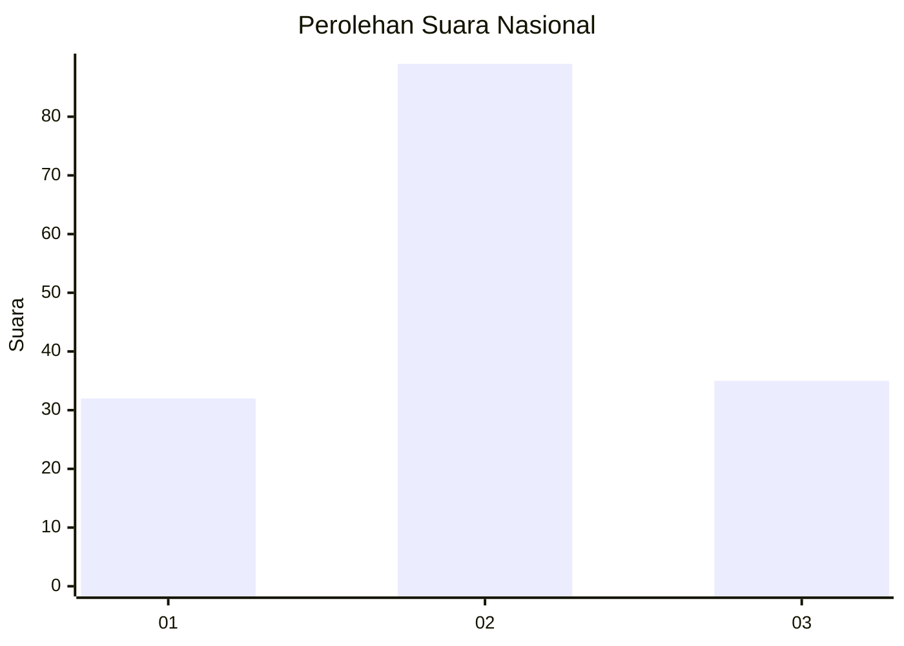
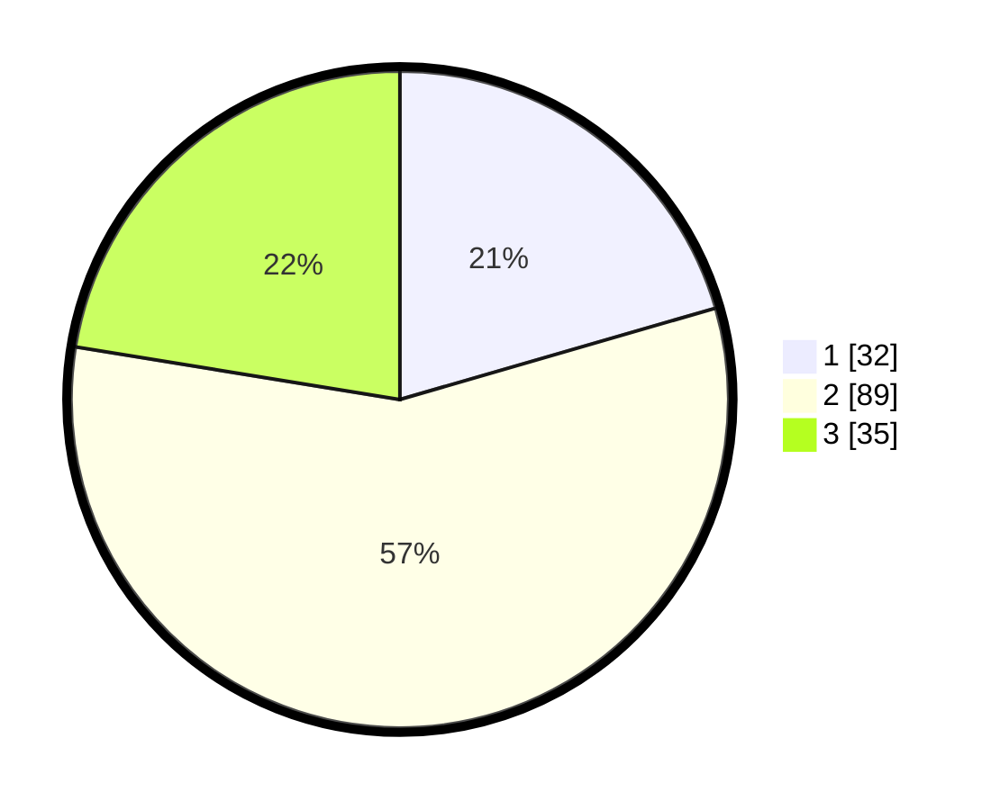

# Hasil

## Grafik

## Tabel

| No.    | Nama Paslon    | Suara | Suara (raw) | Persentase |
|:------ |:-------------- | -----:| -----------:| ----------:|
| 100025 | ANIES MUHAIMIN | 32    | [32][p-1]   | 20,51      |
| 100026 | PRABOWO GIBRAN | 89    | [89][p-2]   | 57,05      |
| 100027 | GANJAR MAHFUD  | 35    | [35][p-3]   | 22,44      |

[p-1]: https://github.com/gigit-pemilu/pemilu-2024/blob/main/pilpres/hitung-suara/sub/31-dki-jakarta/sub/75-jakarta-timur/sub/03-jatinegara/sub/1002-bidara-cina/sub/077-tps/sub/paslon-1.txt
[p-2]: https://github.com/gigit-pemilu/pemilu-2024/blob/main/pilpres/hitung-suara/sub/31-dki-jakarta/sub/75-jakarta-timur/sub/03-jatinegara/sub/1002-bidara-cina/sub/077-tps/sub/paslon-2.txt
[p-3]: https://github.com/gigit-pemilu/pemilu-2024/blob/main/pilpres/hitung-suara/sub/31-dki-jakarta/sub/75-jakarta-timur/sub/03-jatinegara/sub/1002-bidara-cina/sub/077-tps/sub/paslon-3.txt

## Foto C Plano

https://sirekap-obj-formc.kpu.go.id/abe0/pemilu/ppwp/31/75/03/10/02/3175031002077-20240215-003551--a585c3ef-29a9-4c6e-8bdb-795e6cce0d31.jpg

https://sirekap-obj-formc.kpu.go.id/abe0/pemilu/ppwp/31/75/03/10/02/3175031002077-20240215-003558--2189a5d3-c9ac-41f4-b981-659a30b2ce1f.jpg

https://sirekap-obj-formc.kpu.go.id/abe0/pemilu/ppwp/31/75/03/10/02/3175031002077-20240215-003603--8a8b84cd-25fc-498e-ac6b-251535fb6bd0.jpg

## Metadata

| Key        | Value               |
| ---------- | ------------------- |
| Time Stamp | 2024-02-16 21:01:00 |

