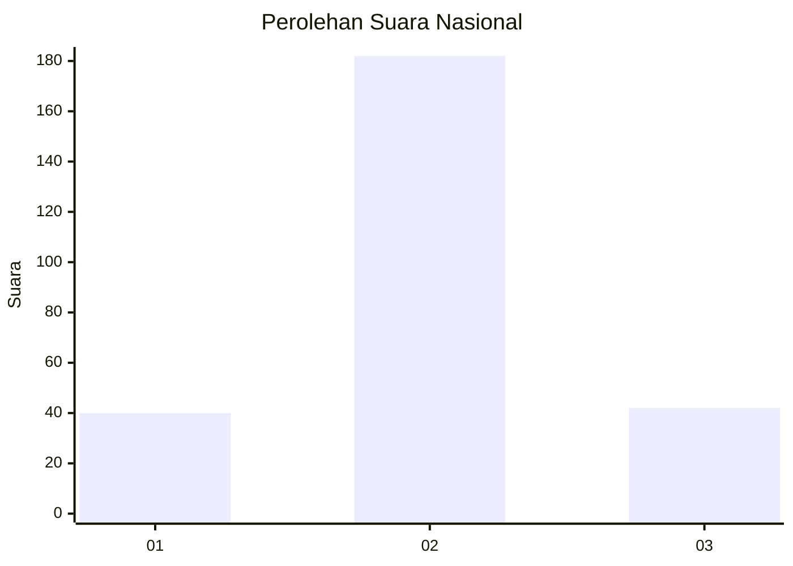
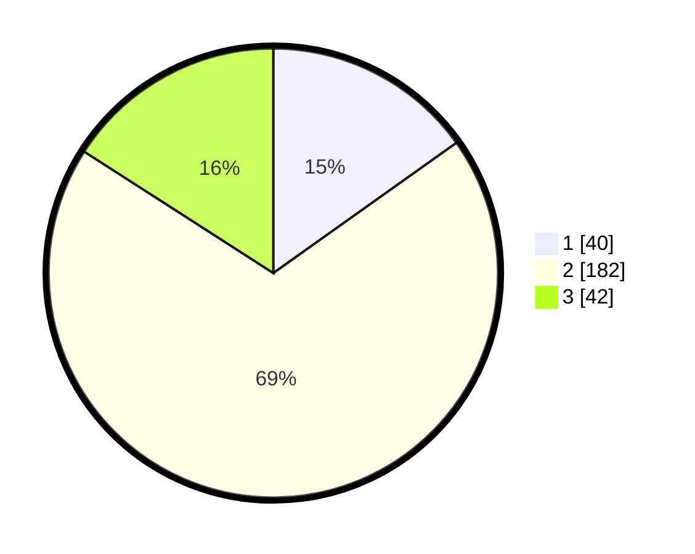

# Hasil

## Grafik

## Tabel

| No.    | Nama Paslon    | Suara | Suara (raw) | Persentase |
|:------ |:-------------- | -----:| -----------:| ----------:|
| 100025 | ANIES MUHAIMIN | 40    | [40][p-1]   | 15,15      |
| 100026 | PRABOWO GIBRAN | 182   | [182][p-2]  | 68,94      |
| 100027 | GANJAR MAHFUD  | 42    | [42][p-3]   | 15,91      |

[p-1]: https://github.com/gigit-pemilu/pemilu-2024/blob/main/pilpres/hitung-suara/sub/31-dki-jakarta/sub/75-jakarta-timur/sub/03-jatinegara/sub/1002-bidara-cina/sub/079-tps/sub/paslon-1.txt
[p-2]: https://github.com/gigit-pemilu/pemilu-2024/blob/main/pilpres/hitung-suara/sub/31-dki-jakarta/sub/75-jakarta-timur/sub/03-jatinegara/sub/1002-bidara-cina/sub/079-tps/sub/paslon-2.txt
[p-3]: https://github.com/gigit-pemilu/pemilu-2024/blob/main/pilpres/hitung-suara/sub/31-dki-jakarta/sub/75-jakarta-timur/sub/03-jatinegara/sub/1002-bidara-cina/sub/079-tps/sub/paslon-3.txt

## Foto C Plano

https://sirekap-obj-formc.kpu.go.id/819f/pemilu/ppwp/31/75/03/10/02/3175031002079-20240215-005901--9384802d-ada9-4959-90b4-428ef3c4064d.jpg

https://sirekap-obj-formc.kpu.go.id/819f/pemilu/ppwp/31/75/03/10/02/3175031002079-20240215-010915--da40bf07-d668-4132-af07-2b4fbffa4a1f.jpg

https://sirekap-obj-formc.kpu.go.id/819f/pemilu/ppwp/31/75/03/10/02/3175031002079-20240214-215803--5e44f5db-0dda-45c2-bee0-3f28737c5706.jpg

## Metadata

| Key        | Value               |
| ---------- | ------------------- |
| Time Stamp | 2024-02-15 23:29:50 |

