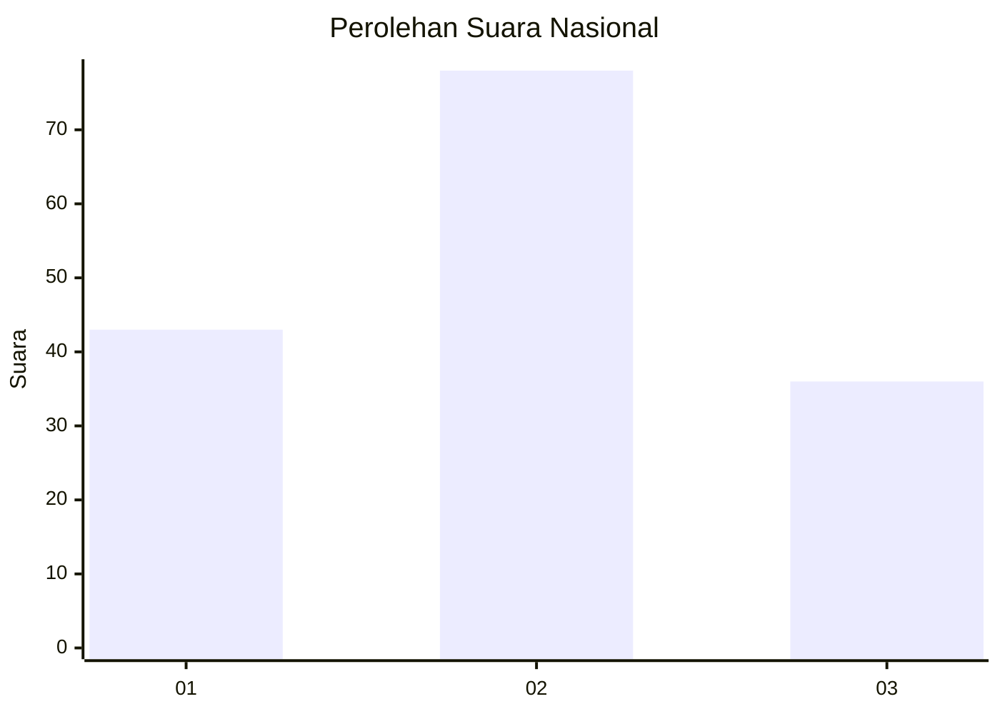
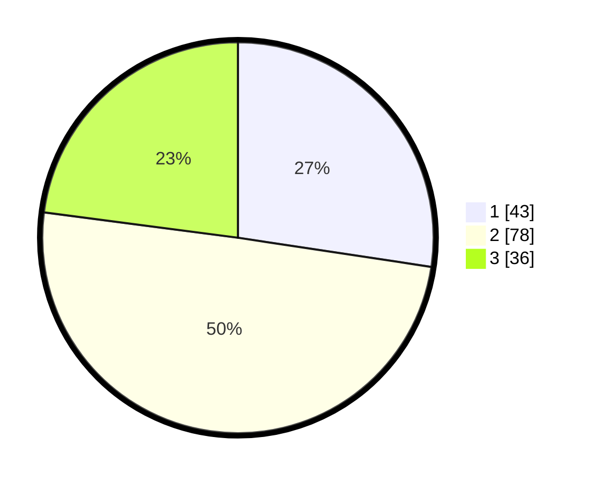

# Hasil

## Grafik

## Tabel

| No.    | Nama Paslon    | Suara | Suara (raw) | Persentase |
|:------ |:-------------- | -----:| -----------:| ----------:|
| 100025 | ANIES MUHAIMIN | 43    | [43][p-1]   | 27,39      |
| 100026 | PRABOWO GIBRAN | 78    | [78][p-2]   | 49,68      |
| 100027 | GANJAR MAHFUD  | 36    | [36][p-3]   | 22,93      |

[p-1]: https://github.com/gigit-pemilu/pemilu-2024/blob/main/pilpres/hitung-suara/sub/31-dki-jakarta/sub/75-jakarta-timur/sub/03-jatinegara/sub/1002-bidara-cina/sub/080-tps/sub/paslon-1.txt
[p-2]: https://github.com/gigit-pemilu/pemilu-2024/blob/main/pilpres/hitung-suara/sub/31-dki-jakarta/sub/75-jakarta-timur/sub/03-jatinegara/sub/1002-bidara-cina/sub/080-tps/sub/paslon-2.txt
[p-3]: https://github.com/gigit-pemilu/pemilu-2024/blob/main/pilpres/hitung-suara/sub/31-dki-jakarta/sub/75-jakarta-timur/sub/03-jatinegara/sub/1002-bidara-cina/sub/080-tps/sub/paslon-3.txt

## Foto C Plano

https://sirekap-obj-formc.kpu.go.id/fb59/pemilu/ppwp/31/75/03/10/02/3175031002080-20240214-232255--a582f0a3-0a19-458a-b09e-3ace17646627.jpg

https://sirekap-obj-formc.kpu.go.id/fb59/pemilu/ppwp/31/75/03/10/02/3175031002080-20240214-232337--3d9a103c-a998-4bba-a589-106b29b42e94.jpg

https://sirekap-obj-formc.kpu.go.id/fb59/pemilu/ppwp/31/75/03/10/02/3175031002080-20240214-232404--071f677d-84a0-431d-b822-26a4fe70f05a.jpg

## Metadata

| Key        | Value               |
| ---------- | ------------------- |
| Time Stamp | 2024-02-15 23:29:50 |

