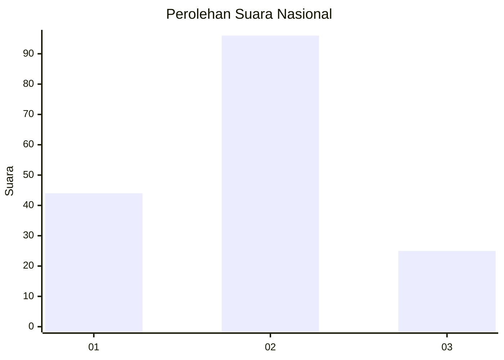
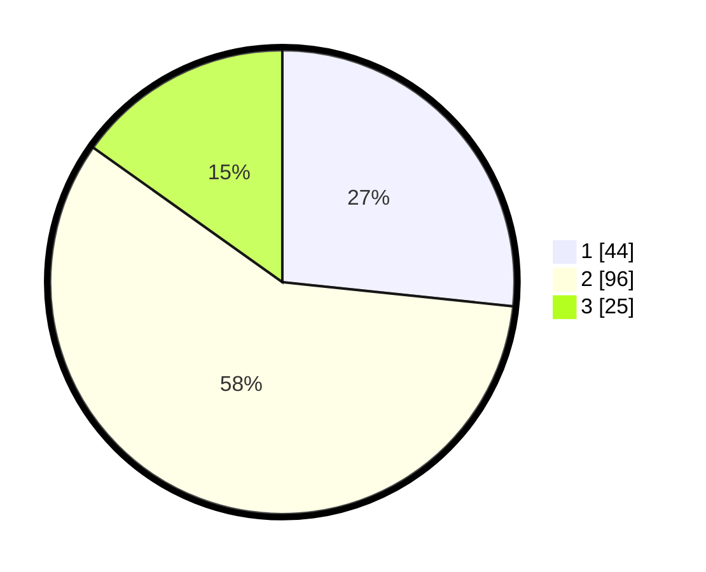

# Hasil

## Grafik

## Tabel

| No.    | Nama Paslon    | Suara | Suara (raw) | Persentase |
|:------ |:-------------- | -----:| -----------:| ----------:|
| 100025 | ANIES MUHAIMIN | 44    | [44][p-1]   | 26,67      |
| 100026 | PRABOWO GIBRAN | 96    | [96][p-2]   | 58,18      |
| 100027 | GANJAR MAHFUD  | 25    | [25][p-3]   | 15,15      |

[p-1]: https://github.com/gigit-pemilu/pemilu-2024/blob/main/pilpres/hitung-suara/sub/31-dki-jakarta/sub/75-jakarta-timur/sub/03-jatinegara/sub/1002-bidara-cina/sub/081-tps/sub/paslon-1.txt
[p-2]: https://github.com/gigit-pemilu/pemilu-2024/blob/main/pilpres/hitung-suara/sub/31-dki-jakarta/sub/75-jakarta-timur/sub/03-jatinegara/sub/1002-bidara-cina/sub/081-tps/sub/paslon-2.txt
[p-3]: https://github.com/gigit-pemilu/pemilu-2024/blob/main/pilpres/hitung-suara/sub/31-dki-jakarta/sub/75-jakarta-timur/sub/03-jatinegara/sub/1002-bidara-cina/sub/081-tps/sub/paslon-3.txt

## Foto C Plano

https://sirekap-obj-formc.kpu.go.id/471f/pemilu/ppwp/31/75/03/10/02/3175031002081-20240214-235358--7ea2f990-b5c5-4eb7-a16d-ce53894f3bee.jpg

https://sirekap-obj-formc.kpu.go.id/471f/pemilu/ppwp/31/75/03/10/02/3175031002081-20240214-235440--a031e7ca-a125-438b-b42a-ae1c46b8013b.jpg

https://sirekap-obj-formc.kpu.go.id/471f/pemilu/ppwp/31/75/03/10/02/3175031002081-20240214-235513--1ddfb96b-ad06-4971-9549-43b0110298f2.jpg

## Metadata

| Key        | Value               |
| ---------- | ------------------- |
| Time Stamp | 2024-02-16 21:01:00 |

