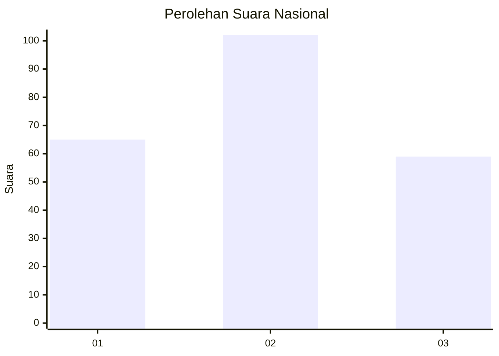
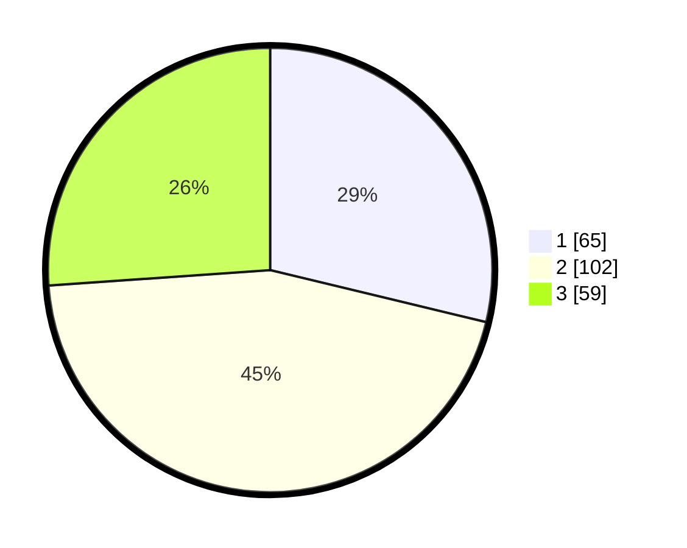

# Hasil

## Grafik

## Tabel

| No.    | Nama Paslon    | Suara | Suara (raw) | Persentase |
|:------ |:-------------- | -----:| -----------:| ----------:|
| 100025 | ANIES MUHAIMIN | 65    | [65][p-1]   | 28,76      |
| 100026 | PRABOWO GIBRAN | 102   | [102][p-2]  | 45,13      |
| 100027 | GANJAR MAHFUD  | 59    | [59][p-3]   | 26,11      |

[p-1]: https://github.com/gigit-pemilu/pemilu-2024/blob/main/pilpres/hitung-suara/sub/31-dki-jakarta/sub/75-jakarta-timur/sub/03-jatinegara/sub/1002-bidara-cina/sub/087-tps/sub/paslon-1.txt
[p-2]: https://github.com/gigit-pemilu/pemilu-2024/blob/main/pilpres/hitung-suara/sub/31-dki-jakarta/sub/75-jakarta-timur/sub/03-jatinegara/sub/1002-bidara-cina/sub/087-tps/sub/paslon-2.txt
[p-3]: https://github.com/gigit-pemilu/pemilu-2024/blob/main/pilpres/hitung-suara/sub/31-dki-jakarta/sub/75-jakarta-timur/sub/03-jatinegara/sub/1002-bidara-cina/sub/087-tps/sub/paslon-3.txt

## Foto C Plano

https://sirekap-obj-formc.kpu.go.id/688e/pemilu/ppwp/31/75/03/10/02/3175031002087-20240214-234946--03e2a011-c1dd-4613-8925-cba6d93ebd93.jpg

https://sirekap-obj-formc.kpu.go.id/688e/pemilu/ppwp/31/75/03/10/02/3175031002087-20240214-235047--477b96fa-f7d2-4ec4-81ad-dfce9b4a0438.jpg

https://sirekap-obj-formc.kpu.go.id/688e/pemilu/ppwp/31/75/03/10/02/3175031002087-20240214-235129--78423c82-642c-4336-b73a-4fb96dfeb485.jpg

## Metadata

| Key        | Value               |
| ---------- | ------------------- |
| Time Stamp | 2024-02-16 21:01:00 |

