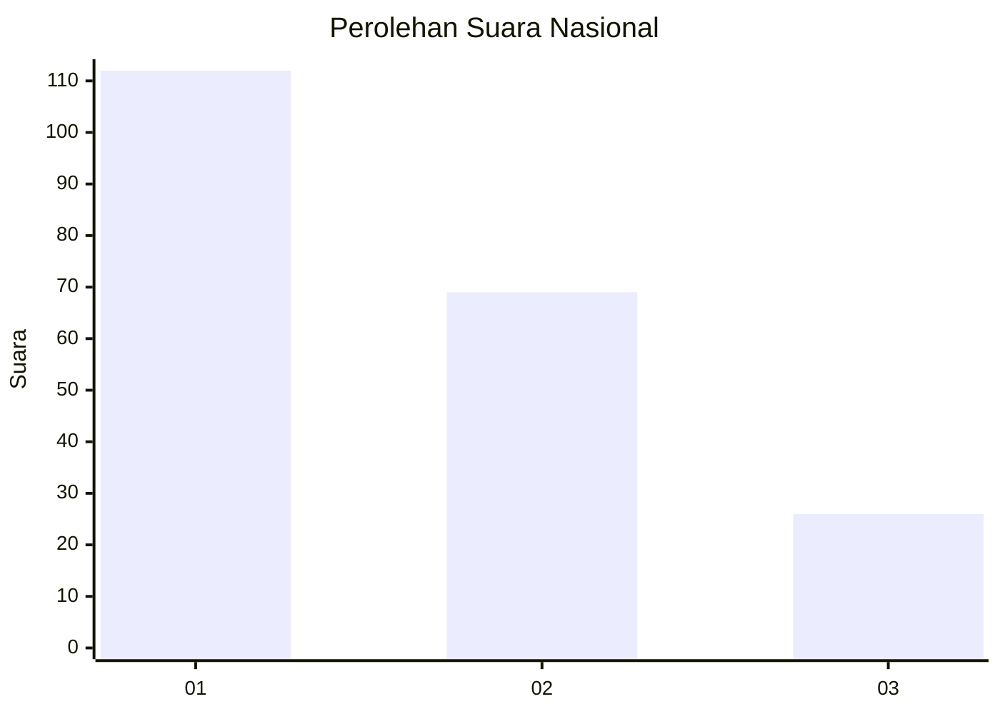
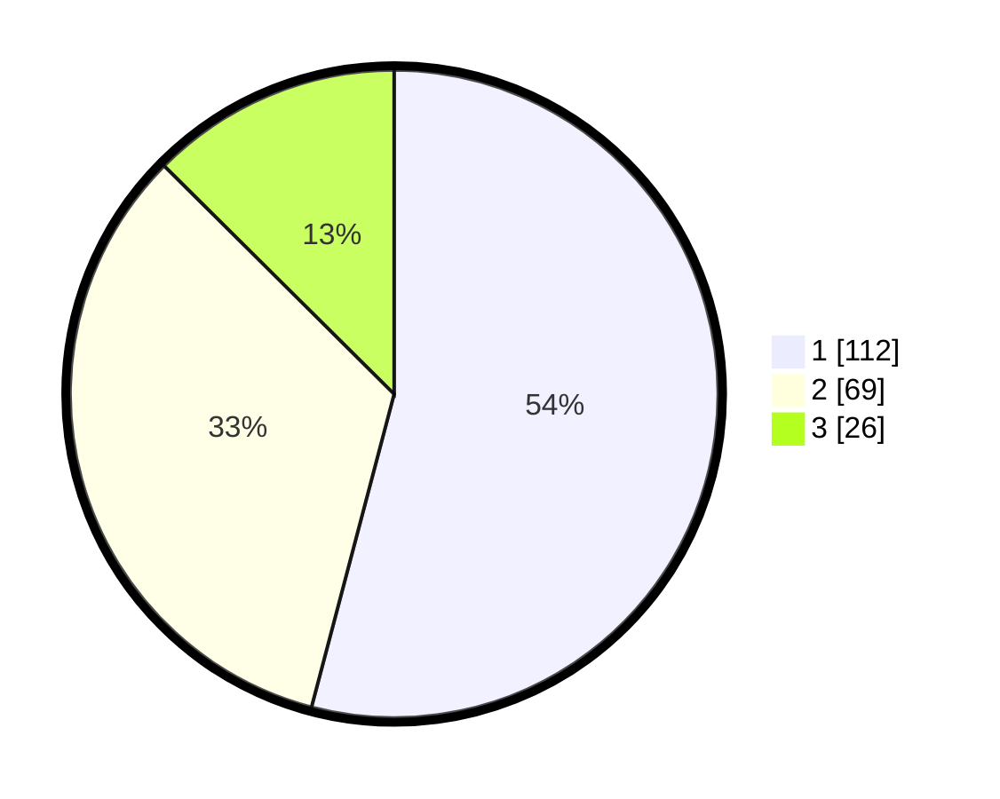

# Hasil

## Grafik

## Tabel

| No.    | Nama Paslon    | Suara | Suara (raw) | Persentase |
|:------ |:-------------- | -----:| -----------:| ----------:|
| 100025 | ANIES MUHAIMIN | 112   | [112][p-1]  | 54,11      |
| 100026 | PRABOWO GIBRAN | 69    | [69][p-2]   | 33,33      |
| 100027 | GANJAR MAHFUD  | 26    | [26][p-3]   | 12,56      |

[p-1]: https://github.com/gigit-pemilu/pemilu-2024/blob/main/pilpres/hitung-suara/sub/31-dki-jakarta/sub/75-jakarta-timur/sub/03-jatinegara/sub/1002-bidara-cina/sub/089-tps/sub/paslon-1.txt
[p-2]: https://github.com/gigit-pemilu/pemilu-2024/blob/main/pilpres/hitung-suara/sub/31-dki-jakarta/sub/75-jakarta-timur/sub/03-jatinegara/sub/1002-bidara-cina/sub/089-tps/sub/paslon-2.txt
[p-3]: https://github.com/gigit-pemilu/pemilu-2024/blob/main/pilpres/hitung-suara/sub/31-dki-jakarta/sub/75-jakarta-timur/sub/03-jatinegara/sub/1002-bidara-cina/sub/089-tps/sub/paslon-3.txt

## Foto C Plano

https://sirekap-obj-formc.kpu.go.id/fb02/pemilu/ppwp/31/75/03/10/02/3175031002089-20240215-011134--16634107-7276-4239-bc5b-4ac24bfd32c2.jpg

https://sirekap-obj-formc.kpu.go.id/fb02/pemilu/ppwp/31/75/03/10/02/3175031002089-20240215-013419--9eabe5ac-0c36-48ce-8619-b8d38f700901.jpg

https://sirekap-obj-formc.kpu.go.id/fb02/pemilu/ppwp/31/75/03/10/02/3175031002089-20240215-013636--1f851440-795e-4890-917d-fb4fe004db09.jpg

## Metadata

| Key        | Value               |
| ---------- | ------------------- |
| Time Stamp | 2024-02-16 23:00:00 |

