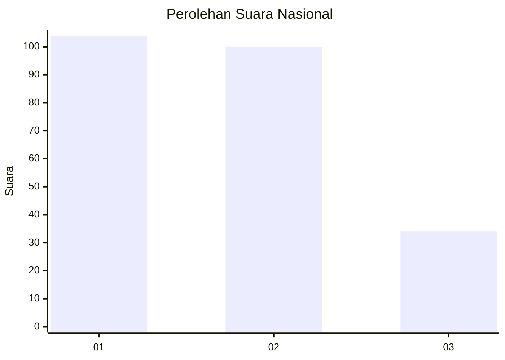
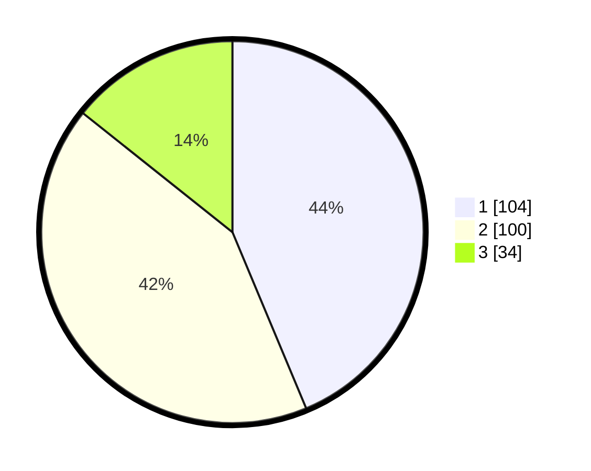

# Hasil

## Grafik

## Tabel

| No.    | Nama Paslon    | Suara | Suara (raw) | Persentase |
|:------ |:-------------- | -----:| -----------:| ----------:|
| 100025 | ANIES MUHAIMIN | 104   | [104][p-1]  | 43,70      |
| 100026 | PRABOWO GIBRAN | 100   | [100][p-2]  | 42,02      |
| 100027 | GANJAR MAHFUD  | 34    | [34][p-3]   | 14,29      |

[p-1]: https://github.com/gigit-pemilu/pemilu-2024/blob/main/pilpres/hitung-suara/sub/31-dki-jakarta/sub/75-jakarta-timur/sub/03-jatinegara/sub/1002-bidara-cina/sub/098-tps/sub/paslon-1.txt
[p-2]: https://github.com/gigit-pemilu/pemilu-2024/blob/main/pilpres/hitung-suara/sub/31-dki-jakarta/sub/75-jakarta-timur/sub/03-jatinegara/sub/1002-bidara-cina/sub/098-tps/sub/paslon-2.txt
[p-3]: https://github.com/gigit-pemilu/pemilu-2024/blob/main/pilpres/hitung-suara/sub/31-dki-jakarta/sub/75-jakarta-timur/sub/03-jatinegara/sub/1002-bidara-cina/sub/098-tps/sub/paslon-3.txt

## Foto C Plano

https://sirekap-obj-formc.kpu.go.id/b0dd/pemilu/ppwp/31/75/03/10/02/3175031002098-20240214-233752--e546aaac-9f40-4821-9e25-1060ff7f38e6.jpg

https://sirekap-obj-formc.kpu.go.id/b0dd/pemilu/ppwp/31/75/03/10/02/3175031002098-20240214-234013--531fa113-46fe-4a09-993d-bb23330ed8f6.jpg

https://sirekap-obj-formc.kpu.go.id/b0dd/pemilu/ppwp/31/75/03/10/02/3175031002098-20240214-234117--9a54597e-63c8-46e7-a9e9-e7a24326958d.jpg

## Metadata

| Key        | Value               |
| ---------- | ------------------- |
| Time Stamp | 2024-02-15 23:29:50 |

