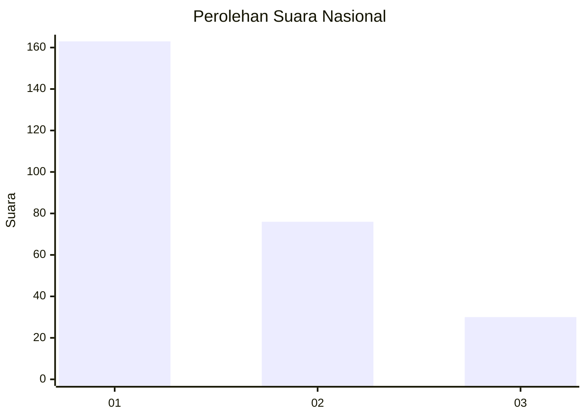
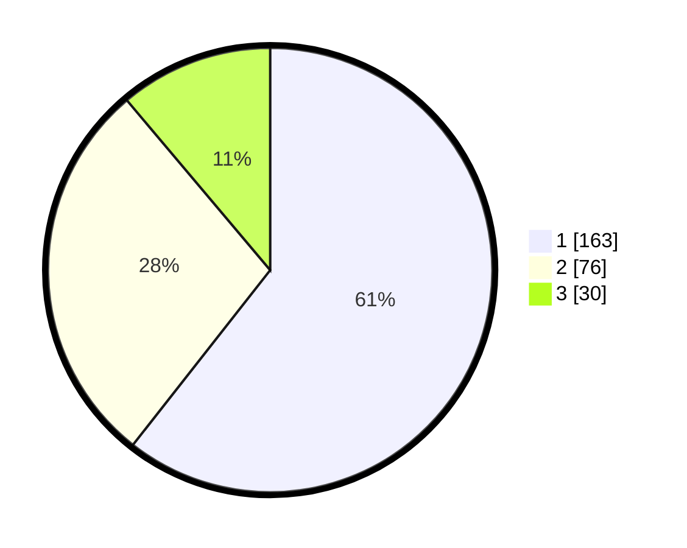

# Hasil

## Grafik

## Tabel

| No. | Nama Paslon    | Suara | Suara (raw) | Persentase |
|:--- |:-------------- | -----:| -----------:| ----------:|
| 1   | ANIES MUHAIMIN | 163   | [163][p-1]  | 60,59      |
| 2   | PRABOWO GIBRAN | 76    | [76][p-2]   | 28,25      |
| 3   | GANJAR MAHFUD  | 30    | [30][p-3]   | 11,15      |

[p-1]: https://github.com/gigit-pemilu/pemilu-2024/blob/main/pilpres/hitung-suara/sub/31-dki-jakarta/sub/75-jakarta-timur/sub/03-jatinegara/sub/1002-bidara-cina/sub/103-tps/sub/paslon-1.txt
[p-2]: https://github.com/gigit-pemilu/pemilu-2024/blob/main/pilpres/hitung-suara/sub/31-dki-jakarta/sub/75-jakarta-timur/sub/03-jatinegara/sub/1002-bidara-cina/sub/103-tps/sub/paslon-2.txt
[p-3]: https://github.com/gigit-pemilu/pemilu-2024/blob/main/pilpres/hitung-suara/sub/31-dki-jakarta/sub/75-jakarta-timur/sub/03-jatinegara/sub/1002-bidara-cina/sub/103-tps/sub/paslon-3.txt

## Foto C Plano

https://sirekap-obj-formc.kpu.go.id/d845/pemilu/ppwp/31/75/03/10/02/3175031002103-20240215-032805--3d89e5c1-ee9e-4e29-85fd-4da6a953c1cf.jpg

https://sirekap-obj-formc.kpu.go.id/d845/pemilu/ppwp/31/75/03/10/02/3175031002103-20240215-032859--b336b11b-43b0-4bff-a328-54c4c5d3bcb9.jpg

https://sirekap-obj-formc.kpu.go.id/d845/pemilu/ppwp/31/75/03/10/02/3175031002103-20240215-032931--e9553a65-92d6-4871-a99d-d7f54aa50d0b.jpg

## Metadata

| Key        | Value               |
| ---------- | ------------------- |
| Time Stamp | 2024-02-24 22:31:28 |

