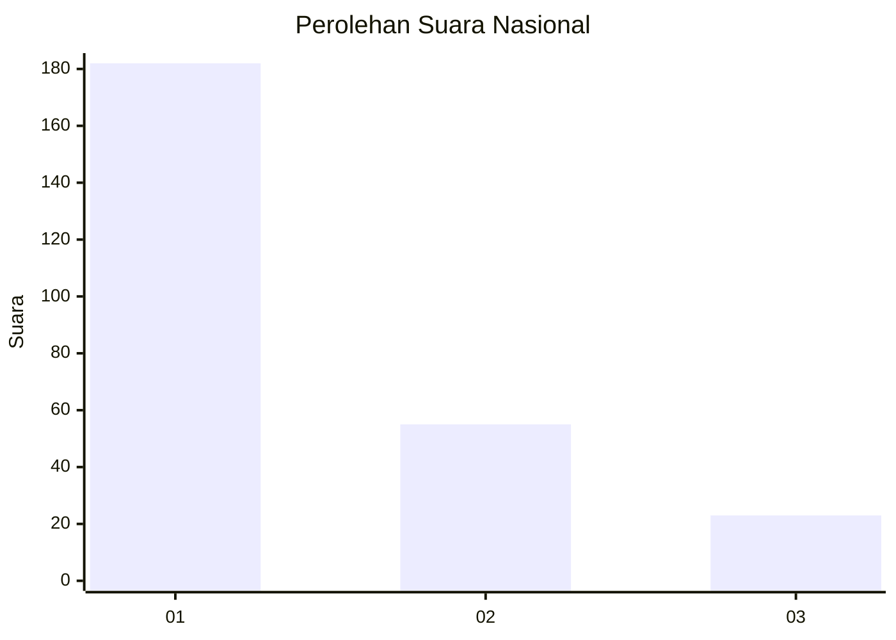
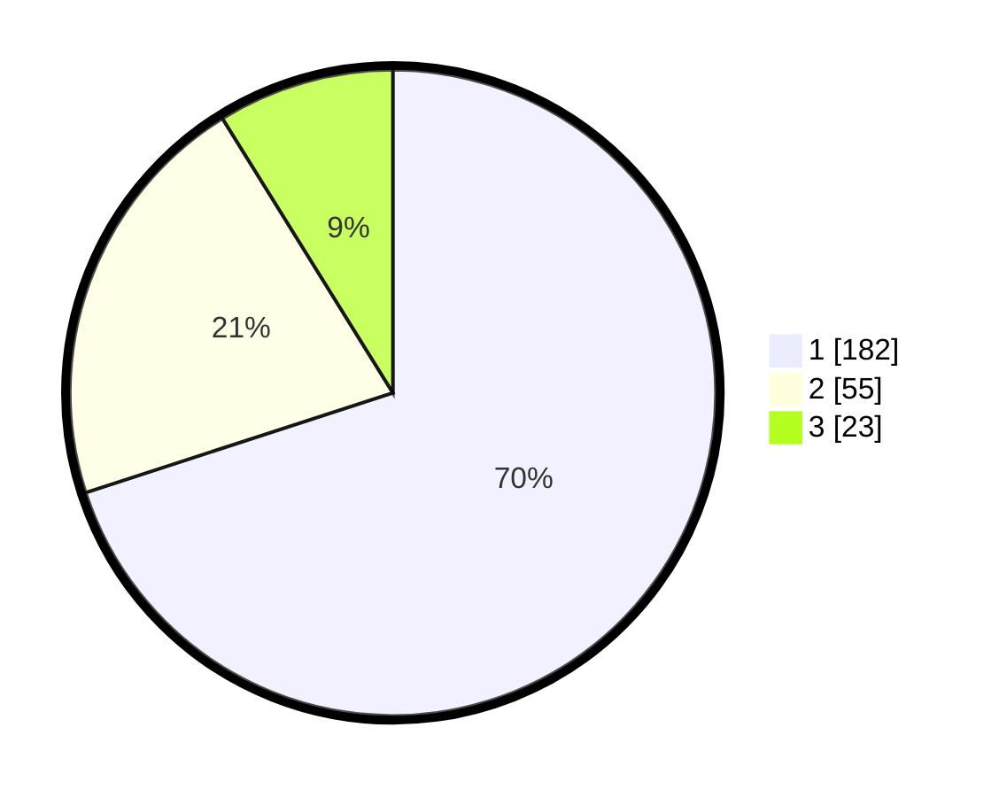

# Hasil

## Grafik

## Tabel

| No. | Nama Paslon    | Suara | Suara (raw) | Persentase |
|:--- |:-------------- | -----:| -----------:| ----------:|
| 1   | ANIES MUHAIMIN | 182   | [182][p-1]  | 70,00      |
| 2   | PRABOWO GIBRAN | 55    | [55][p-2]   | 21,15      |
| 3   | GANJAR MAHFUD  | 23    | [23][p-3]   | 8,85       |

[p-1]: https://github.com/gigit-pemilu/pemilu-2024/blob/main/pilpres/hitung-suara/sub/31-dki-jakarta/sub/75-jakarta-timur/sub/03-jatinegara/sub/1002-bidara-cina/sub/114-tps/sub/paslon-1.txt
[p-2]: https://github.com/gigit-pemilu/pemilu-2024/blob/main/pilpres/hitung-suara/sub/31-dki-jakarta/sub/75-jakarta-timur/sub/03-jatinegara/sub/1002-bidara-cina/sub/114-tps/sub/paslon-2.txt
[p-3]: https://github.com/gigit-pemilu/pemilu-2024/blob/main/pilpres/hitung-suara/sub/31-dki-jakarta/sub/75-jakarta-timur/sub/03-jatinegara/sub/1002-bidara-cina/sub/114-tps/sub/paslon-3.txt

## Foto C Plano

https://sirekap-obj-formc.kpu.go.id/75a5/pemilu/ppwp/31/75/03/10/02/3175031002114-20240218-141945--48cb830b-0bdb-461a-ac48-c69da59fbe42.jpg

https://sirekap-obj-formc.kpu.go.id/75a5/pemilu/ppwp/31/75/03/10/02/3175031002114-20240218-142036--73a3ed0b-d783-483c-8e81-ea5fc77144c5.jpg

https://sirekap-obj-formc.kpu.go.id/75a5/pemilu/ppwp/31/75/03/10/02/3175031002114-20240218-142120--f106190f-4407-49ea-a69d-81d45fecf508.jpg

## Metadata

| Key        | Value               |
| ---------- | ------------------- |
| Time Stamp | 2024-02-24 22:31:28 |

