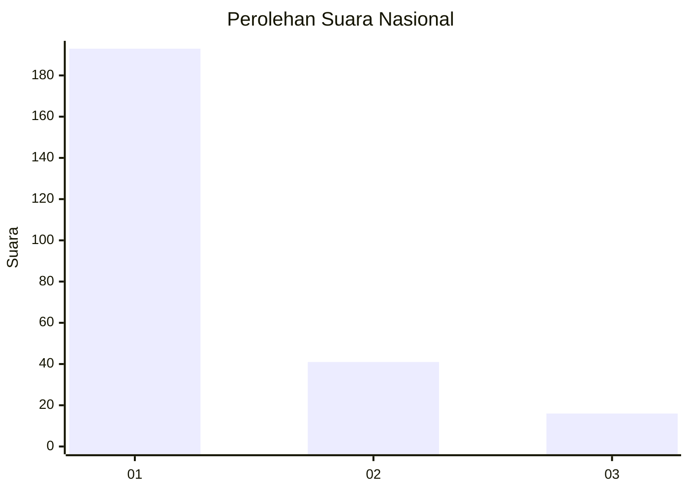
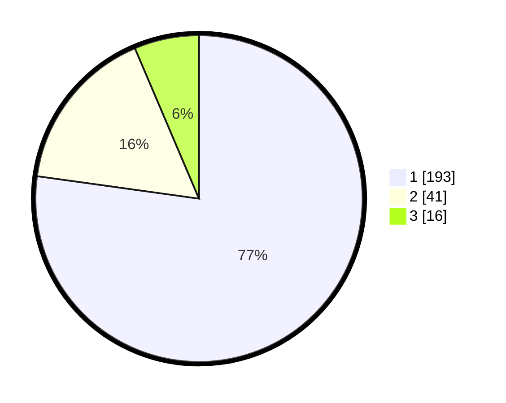

# Hasil

## Grafik

## Tabel

| No.    | Nama Paslon    | Suara | Suara (raw) | Persentase |
|:------ |:-------------- | -----:| -----------:| ----------:|
| 100025 | ANIES MUHAIMIN | 193   | [193][p-1]  | 77,20      |
| 100026 | PRABOWO GIBRAN | 41    | [41][p-2]   | 16,40      |
| 100027 | GANJAR MAHFUD  | 16    | [16][p-3]   | 6,40       |

[p-1]: https://github.com/gigit-pemilu/pemilu-2024/blob/main/pilpres/hitung-suara/sub/31-dki-jakarta/sub/75-jakarta-timur/sub/03-jatinegara/sub/1002-bidara-cina/sub/117-tps/sub/paslon-1.txt
[p-2]: https://github.com/gigit-pemilu/pemilu-2024/blob/main/pilpres/hitung-suara/sub/31-dki-jakarta/sub/75-jakarta-timur/sub/03-jatinegara/sub/1002-bidara-cina/sub/117-tps/sub/paslon-2.txt
[p-3]: https://github.com/gigit-pemilu/pemilu-2024/blob/main/pilpres/hitung-suara/sub/31-dki-jakarta/sub/75-jakarta-timur/sub/03-jatinegara/sub/1002-bidara-cina/sub/117-tps/sub/paslon-3.txt

## Foto C Plano

https://sirekap-obj-formc.kpu.go.id/eef0/pemilu/ppwp/31/75/03/10/02/3175031002117-20240215-004910--7ede0b25-9ed0-4a91-af5a-bdeec4331641.jpg

https://sirekap-obj-formc.kpu.go.id/eef0/pemilu/ppwp/31/75/03/10/02/3175031002117-20240215-005110--5999981a-9715-4955-a368-18b0473f024d.jpg

https://sirekap-obj-formc.kpu.go.id/eef0/pemilu/ppwp/31/75/03/10/02/3175031002117-20240215-005244--7277896e-6781-4fe1-89b9-7720f449b97c.jpg

## Metadata

| Key        | Value               |
| ---------- | ------------------- |
| Time Stamp | 2024-02-15 23:29:50 |

