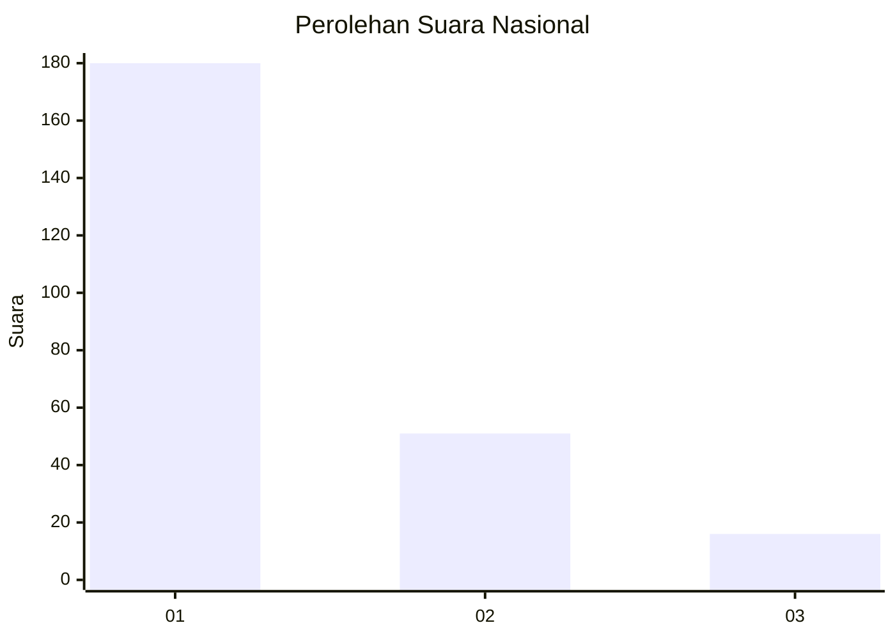
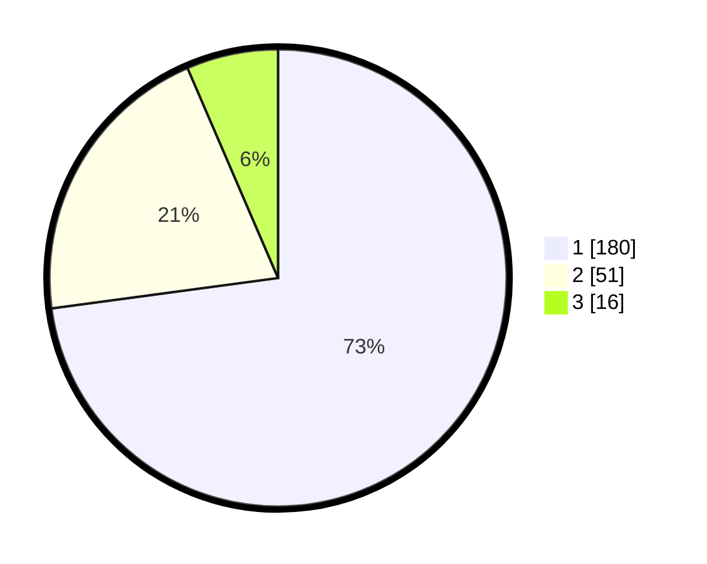

# Hasil

## Grafik

## Tabel

| No.    | Nama Paslon    | Suara | Suara (raw) | Persentase |
|:------ |:-------------- | -----:| -----------:| ----------:|
| 100025 | ANIES MUHAIMIN | 180   | [180][p-1]  | 72,87      |
| 100026 | PRABOWO GIBRAN | 51    | [51][p-2]   | 20,65      |
| 100027 | GANJAR MAHFUD  | 16    | [16][p-3]   | 6,48       |

[p-1]: https://github.com/gigit-pemilu/pemilu-2024/blob/main/pilpres/hitung-suara/sub/31-dki-jakarta/sub/75-jakarta-timur/sub/03-jatinegara/sub/1002-bidara-cina/sub/120-tps/sub/paslon-1.txt
[p-2]: https://github.com/gigit-pemilu/pemilu-2024/blob/main/pilpres/hitung-suara/sub/31-dki-jakarta/sub/75-jakarta-timur/sub/03-jatinegara/sub/1002-bidara-cina/sub/120-tps/sub/paslon-2.txt
[p-3]: https://github.com/gigit-pemilu/pemilu-2024/blob/main/pilpres/hitung-suara/sub/31-dki-jakarta/sub/75-jakarta-timur/sub/03-jatinegara/sub/1002-bidara-cina/sub/120-tps/sub/paslon-3.txt

## Foto C Plano

https://sirekap-obj-formc.kpu.go.id/6a27/pemilu/ppwp/31/75/03/10/02/3175031002120-20240214-203837--5d9e3c82-0a0d-41d5-a565-502d921b4354.jpg

https://sirekap-obj-formc.kpu.go.id/6a27/pemilu/ppwp/31/75/03/10/02/3175031002120-20240214-204214--0b76a606-876f-45a5-a20f-9d798ed570ce.jpg

https://sirekap-obj-formc.kpu.go.id/6a27/pemilu/ppwp/31/75/03/10/02/3175031002120-20240214-204243--1581ca5d-9d05-47ae-99f2-69a6a107c38c.jpg

## Metadata

| Key        | Value               |
| ---------- | ------------------- |
| Time Stamp | 2024-02-24 22:31:28 |

