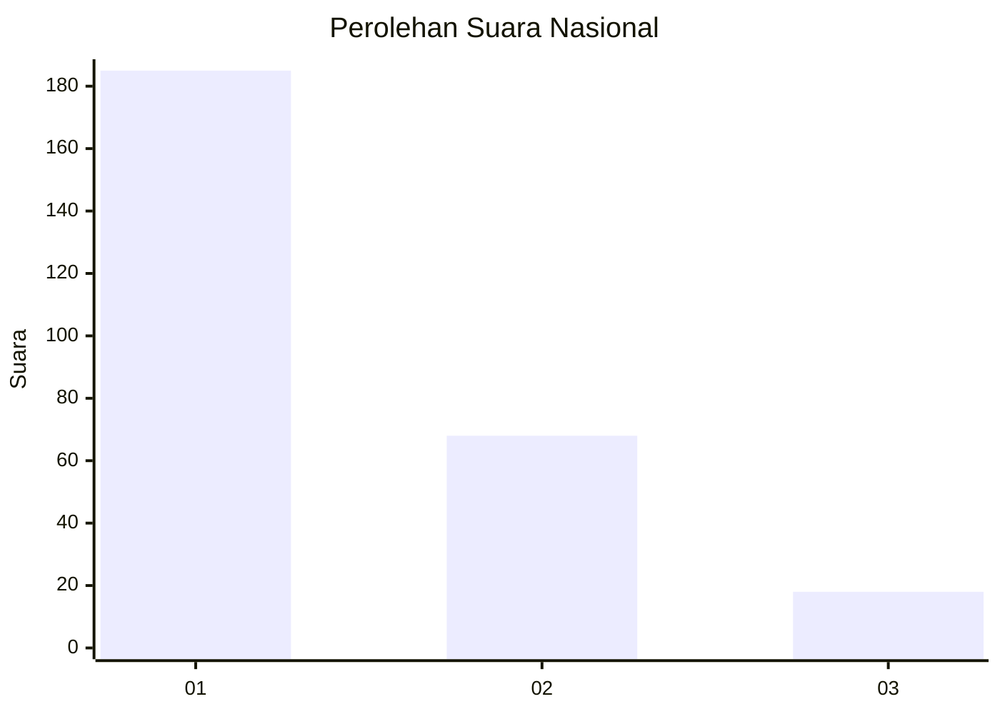
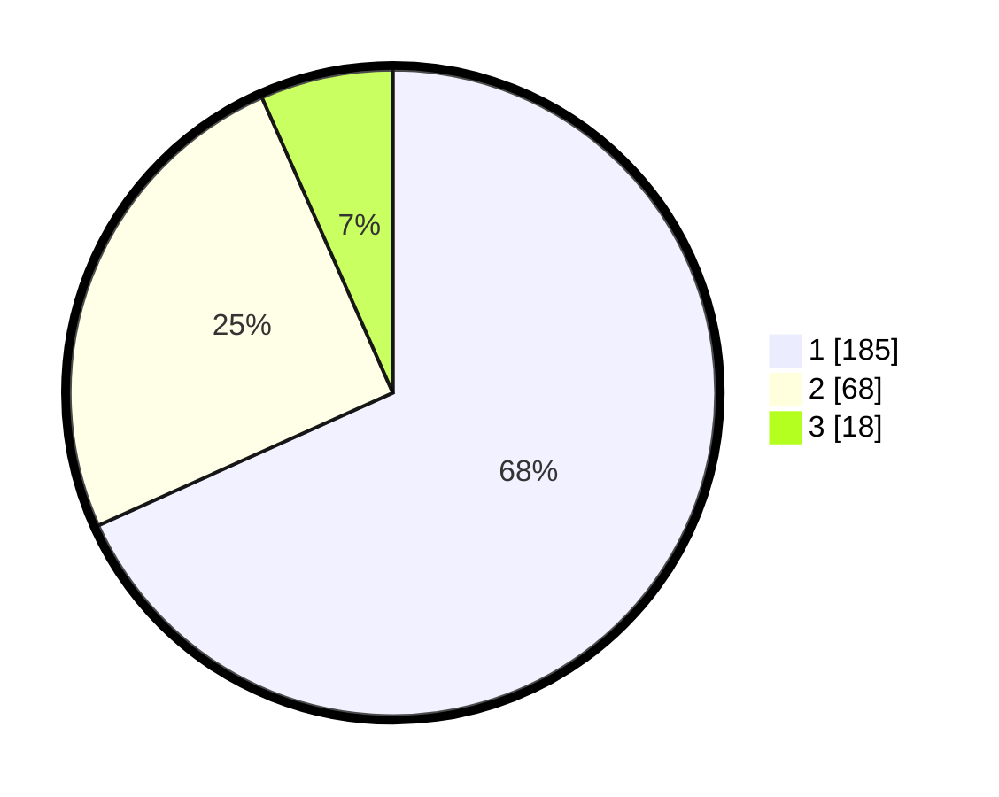

# Hasil

## Grafik

## Tabel

| No. | Nama Paslon    | Suara | Suara (raw) | Persentase |
|:--- |:-------------- | -----:| -----------:| ----------:|
| 1   | ANIES MUHAIMIN | 185   | [185][p-1]  | 68,27      |
| 2   | PRABOWO GIBRAN | 68    | [68][p-2]   | 25,09      |
| 3   | GANJAR MAHFUD  | 18    | [18][p-3]   | 6,64       |

[p-1]: https://github.com/gigit-pemilu/pemilu-2024/blob/main/pilpres/hitung-suara/sub/31-dki-jakarta/sub/75-jakarta-timur/sub/03-jatinegara/sub/1002-bidara-cina/sub/121-tps/sub/paslon-1.txt
[p-2]: https://github.com/gigit-pemilu/pemilu-2024/blob/main/pilpres/hitung-suara/sub/31-dki-jakarta/sub/75-jakarta-timur/sub/03-jatinegara/sub/1002-bidara-cina/sub/121-tps/sub/paslon-2.txt
[p-3]: https://github.com/gigit-pemilu/pemilu-2024/blob/main/pilpres/hitung-suara/sub/31-dki-jakarta/sub/75-jakarta-timur/sub/03-jatinegara/sub/1002-bidara-cina/sub/121-tps/sub/paslon-3.txt

## Foto C Plano

https://sirekap-obj-formc.kpu.go.id/beb2/pemilu/ppwp/31/75/03/10/02/3175031002121-20240214-205335--61527ddc-5500-4743-b30a-b3532a0229c0.jpg

https://sirekap-obj-formc.kpu.go.id/beb2/pemilu/ppwp/31/75/03/10/02/3175031002121-20240214-205442--54702401-a934-4aa6-b283-980e5cc99102.jpg

https://sirekap-obj-formc.kpu.go.id/beb2/pemilu/ppwp/31/75/03/10/02/3175031002121-20240214-205604--f1730d71-e285-47b8-9c7d-56f03cd1a34e.jpg

## Metadata

| Key        | Value               |
| ---------- | ------------------- |
| Time Stamp | 2024-02-15 23:29:50 |

