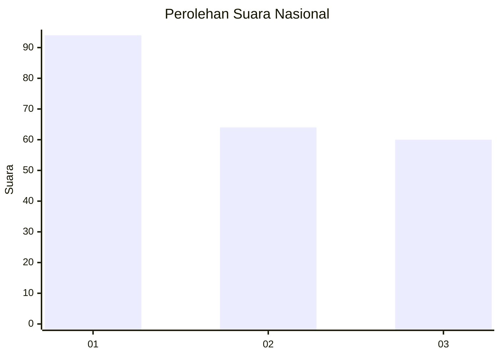
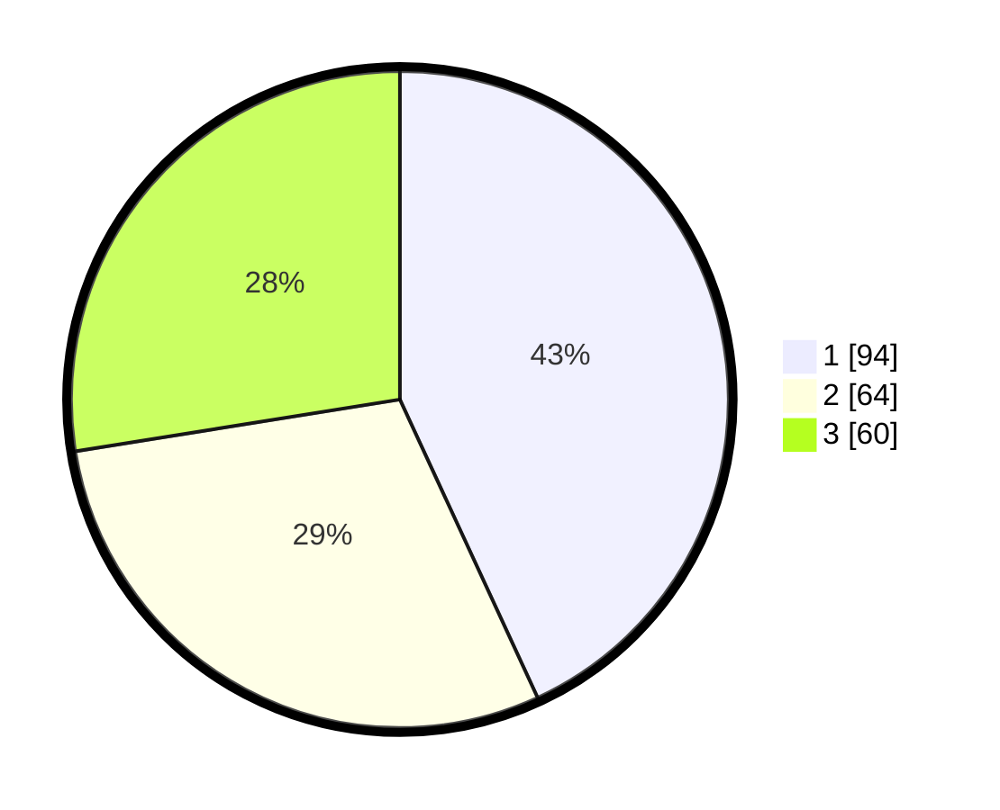

# Hasil

## Grafik

## Tabel

| No.    | Nama Paslon    | Suara | Suara (raw) | Persentase |
|:------ |:-------------- | -----:| -----------:| ----------:|
| 100025 | ANIES MUHAIMIN | 94    | [94][p-1]   | 43,12      |
| 100026 | PRABOWO GIBRAN | 64    | [64][p-2]   | 29,36      |
| 100027 | GANJAR MAHFUD  | 60    | [60][p-3]   | 27,52      |

[p-1]: https://github.com/gigit-pemilu/pemilu-2024/blob/main/pilpres/hitung-suara/sub/31-dki-jakarta/sub/75-jakarta-timur/sub/03-jatinegara/sub/1003-bali-mester/sub/010-tps/sub/paslon-1.txt
[p-2]: https://github.com/gigit-pemilu/pemilu-2024/blob/main/pilpres/hitung-suara/sub/31-dki-jakarta/sub/75-jakarta-timur/sub/03-jatinegara/sub/1003-bali-mester/sub/010-tps/sub/paslon-2.txt
[p-3]: https://github.com/gigit-pemilu/pemilu-2024/blob/main/pilpres/hitung-suara/sub/31-dki-jakarta/sub/75-jakarta-timur/sub/03-jatinegara/sub/1003-bali-mester/sub/010-tps/sub/paslon-3.txt

## Foto C Plano

https://sirekap-obj-formc.kpu.go.id/4240/pemilu/ppwp/31/75/03/10/03/3175031003010-20240221-192101--52d2dd25-eb90-49b4-a913-6f8b99ef8ba3.jpg

https://sirekap-obj-formc.kpu.go.id/4240/pemilu/ppwp/31/75/03/10/03/3175031003010-20240221-192117--f272dbae-8c87-4efe-a3a4-0569339f0520.jpg

https://sirekap-obj-formc.kpu.go.id/4240/pemilu/ppwp/31/75/03/10/03/3175031003010-20240221-192128--fc879ce2-7c7a-4420-a476-ef1e43d0090b.jpg

## Metadata

| Key        | Value               |
| ---------- | ------------------- |
| Time Stamp | 2024-02-24 22:31:28 |

