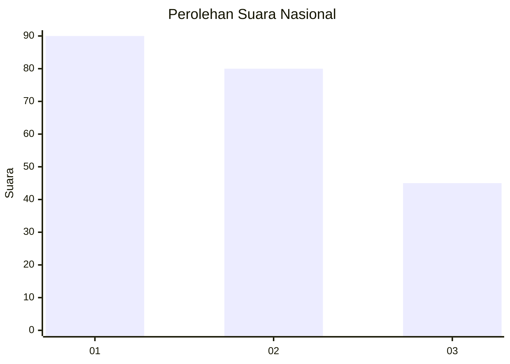
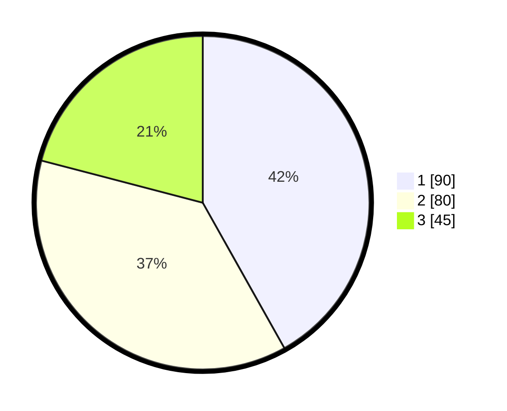

# Hasil

## Grafik

## Tabel

| No.    | Nama Paslon    | Suara | Suara (raw) | Persentase |
|:------ |:-------------- | -----:| -----------:| ----------:|
| 100025 | ANIES MUHAIMIN | 90    | [90][p-1]   | 41,86      |
| 100026 | PRABOWO GIBRAN | 80    | [80][p-2]   | 37,21      |
| 100027 | GANJAR MAHFUD  | 45    | [45][p-3]   | 20,93      |

[p-1]: https://github.com/gigit-pemilu/pemilu-2024/blob/main/pilpres/hitung-suara/sub/31-dki-jakarta/sub/75-jakarta-timur/sub/03-jatinegara/sub/1003-bali-mester/sub/024-tps/sub/paslon-1.txt
[p-2]: https://github.com/gigit-pemilu/pemilu-2024/blob/main/pilpres/hitung-suara/sub/31-dki-jakarta/sub/75-jakarta-timur/sub/03-jatinegara/sub/1003-bali-mester/sub/024-tps/sub/paslon-2.txt
[p-3]: https://github.com/gigit-pemilu/pemilu-2024/blob/main/pilpres/hitung-suara/sub/31-dki-jakarta/sub/75-jakarta-timur/sub/03-jatinegara/sub/1003-bali-mester/sub/024-tps/sub/paslon-3.txt

## Foto C Plano

https://sirekap-obj-formc.kpu.go.id/8233/pemilu/ppwp/31/75/03/10/03/3175031003024-20240214-234342--4fe5306f-9c5d-4604-9064-5ea58727d908.jpg

https://sirekap-obj-formc.kpu.go.id/8233/pemilu/ppwp/31/75/03/10/03/3175031003024-20240214-234437--d9e8c745-e116-41c4-ba53-406eb3a60954.jpg

https://sirekap-obj-formc.kpu.go.id/8233/pemilu/ppwp/31/75/03/10/03/3175031003024-20240214-234528--a0ca5d24-8411-452f-b790-c5355de41cf2.jpg

## Metadata

| Key        | Value               |
| ---------- | ------------------- |
| Time Stamp | 2024-02-15 23:29:50 |

