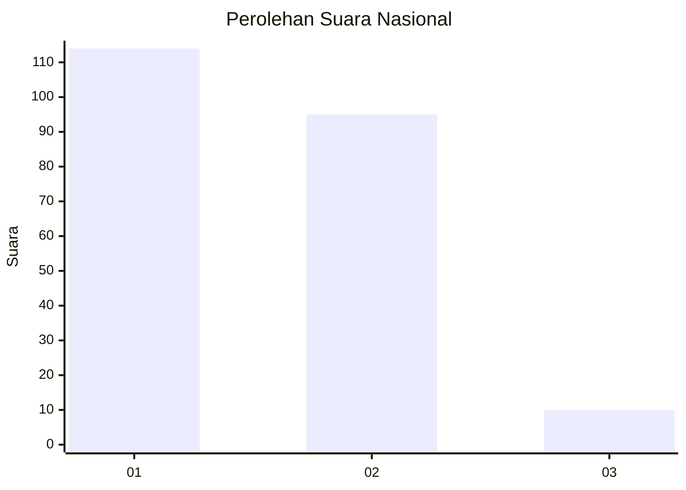
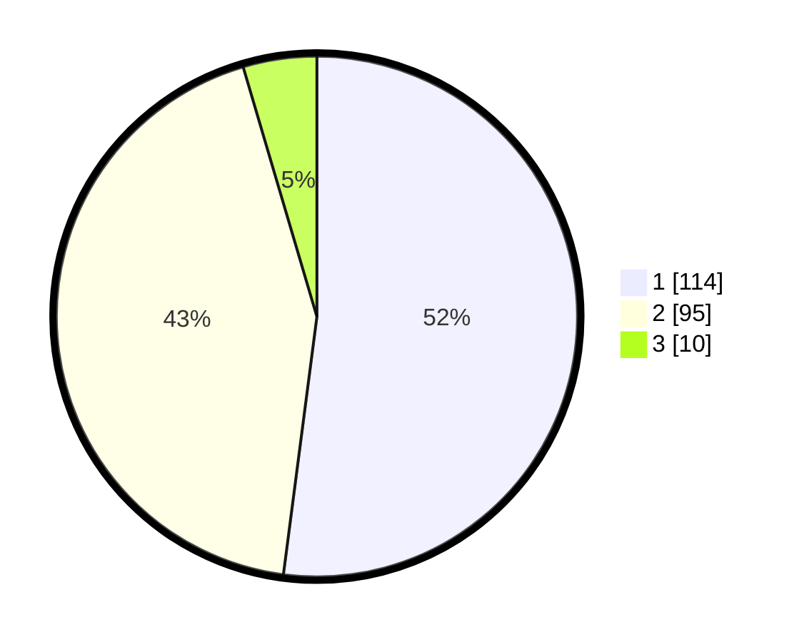

# Hasil

## Grafik

## Tabel

| No.    | Nama Paslon    | Suara | Suara (raw) | Persentase |
|:------ |:-------------- | -----:| -----------:| ----------:|
| 100025 | ANIES MUHAIMIN | 114   | [114][p-1]  | 52,05      |
| 100026 | PRABOWO GIBRAN | 95    | [95][p-2]   | 43,38      |
| 100027 | GANJAR MAHFUD  | 10    | [10][p-3]   | 4,57       |

[p-1]: https://github.com/gigit-pemilu/pemilu-2024/blob/main/pilpres/hitung-suara/sub/31-dki-jakarta/sub/75-jakarta-timur/sub/03-jatinegara/sub/1004-rawa-bunga/sub/031-tps/sub/paslon-1.txt
[p-2]: https://github.com/gigit-pemilu/pemilu-2024/blob/main/pilpres/hitung-suara/sub/31-dki-jakarta/sub/75-jakarta-timur/sub/03-jatinegara/sub/1004-rawa-bunga/sub/031-tps/sub/paslon-2.txt
[p-3]: https://github.com/gigit-pemilu/pemilu-2024/blob/main/pilpres/hitung-suara/sub/31-dki-jakarta/sub/75-jakarta-timur/sub/03-jatinegara/sub/1004-rawa-bunga/sub/031-tps/sub/paslon-3.txt

## Foto C Plano

https://sirekap-obj-formc.kpu.go.id/bce8/pemilu/ppwp/31/75/03/10/04/3175031004031-20240214-214130--a4043907-2159-4775-b9e6-d5dc878ef4b8.jpg

https://sirekap-obj-formc.kpu.go.id/bce8/pemilu/ppwp/31/75/03/10/04/3175031004031-20240214-214243--04edd34f-e7f6-47fe-b85d-9ce4144fb3b8.jpg

https://sirekap-obj-formc.kpu.go.id/bce8/pemilu/ppwp/31/75/03/10/04/3175031004031-20240214-214410--e6bb9da1-a25b-424a-9890-263c9057f210.jpg

## Metadata

| Key        | Value               |
| ---------- | ------------------- |
| Time Stamp | 2024-02-15 23:29:50 |

