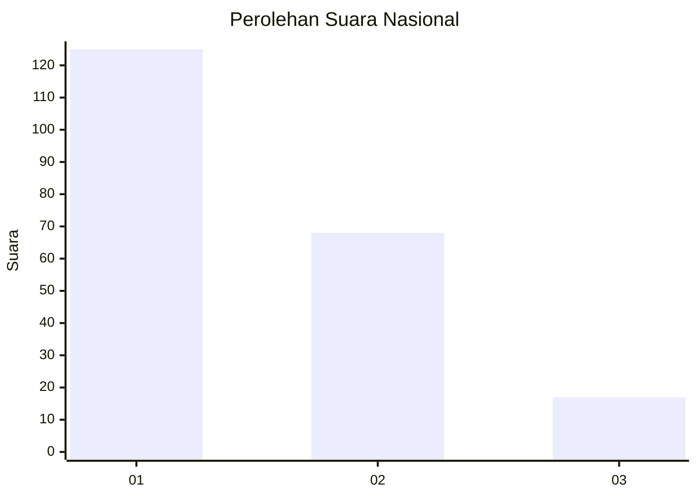
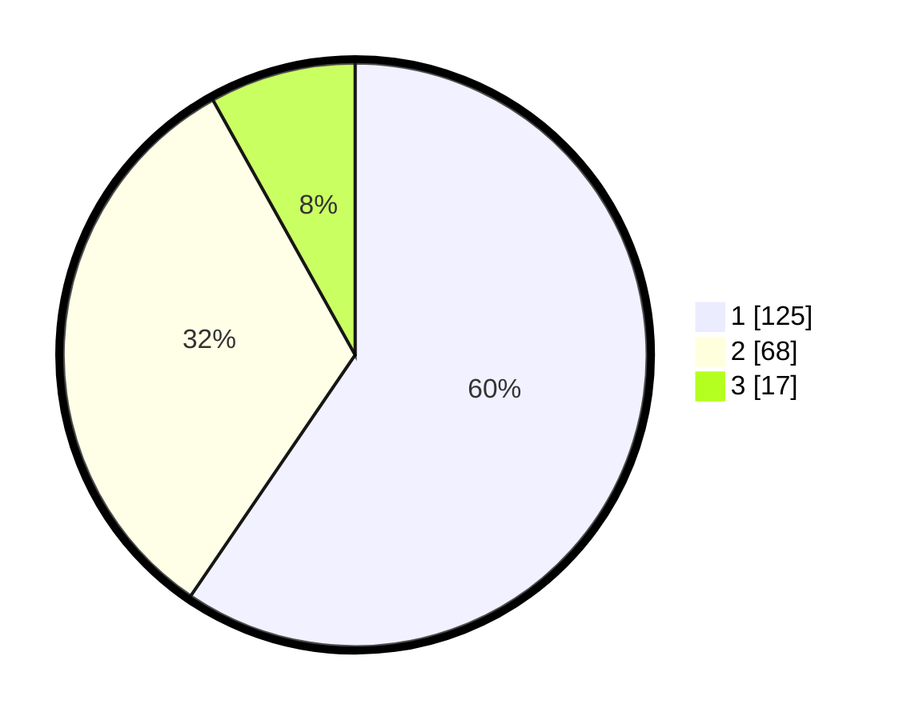

# Hasil

## Grafik

## Tabel

| No.    | Nama Paslon    | Suara | Suara (raw) | Persentase |
|:------ |:-------------- | -----:| -----------:| ----------:|
| 100025 | ANIES MUHAIMIN | 125   | [125][p-1]  | 59,52      |
| 100026 | PRABOWO GIBRAN | 68    | [68][p-2]   | 32,38      |
| 100027 | GANJAR MAHFUD  | 17    | [17][p-3]   | 8,10       |

[p-1]: https://github.com/gigit-pemilu/pemilu-2024/blob/main/pilpres/hitung-suara/sub/31-dki-jakarta/sub/75-jakarta-timur/sub/03-jatinegara/sub/1004-rawa-bunga/sub/048-tps/sub/paslon-1.txt
[p-2]: https://github.com/gigit-pemilu/pemilu-2024/blob/main/pilpres/hitung-suara/sub/31-dki-jakarta/sub/75-jakarta-timur/sub/03-jatinegara/sub/1004-rawa-bunga/sub/048-tps/sub/paslon-2.txt
[p-3]: https://github.com/gigit-pemilu/pemilu-2024/blob/main/pilpres/hitung-suara/sub/31-dki-jakarta/sub/75-jakarta-timur/sub/03-jatinegara/sub/1004-rawa-bunga/sub/048-tps/sub/paslon-3.txt

## Foto C Plano

https://sirekap-obj-formc.kpu.go.id/5895/pemilu/ppwp/31/75/03/10/04/3175031004048-20240215-003832--cd832eed-6ab1-4e6c-b22c-44943595a672.jpg

https://sirekap-obj-formc.kpu.go.id/5895/pemilu/ppwp/31/75/03/10/04/3175031004048-20240214-222218--88c0932d-7780-4a00-bbc4-39e4bf6b8e5c.jpg

https://sirekap-obj-formc.kpu.go.id/5895/pemilu/ppwp/31/75/03/10/04/3175031004048-20240214-222303--3bcfeba6-b4a4-4886-ac29-7f3629f507f2.jpg

## Metadata

| Key        | Value               |
| ---------- | ------------------- |
| Time Stamp | 2024-02-24 22:31:28 |

