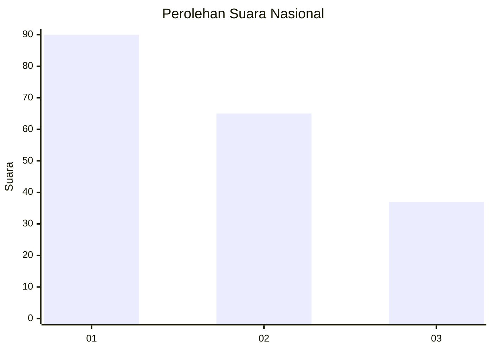
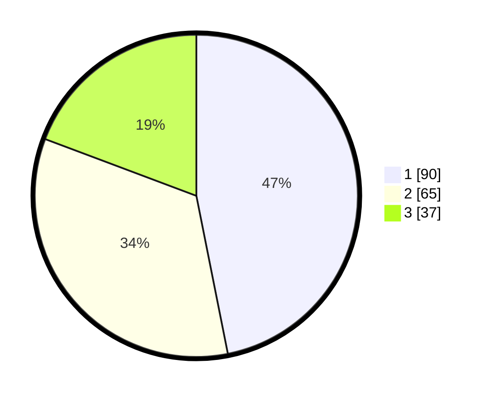

# Hasil

## Grafik

## Tabel

| No.    | Nama Paslon    | Suara | Suara (raw) | Persentase |
|:------ |:-------------- | -----:| -----------:| ----------:|
| 100025 | ANIES MUHAIMIN | 90    | [90][p-1]   | 46,88      |
| 100026 | PRABOWO GIBRAN | 65    | [65][p-2]   | 33,85      |
| 100027 | GANJAR MAHFUD  | 37    | [37][p-3]   | 19,27      |

[p-1]: https://github.com/gigit-pemilu/pemilu-2024/blob/main/pilpres/hitung-suara/sub/31-dki-jakarta/sub/75-jakarta-timur/sub/03-jatinegara/sub/1005-cipinang-cempedak/sub/006-tps/sub/paslon-1.txt
[p-2]: https://github.com/gigit-pemilu/pemilu-2024/blob/main/pilpres/hitung-suara/sub/31-dki-jakarta/sub/75-jakarta-timur/sub/03-jatinegara/sub/1005-cipinang-cempedak/sub/006-tps/sub/paslon-2.txt
[p-3]: https://github.com/gigit-pemilu/pemilu-2024/blob/main/pilpres/hitung-suara/sub/31-dki-jakarta/sub/75-jakarta-timur/sub/03-jatinegara/sub/1005-cipinang-cempedak/sub/006-tps/sub/paslon-3.txt

## Foto C Plano

https://sirekap-obj-formc.kpu.go.id/f731/pemilu/ppwp/31/75/03/10/05/3175031005006-20240215-003454--ec48c1ab-786e-4c9e-847b-38dc9e4a61b5.jpg

https://sirekap-obj-formc.kpu.go.id/f731/pemilu/ppwp/31/75/03/10/05/3175031005006-20240215-003052--bcf29b09-c3b6-417b-a7a7-49288cece203.jpg

https://sirekap-obj-formc.kpu.go.id/f731/pemilu/ppwp/31/75/03/10/05/3175031005006-20240215-002957--cbfe86f6-2110-4daa-908a-b7336123b50f.jpg

## Metadata

| Key        | Value               |
| ---------- | ------------------- |
| Time Stamp | 2024-02-15 19:30:26 |

