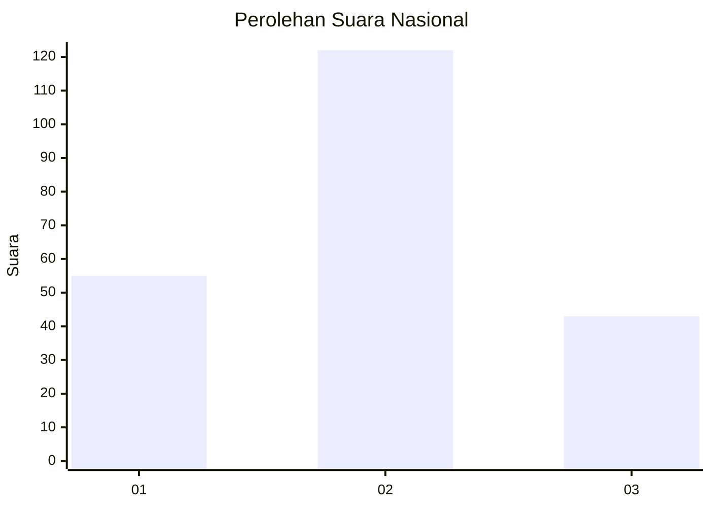
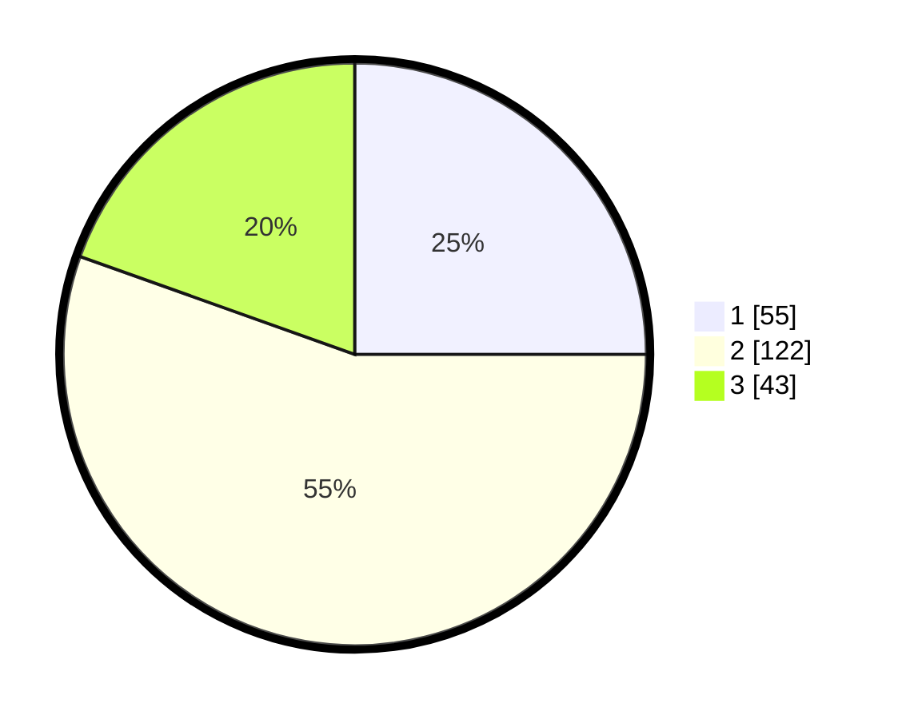

# Hasil

## Grafik

## Tabel

| No.    | Nama Paslon    | Suara | Suara (raw) | Persentase |
|:------ |:-------------- | -----:| -----------:| ----------:|
| 100025 | ANIES MUHAIMIN | 55    | [55][p-1]   | 25,00      |
| 100026 | PRABOWO GIBRAN | 122   | [122][p-2]  | 55,45      |
| 100027 | GANJAR MAHFUD  | 43    | [43][p-3]   | 19,55      |

[p-1]: https://github.com/gigit-pemilu/pemilu-2024/blob/main/pilpres/hitung-suara/sub/31-dki-jakarta/sub/75-jakarta-timur/sub/03-jatinegara/sub/1005-cipinang-cempedak/sub/015-tps/sub/paslon-1.txt
[p-2]: https://github.com/gigit-pemilu/pemilu-2024/blob/main/pilpres/hitung-suara/sub/31-dki-jakarta/sub/75-jakarta-timur/sub/03-jatinegara/sub/1005-cipinang-cempedak/sub/015-tps/sub/paslon-2.txt
[p-3]: https://github.com/gigit-pemilu/pemilu-2024/blob/main/pilpres/hitung-suara/sub/31-dki-jakarta/sub/75-jakarta-timur/sub/03-jatinegara/sub/1005-cipinang-cempedak/sub/015-tps/sub/paslon-3.txt

## Foto C Plano

https://sirekap-obj-formc.kpu.go.id/6ef9/pemilu/ppwp/31/75/03/10/05/3175031005015-20240214-191510--6284e846-6e21-4c45-9aa9-6e287c23b91c.jpg

https://sirekap-obj-formc.kpu.go.id/6ef9/pemilu/ppwp/31/75/03/10/05/3175031005015-20240214-190750--48160554-c848-4364-a5b4-7d9cace7c2ce.jpg

https://sirekap-obj-formc.kpu.go.id/6ef9/pemilu/ppwp/31/75/03/10/05/3175031005015-20240214-190904--ccc1a57e-8637-4069-9b4d-37a6c76d19af.jpg

## Metadata

| Key        | Value               |
| ---------- | ------------------- |
| Time Stamp | 2024-02-15 23:29:50 |

