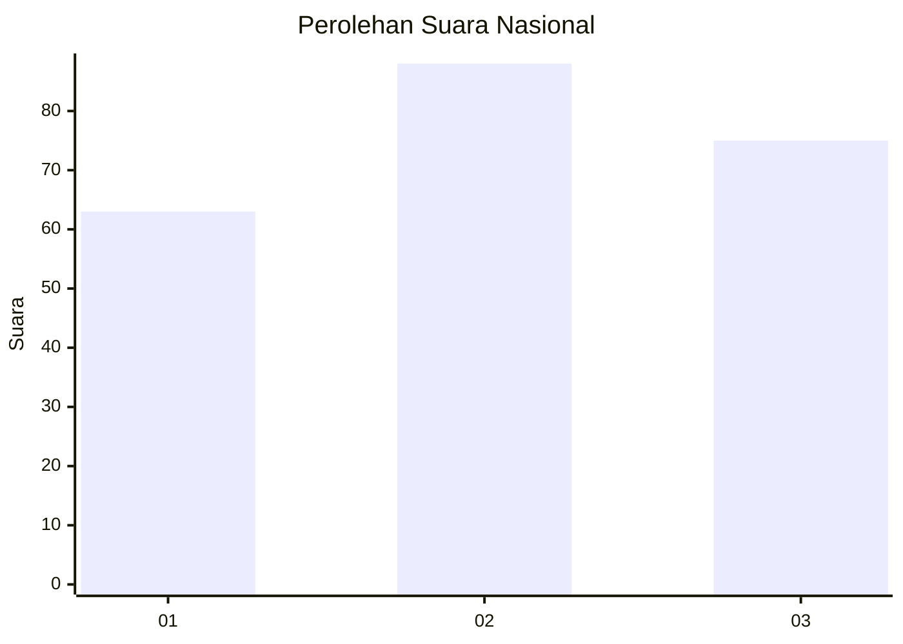
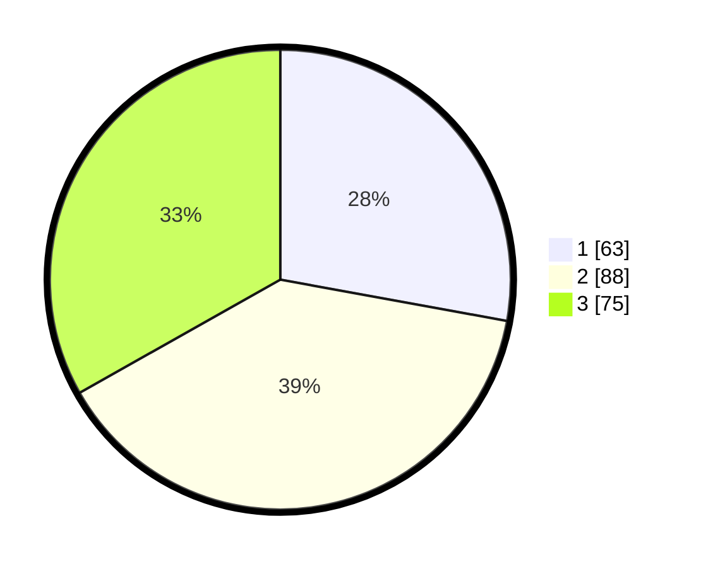

# Hasil

## Grafik

## Tabel

| No.    | Nama Paslon    | Suara | Suara (raw) | Persentase |
|:------ |:-------------- | -----:| -----------:| ----------:|
| 100025 | ANIES MUHAIMIN | 63    | [63][p-1]   | 27,88      |
| 100026 | PRABOWO GIBRAN | 88    | [88][p-2]   | 38,94      |
| 100027 | GANJAR MAHFUD  | 75    | [75][p-3]   | 33,19      |

[p-1]: https://github.com/gigit-pemilu/pemilu-2024/blob/main/pilpres/hitung-suara/sub/31-dki-jakarta/sub/75-jakarta-timur/sub/03-jatinegara/sub/1005-cipinang-cempedak/sub/017-tps/sub/paslon-1.txt
[p-2]: https://github.com/gigit-pemilu/pemilu-2024/blob/main/pilpres/hitung-suara/sub/31-dki-jakarta/sub/75-jakarta-timur/sub/03-jatinegara/sub/1005-cipinang-cempedak/sub/017-tps/sub/paslon-2.txt
[p-3]: https://github.com/gigit-pemilu/pemilu-2024/blob/main/pilpres/hitung-suara/sub/31-dki-jakarta/sub/75-jakarta-timur/sub/03-jatinegara/sub/1005-cipinang-cempedak/sub/017-tps/sub/paslon-3.txt

## Foto C Plano

https://sirekap-obj-formc.kpu.go.id/6ef5/pemilu/ppwp/31/75/03/10/05/3175031005017-20240214-234430--f4fd59d2-5c00-4bc6-af89-9bb0d410e552.jpg

https://sirekap-obj-formc.kpu.go.id/6ef5/pemilu/ppwp/31/75/03/10/05/3175031005017-20240214-200302--b2708520-7c25-454a-8dd6-6f8bf77155d5.jpg

https://sirekap-obj-formc.kpu.go.id/6ef5/pemilu/ppwp/31/75/03/10/05/3175031005017-20240214-234846--1a3a6df7-69c6-4841-8da5-8af1f424ef74.jpg

## Metadata

| Key        | Value               |
| ---------- | ------------------- |
| Time Stamp | 2024-02-24 22:31:28 |

