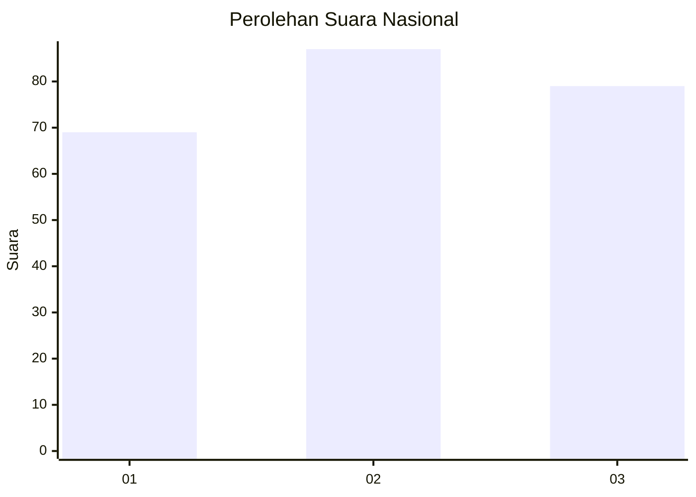
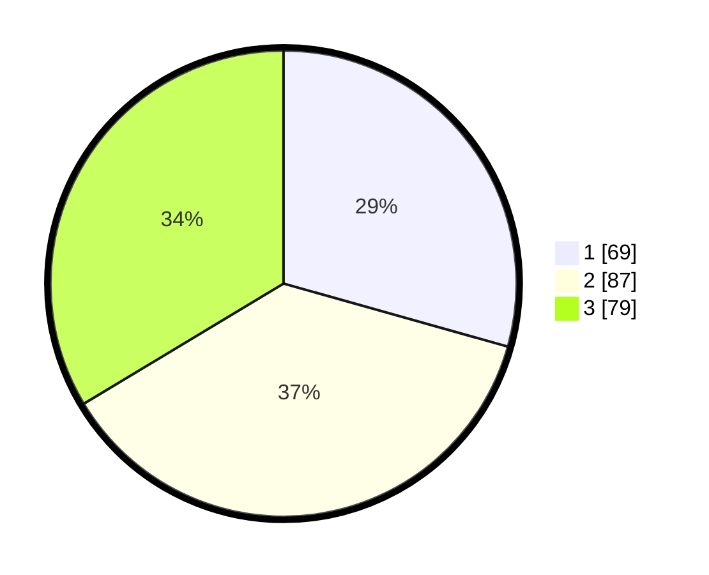

# Hasil

## Grafik

## Tabel

| No.    | Nama Paslon    | Suara | Suara (raw) | Persentase |
|:------ |:-------------- | -----:| -----------:| ----------:|
| 100025 | ANIES MUHAIMIN | 69    | [69][p-1]   | 29,36      |
| 100026 | PRABOWO GIBRAN | 87    | [87][p-2]   | 37,02      |
| 100027 | GANJAR MAHFUD  | 79    | [79][p-3]   | 33,62      |

[p-1]: https://github.com/gigit-pemilu/pemilu-2024/blob/main/pilpres/hitung-suara/sub/31-dki-jakarta/sub/75-jakarta-timur/sub/03-jatinegara/sub/1005-cipinang-cempedak/sub/026-tps/sub/paslon-1.txt
[p-2]: https://github.com/gigit-pemilu/pemilu-2024/blob/main/pilpres/hitung-suara/sub/31-dki-jakarta/sub/75-jakarta-timur/sub/03-jatinegara/sub/1005-cipinang-cempedak/sub/026-tps/sub/paslon-2.txt
[p-3]: https://github.com/gigit-pemilu/pemilu-2024/blob/main/pilpres/hitung-suara/sub/31-dki-jakarta/sub/75-jakarta-timur/sub/03-jatinegara/sub/1005-cipinang-cempedak/sub/026-tps/sub/paslon-3.txt

## Foto C Plano

https://sirekap-obj-formc.kpu.go.id/a25c/pemilu/ppwp/31/75/03/10/05/3175031005026-20240214-233522--d2296286-3b61-4a63-b9ea-fb447dbaf86f.jpg

https://sirekap-obj-formc.kpu.go.id/a25c/pemilu/ppwp/31/75/03/10/05/3175031005026-20240214-233754--5d7a0290-b0aa-4e94-8fef-fa73f7cfaf61.jpg

https://sirekap-obj-formc.kpu.go.id/a25c/pemilu/ppwp/31/75/03/10/05/3175031005026-20240214-234007--dcfac18b-7dea-4de3-9e30-423775eb4bb0.jpg

## Metadata

| Key        | Value               |
| ---------- | ------------------- |
| Time Stamp | 2024-02-15 16:00:26 |

