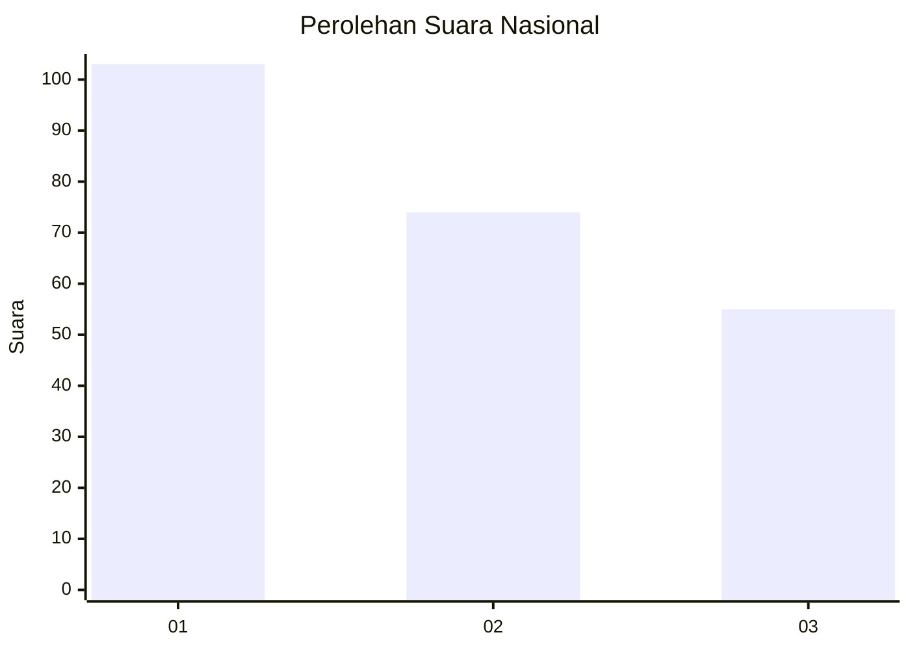
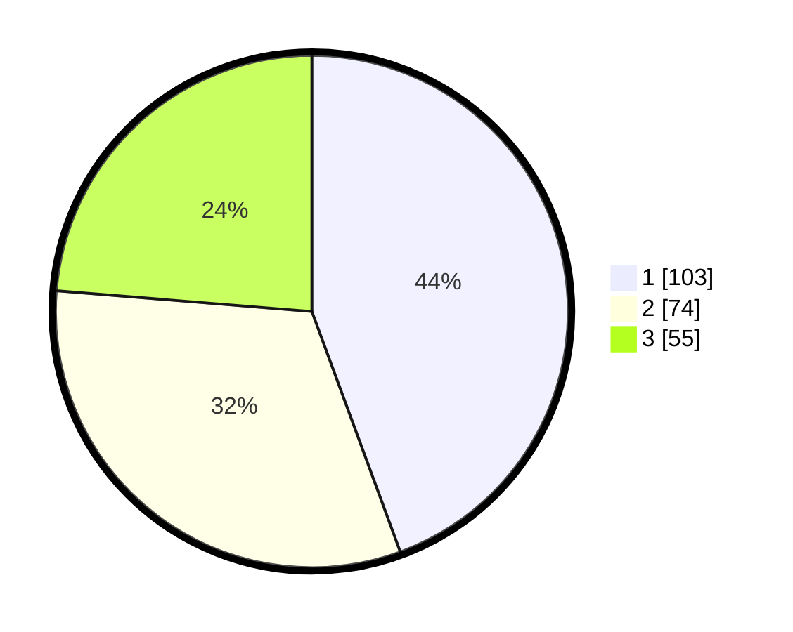

# Hasil

## Grafik

## Tabel

| No.    | Nama Paslon    | Suara | Suara (raw) | Persentase |
|:------ |:-------------- | -----:| -----------:| ----------:|
| 100025 | ANIES MUHAIMIN | 103   | [103][p-1]  | 44,40      |
| 100026 | PRABOWO GIBRAN | 74    | [74][p-2]   | 31,90      |
| 100027 | GANJAR MAHFUD  | 55    | [55][p-3]   | 23,71      |

[p-1]: https://github.com/gigit-pemilu/pemilu-2024/blob/main/pilpres/hitung-suara/sub/31-dki-jakarta/sub/75-jakarta-timur/sub/03-jatinegara/sub/1005-cipinang-cempedak/sub/038-tps/sub/paslon-1.txt
[p-2]: https://github.com/gigit-pemilu/pemilu-2024/blob/main/pilpres/hitung-suara/sub/31-dki-jakarta/sub/75-jakarta-timur/sub/03-jatinegara/sub/1005-cipinang-cempedak/sub/038-tps/sub/paslon-2.txt
[p-3]: https://github.com/gigit-pemilu/pemilu-2024/blob/main/pilpres/hitung-suara/sub/31-dki-jakarta/sub/75-jakarta-timur/sub/03-jatinegara/sub/1005-cipinang-cempedak/sub/038-tps/sub/paslon-3.txt

## Foto C Plano

https://sirekap-obj-formc.kpu.go.id/e777/pemilu/ppwp/31/75/03/10/05/3175031005038-20240215-001542--bceaf999-4cd3-49b6-bac8-1bc1832f1b81.jpg

https://sirekap-obj-formc.kpu.go.id/e777/pemilu/ppwp/31/75/03/10/05/3175031005038-20240215-002627--a1c55fa7-e29e-4e12-8754-b5c4410f0879.jpg

https://sirekap-obj-formc.kpu.go.id/e777/pemilu/ppwp/31/75/03/10/05/3175031005038-20240214-221513--f1bb99f7-bbd3-42df-8518-b3dc4a1b83ff.jpg

## Metadata

| Key        | Value               |
| ---------- | ------------------- |
| Time Stamp | 2024-02-24 22:31:28 |

