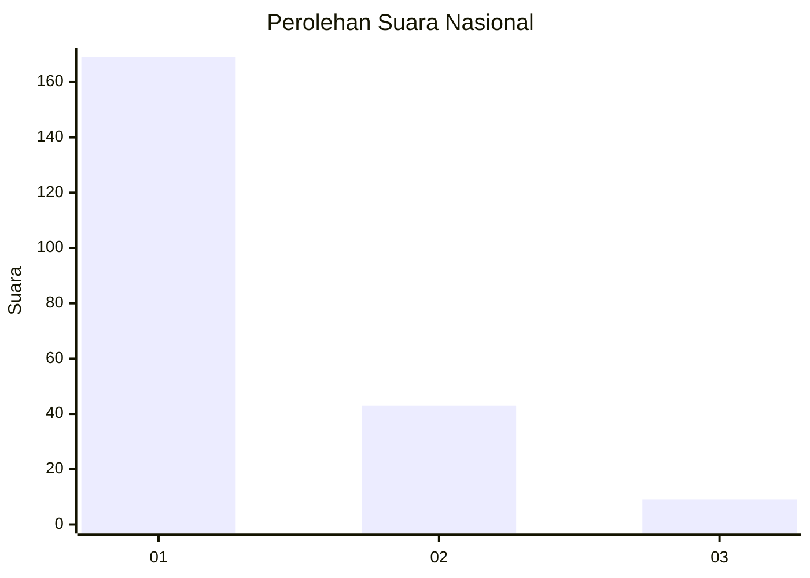
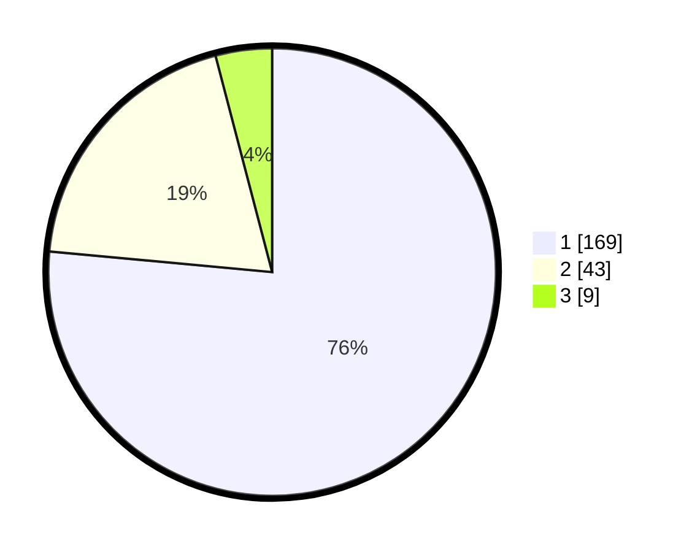

# Hasil

## Grafik

## Tabel

| No.    | Nama Paslon    | Suara | Suara (raw) | Persentase |
|:------ |:-------------- | -----:| -----------:| ----------:|
| 100025 | ANIES MUHAIMIN | 169   | [169][p-1]  | 76,47      |
| 100026 | PRABOWO GIBRAN | 43    | [43][p-2]   | 19,46      |
| 100027 | GANJAR MAHFUD  | 9     | [9][p-3]    | 4,07       |

[p-1]: https://github.com/gigit-pemilu/pemilu-2024/blob/main/pilpres/hitung-suara/sub/31-dki-jakarta/sub/75-jakarta-timur/sub/03-jatinegara/sub/1005-cipinang-cempedak/sub/066-tps/sub/paslon-1.txt
[p-2]: https://github.com/gigit-pemilu/pemilu-2024/blob/main/pilpres/hitung-suara/sub/31-dki-jakarta/sub/75-jakarta-timur/sub/03-jatinegara/sub/1005-cipinang-cempedak/sub/066-tps/sub/paslon-2.txt
[p-3]: https://github.com/gigit-pemilu/pemilu-2024/blob/main/pilpres/hitung-suara/sub/31-dki-jakarta/sub/75-jakarta-timur/sub/03-jatinegara/sub/1005-cipinang-cempedak/sub/066-tps/sub/paslon-3.txt

## Foto C Plano

https://sirekap-obj-formc.kpu.go.id/30a9/pemilu/ppwp/31/75/03/10/05/3175031005066-20240215-000447--cbdd7ae8-fe7d-45d4-aff0-0a4128d7f17d.jpg

https://sirekap-obj-formc.kpu.go.id/30a9/pemilu/ppwp/31/75/03/10/05/3175031005066-20240215-000629--c6481b7c-394f-4809-a453-067bb838e523.jpg

https://sirekap-obj-formc.kpu.go.id/30a9/pemilu/ppwp/31/75/03/10/05/3175031005066-20240215-000743--9dde41ca-75be-41cc-9ac9-2b2d72843dab.jpg

## Metadata

| Key        | Value               |
| ---------- | ------------------- |
| Time Stamp | 2024-02-15 12:00:28 |

