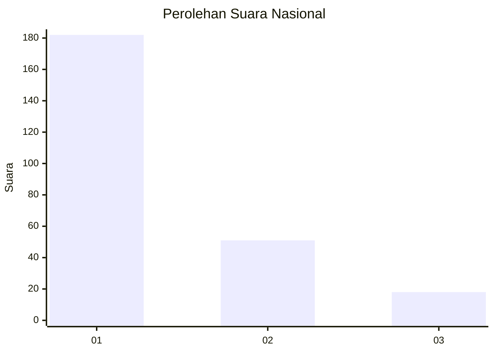
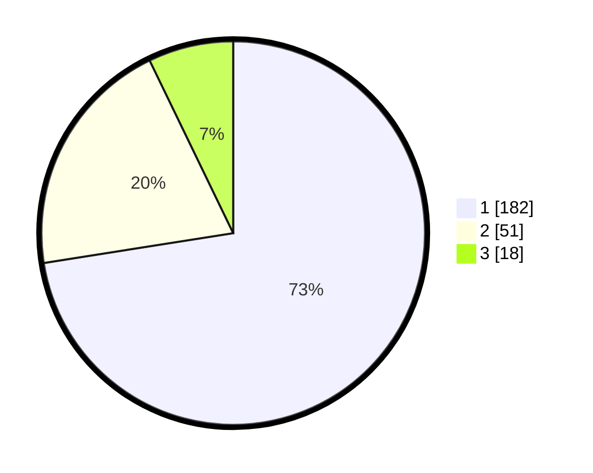

# Hasil

## Grafik

## Tabel

| No.    | Nama Paslon    | Suara | Suara (raw) | Persentase |
|:------ |:-------------- | -----:| -----------:| ----------:|
| 100025 | ANIES MUHAIMIN | 182   | [182][p-1]  | 72,51      |
| 100026 | PRABOWO GIBRAN | 51    | [51][p-2]   | 20,32      |
| 100027 | GANJAR MAHFUD  | 18    | [18][p-3]   | 7,17       |

[p-1]: https://github.com/gigit-pemilu/pemilu-2024/blob/main/pilpres/hitung-suara/sub/31-dki-jakarta/sub/75-jakarta-timur/sub/03-jatinegara/sub/1005-cipinang-cempedak/sub/083-tps/sub/paslon-1.txt
[p-2]: https://github.com/gigit-pemilu/pemilu-2024/blob/main/pilpres/hitung-suara/sub/31-dki-jakarta/sub/75-jakarta-timur/sub/03-jatinegara/sub/1005-cipinang-cempedak/sub/083-tps/sub/paslon-2.txt
[p-3]: https://github.com/gigit-pemilu/pemilu-2024/blob/main/pilpres/hitung-suara/sub/31-dki-jakarta/sub/75-jakarta-timur/sub/03-jatinegara/sub/1005-cipinang-cempedak/sub/083-tps/sub/paslon-3.txt

## Foto C Plano

https://sirekap-obj-formc.kpu.go.id/c787/pemilu/ppwp/31/75/03/10/05/3175031005083-20240214-222909--3f7778a5-3b3e-4253-bd26-619d9724cd0f.jpg

https://sirekap-obj-formc.kpu.go.id/c787/pemilu/ppwp/31/75/03/10/05/3175031005083-20240214-224057--eeb188d8-e811-47a3-8811-9bf670ff55e6.jpg

https://sirekap-obj-formc.kpu.go.id/c787/pemilu/ppwp/31/75/03/10/05/3175031005083-20240214-224233--39b76d2f-8694-4d32-a6b0-f9aa13b354fa.jpg

## Metadata

| Key        | Value               |
| ---------- | ------------------- |
| Time Stamp | 2024-02-24 22:31:28 |

