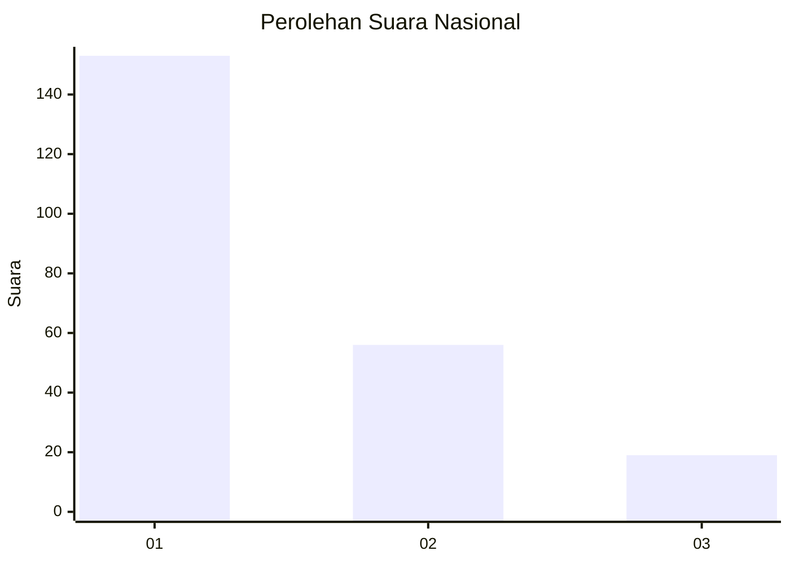
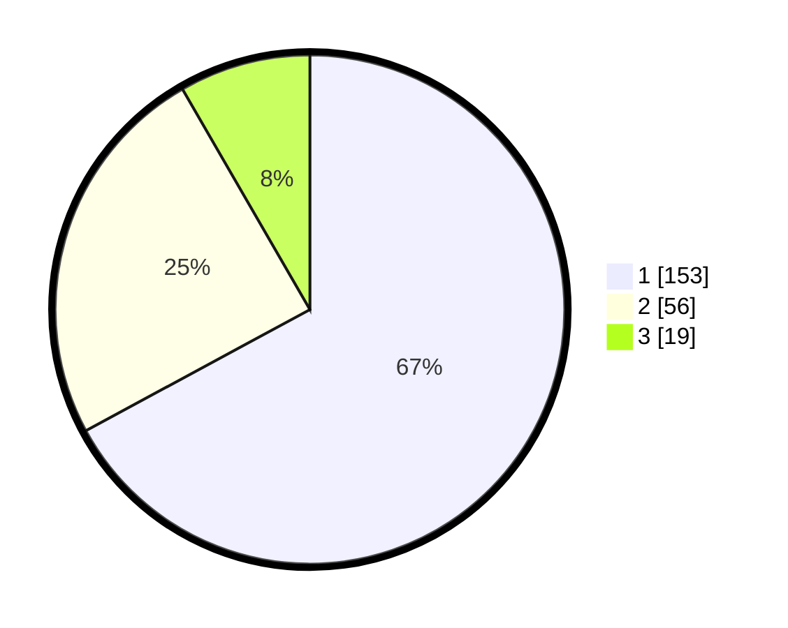

# Hasil

## Grafik

## Tabel

| No.    | Nama Paslon    | Suara | Suara (raw) | Persentase |
|:------ |:-------------- | -----:| -----------:| ----------:|
| 100025 | ANIES MUHAIMIN | 153   | [153][p-1]  | 67,11      |
| 100026 | PRABOWO GIBRAN | 56    | [56][p-2]   | 24,56      |
| 100027 | GANJAR MAHFUD  | 19    | [19][p-3]   | 8,33       |

[p-1]: https://github.com/gigit-pemilu/pemilu-2024/blob/main/pilpres/hitung-suara/sub/31-dki-jakarta/sub/75-jakarta-timur/sub/03-jatinegara/sub/1005-cipinang-cempedak/sub/086-tps/sub/paslon-1.txt
[p-2]: https://github.com/gigit-pemilu/pemilu-2024/blob/main/pilpres/hitung-suara/sub/31-dki-jakarta/sub/75-jakarta-timur/sub/03-jatinegara/sub/1005-cipinang-cempedak/sub/086-tps/sub/paslon-2.txt
[p-3]: https://github.com/gigit-pemilu/pemilu-2024/blob/main/pilpres/hitung-suara/sub/31-dki-jakarta/sub/75-jakarta-timur/sub/03-jatinegara/sub/1005-cipinang-cempedak/sub/086-tps/sub/paslon-3.txt

## Foto C Plano

https://sirekap-obj-formc.kpu.go.id/1f0f/pemilu/ppwp/31/75/03/10/05/3175031005086-20240215-010355--9024826d-b0ef-4a11-8a2a-b22ab89445e1.jpg

https://sirekap-obj-formc.kpu.go.id/1f0f/pemilu/ppwp/31/75/03/10/05/3175031005086-20240215-010430--a1486d7c-a32f-4aba-b0ef-9641445132ff.jpg

https://sirekap-obj-formc.kpu.go.id/1f0f/pemilu/ppwp/31/75/03/10/05/3175031005086-20240215-010804--3107861e-1ff8-40fa-b03e-5e1e23e490b8.jpg

## Metadata

| Key        | Value               |
| ---------- | ------------------- |
| Time Stamp | 2024-02-24 22:31:28 |

