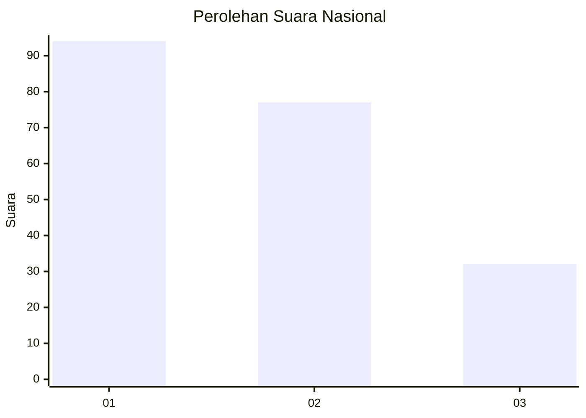
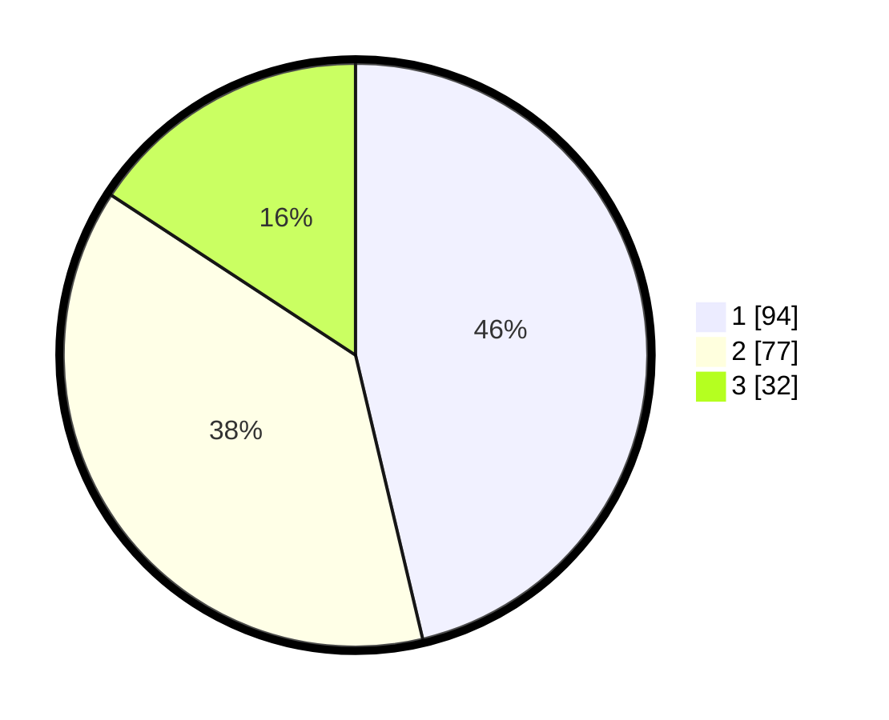

# Hasil

## Grafik

## Tabel

| No.    | Nama Paslon    | Suara | Suara (raw) | Persentase |
|:------ |:-------------- | -----:| -----------:| ----------:|
| 100025 | ANIES MUHAIMIN | 94    | [94][p-1]   | 46,31      |
| 100026 | PRABOWO GIBRAN | 77    | [77][p-2]   | 37,93      |
| 100027 | GANJAR MAHFUD  | 32    | [32][p-3]   | 15,76      |

[p-1]: https://github.com/gigit-pemilu/pemilu-2024/blob/main/pilpres/hitung-suara/sub/31-dki-jakarta/sub/75-jakarta-timur/sub/03-jatinegara/sub/1006-cipinang-muara/sub/012-tps/sub/paslon-1.txt
[p-2]: https://github.com/gigit-pemilu/pemilu-2024/blob/main/pilpres/hitung-suara/sub/31-dki-jakarta/sub/75-jakarta-timur/sub/03-jatinegara/sub/1006-cipinang-muara/sub/012-tps/sub/paslon-2.txt
[p-3]: https://github.com/gigit-pemilu/pemilu-2024/blob/main/pilpres/hitung-suara/sub/31-dki-jakarta/sub/75-jakarta-timur/sub/03-jatinegara/sub/1006-cipinang-muara/sub/012-tps/sub/paslon-3.txt

## Foto C Plano

https://sirekap-obj-formc.kpu.go.id/0d3f/pemilu/ppwp/31/75/03/10/06/3175031006012-20240214-220649--780b6005-3920-48e1-9db3-9a8be19473db.jpg

https://sirekap-obj-formc.kpu.go.id/0d3f/pemilu/ppwp/31/75/03/10/06/3175031006012-20240214-220756--bb1c88a7-90f0-4a2c-ac91-babdd3c9bf80.jpg

https://sirekap-obj-formc.kpu.go.id/0d3f/pemilu/ppwp/31/75/03/10/06/3175031006012-20240214-220815--fc3c5e5e-463d-41d6-8a9f-ba9aee7a1b6d.jpg

## Metadata

| Key        | Value               |
| ---------- | ------------------- |
| Time Stamp | 2024-02-24 22:31:28 |

