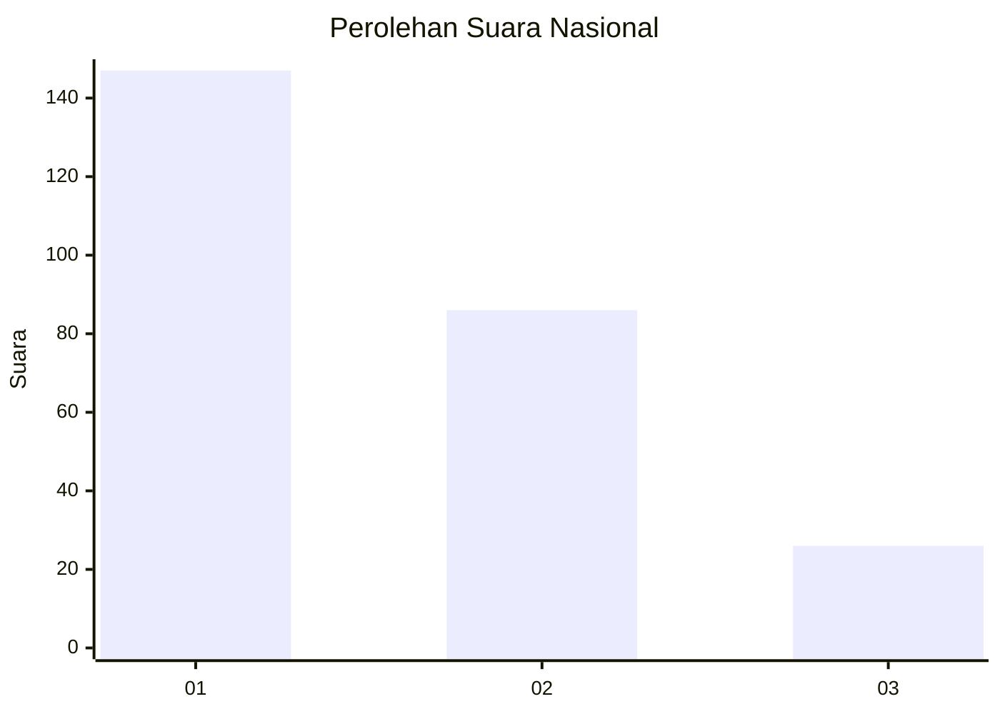
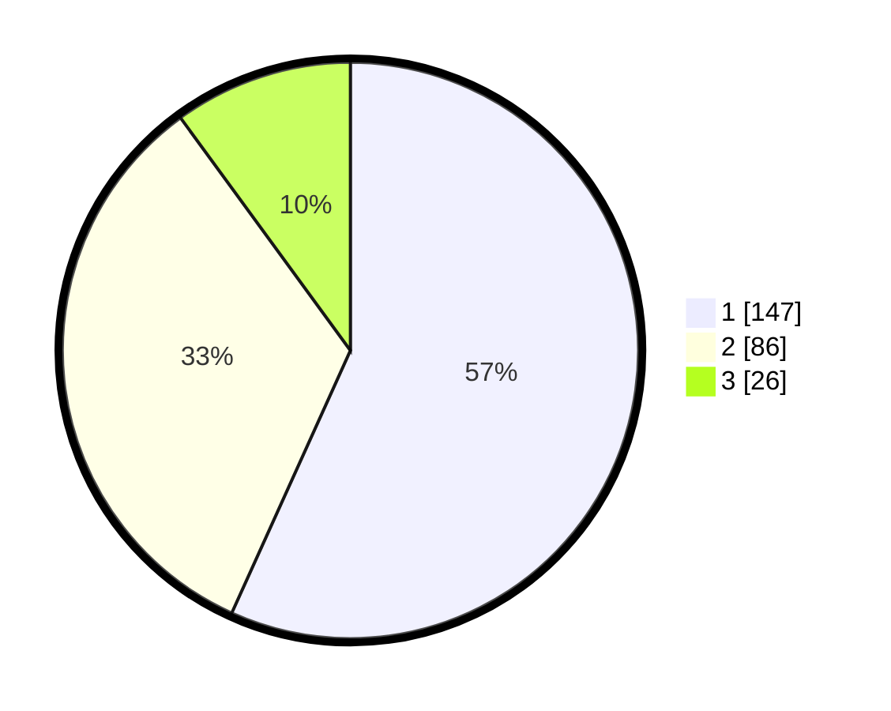

# Hasil

## Grafik

## Tabel

| No. | Nama Paslon    | Suara | Suara (raw) | Persentase |
|:--- |:-------------- | -----:| -----------:| ----------:|
| 1   | ANIES MUHAIMIN | 147   | [147][p-1]  | 56,76      |
| 2   | PRABOWO GIBRAN | 86    | [86][p-2]   | 33,20      |
| 3   | GANJAR MAHFUD  | 26    | [26][p-3]   | 10,04      |

[p-1]: https://github.com/gigit-pemilu/pemilu-2024/blob/main/pilpres/hitung-suara/sub/31-dki-jakarta/sub/75-jakarta-timur/sub/03-jatinegara/sub/1006-cipinang-muara/sub/016-tps/sub/paslon-1.txt
[p-2]: https://github.com/gigit-pemilu/pemilu-2024/blob/main/pilpres/hitung-suara/sub/31-dki-jakarta/sub/75-jakarta-timur/sub/03-jatinegara/sub/1006-cipinang-muara/sub/016-tps/sub/paslon-2.txt
[p-3]: https://github.com/gigit-pemilu/pemilu-2024/blob/main/pilpres/hitung-suara/sub/31-dki-jakarta/sub/75-jakarta-timur/sub/03-jatinegara/sub/1006-cipinang-muara/sub/016-tps/sub/paslon-3.txt

## Foto C Plano

https://sirekap-obj-formc.kpu.go.id/487b/pemilu/ppwp/31/75/03/10/06/3175031006016-20240215-100215--d4166ca6-7c69-4827-80c2-93469e38d123.jpg

https://sirekap-obj-formc.kpu.go.id/487b/pemilu/ppwp/31/75/03/10/06/3175031006016-20240215-100223--a7360a56-5859-46f8-bc4b-f23fa1648365.jpg

https://sirekap-obj-formc.kpu.go.id/487b/pemilu/ppwp/31/75/03/10/06/3175031006016-20240215-100228--6e211dc6-08b3-4c61-aa03-ab60cdefb4d6.jpg

## Metadata

| Key        | Value               |
| ---------- | ------------------- |
| Time Stamp | 2024-02-15 22:30:27 |

