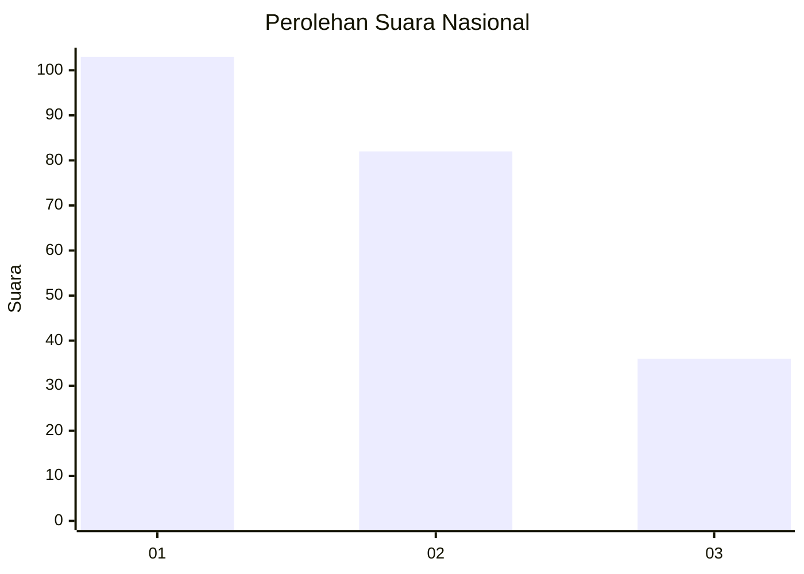
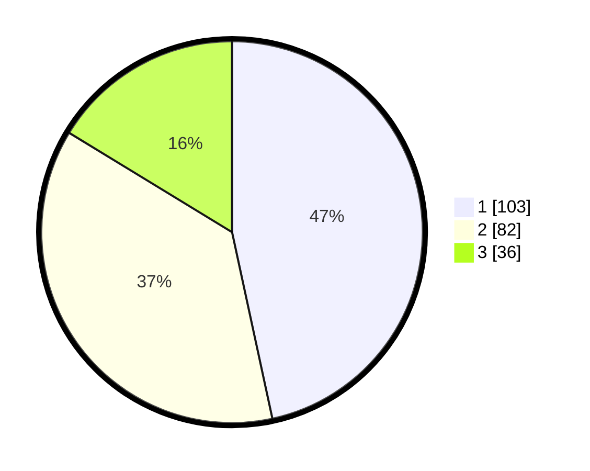

# Hasil

## Grafik

## Tabel

| No. | Nama Paslon    | Suara | Suara (raw) | Persentase |
|:--- |:-------------- | -----:| -----------:| ----------:|
| 1   | ANIES MUHAIMIN | 103   | [103][p-1]  | 46,61      |
| 2   | PRABOWO GIBRAN | 82    | [82][p-2]   | 37,10      |
| 3   | GANJAR MAHFUD  | 36    | [36][p-3]   | 16,29      |

[p-1]: https://github.com/gigit-pemilu/pemilu-2024/blob/main/pilpres/hitung-suara/sub/31-dki-jakarta/sub/75-jakarta-timur/sub/03-jatinegara/sub/1006-cipinang-muara/sub/018-tps/sub/paslon-1.txt
[p-2]: https://github.com/gigit-pemilu/pemilu-2024/blob/main/pilpres/hitung-suara/sub/31-dki-jakarta/sub/75-jakarta-timur/sub/03-jatinegara/sub/1006-cipinang-muara/sub/018-tps/sub/paslon-2.txt
[p-3]: https://github.com/gigit-pemilu/pemilu-2024/blob/main/pilpres/hitung-suara/sub/31-dki-jakarta/sub/75-jakarta-timur/sub/03-jatinegara/sub/1006-cipinang-muara/sub/018-tps/sub/paslon-3.txt

## Foto C Plano

https://sirekap-obj-formc.kpu.go.id/7ae3/pemilu/ppwp/31/75/03/10/06/3175031006018-20240217-235208--78beacac-f1cd-4291-9028-d023e866155c.jpg

https://sirekap-obj-formc.kpu.go.id/7ae3/pemilu/ppwp/31/75/03/10/06/3175031006018-20240217-235406--ef8cee73-0cf1-4848-a2a6-5394c476de6d.jpg

https://sirekap-obj-formc.kpu.go.id/7ae3/pemilu/ppwp/31/75/03/10/06/3175031006018-20240214-232607--cc34f693-dbce-4859-8053-52c5b8cb5880.jpg

## Metadata

| Key        | Value               |
| ---------- | ------------------- |
| Time Stamp | 2024-02-24 22:31:28 |

## DATA PEMILIH TETAP

Jumlah pemilih dalam DPT: **488**.
 * L: **445**.
 * P: **243**.

## DATA PENGGUNA HAK PILIH

Jumlah pengguna hak pilih dalam DPT: **630**.
 * L: **265**.
 * P: **283**.

Jumlah pengguna hak pilih dalam DPTb: **88**.
 * L: **888**.
 * P: **884**.

Jumlah pengguna hak pilih dalam DPK: **880**.
 * L: **888**.
 * P: **208**.

Jumlah pengguna hak pilih: **228**.
 * L: **405**.
 * P: **866**.

## JUMLAH SUARA SAH DAN TIDAK SAH

JUMLAH SELURUH SUARA SAH: **221**.

JUMLAH SUARA TIDAK SAH: **0**.

JUMLAH SELURUH SUARA SAH DAN SUARA TIDAK SAH: **221**.

