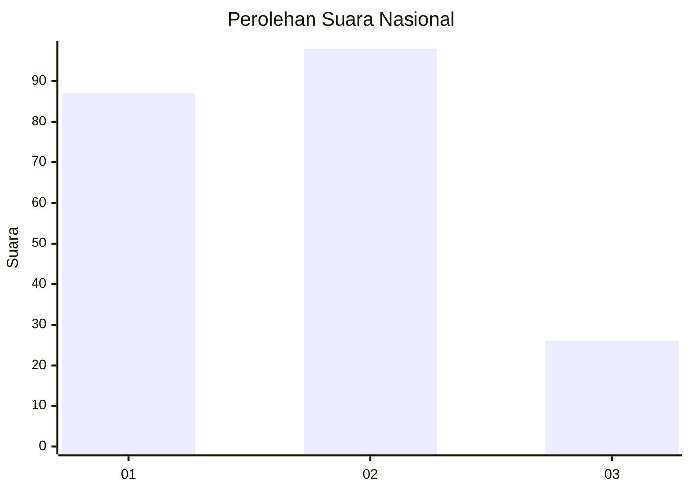
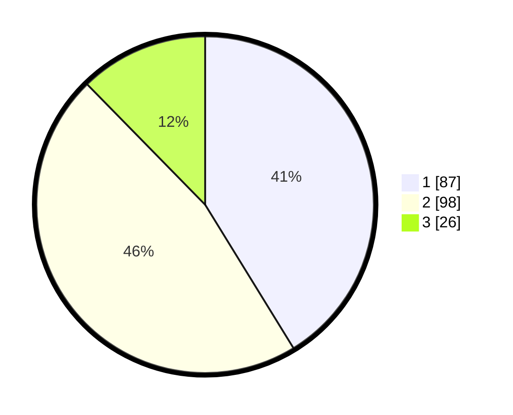

# Hasil

## Grafik

## Tabel

| No.    | Nama Paslon    | Suara | Suara (raw) | Persentase |
|:------ |:-------------- | -----:| -----------:| ----------:|
| 100025 | ANIES MUHAIMIN | 87    | [87][p-1]   | 41,23      |
| 100026 | PRABOWO GIBRAN | 98    | [98][p-2]   | 46,45      |
| 100027 | GANJAR MAHFUD  | 26    | [26][p-3]   | 12,32      |

[p-1]: https://github.com/gigit-pemilu/pemilu-2024/blob/main/pilpres/hitung-suara/sub/31-dki-jakarta/sub/75-jakarta-timur/sub/03-jatinegara/sub/1006-cipinang-muara/sub/023-tps/sub/paslon-1.txt
[p-2]: https://github.com/gigit-pemilu/pemilu-2024/blob/main/pilpres/hitung-suara/sub/31-dki-jakarta/sub/75-jakarta-timur/sub/03-jatinegara/sub/1006-cipinang-muara/sub/023-tps/sub/paslon-2.txt
[p-3]: https://github.com/gigit-pemilu/pemilu-2024/blob/main/pilpres/hitung-suara/sub/31-dki-jakarta/sub/75-jakarta-timur/sub/03-jatinegara/sub/1006-cipinang-muara/sub/023-tps/sub/paslon-3.txt

## Foto C Plano

https://sirekap-obj-formc.kpu.go.id/c0e9/pemilu/ppwp/31/75/03/10/06/3175031006023-20240214-211248--5111a07d-f045-4507-99cb-53ae406b70d1.jpg

https://sirekap-obj-formc.kpu.go.id/c0e9/pemilu/ppwp/31/75/03/10/06/3175031006023-20240214-203521--9ceb1722-ed50-420a-97a5-849fa04a4b14.jpg

https://sirekap-obj-formc.kpu.go.id/c0e9/pemilu/ppwp/31/75/03/10/06/3175031006023-20240214-211457--98603c54-2df5-491a-b28d-aaa35a8203b6.jpg

## Metadata

| Key        | Value               |
| ---------- | ------------------- |
| Time Stamp | 2024-02-15 22:30:27 |

