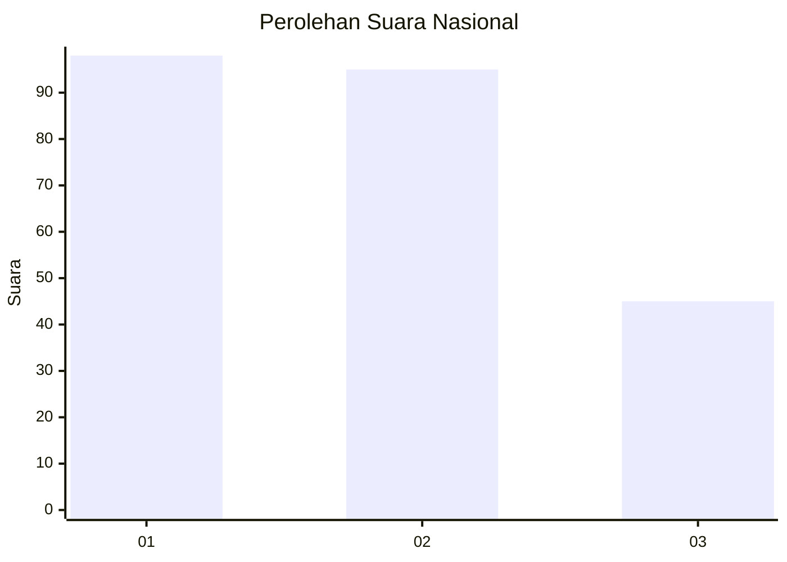
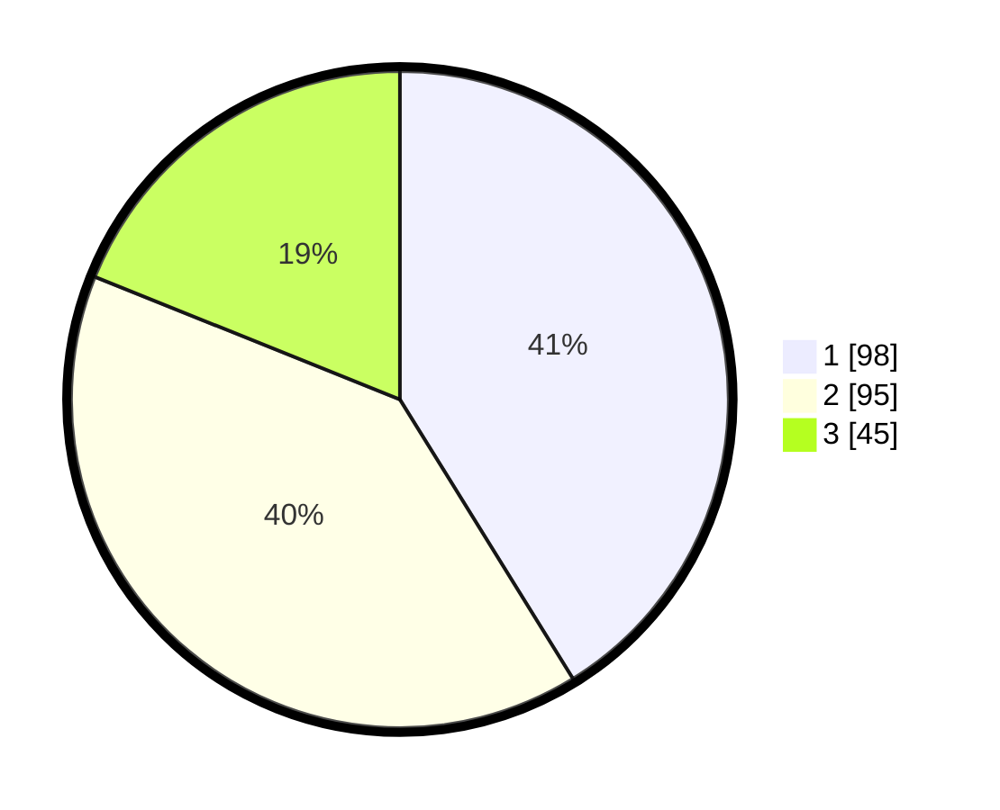

# Hasil

## Grafik

## Tabel

| No.    | Nama Paslon    | Suara | Suara (raw) | Persentase |
|:------ |:-------------- | -----:| -----------:| ----------:|
| 100025 | ANIES MUHAIMIN | 98    | [98][p-1]   | 41,18      |
| 100026 | PRABOWO GIBRAN | 95    | [95][p-2]   | 39,92      |
| 100027 | GANJAR MAHFUD  | 45    | [45][p-3]   | 18,91      |

[p-1]: https://github.com/gigit-pemilu/pemilu-2024/blob/main/pilpres/hitung-suara/sub/31-dki-jakarta/sub/75-jakarta-timur/sub/03-jatinegara/sub/1006-cipinang-muara/sub/029-tps/sub/paslon-1.txt
[p-2]: https://github.com/gigit-pemilu/pemilu-2024/blob/main/pilpres/hitung-suara/sub/31-dki-jakarta/sub/75-jakarta-timur/sub/03-jatinegara/sub/1006-cipinang-muara/sub/029-tps/sub/paslon-2.txt
[p-3]: https://github.com/gigit-pemilu/pemilu-2024/blob/main/pilpres/hitung-suara/sub/31-dki-jakarta/sub/75-jakarta-timur/sub/03-jatinegara/sub/1006-cipinang-muara/sub/029-tps/sub/paslon-3.txt

## Foto C Plano

https://sirekap-obj-formc.kpu.go.id/2977/pemilu/ppwp/31/75/03/10/06/3175031006029-20240214-235329--a931a7fb-34dc-4045-967c-8a2463e030c8.jpg

https://sirekap-obj-formc.kpu.go.id/2977/pemilu/ppwp/31/75/03/10/06/3175031006029-20240214-235627--b9be036b-b2b2-4449-8a8f-bc01fbe5cedb.jpg

https://sirekap-obj-formc.kpu.go.id/2977/pemilu/ppwp/31/75/03/10/06/3175031006029-20240214-235521--e4212c7a-739c-46c1-bd64-f19965b38a14.jpg

## Metadata

| Key        | Value               |
| ---------- | ------------------- |
| Time Stamp | 2024-02-16 00:00:26 |

