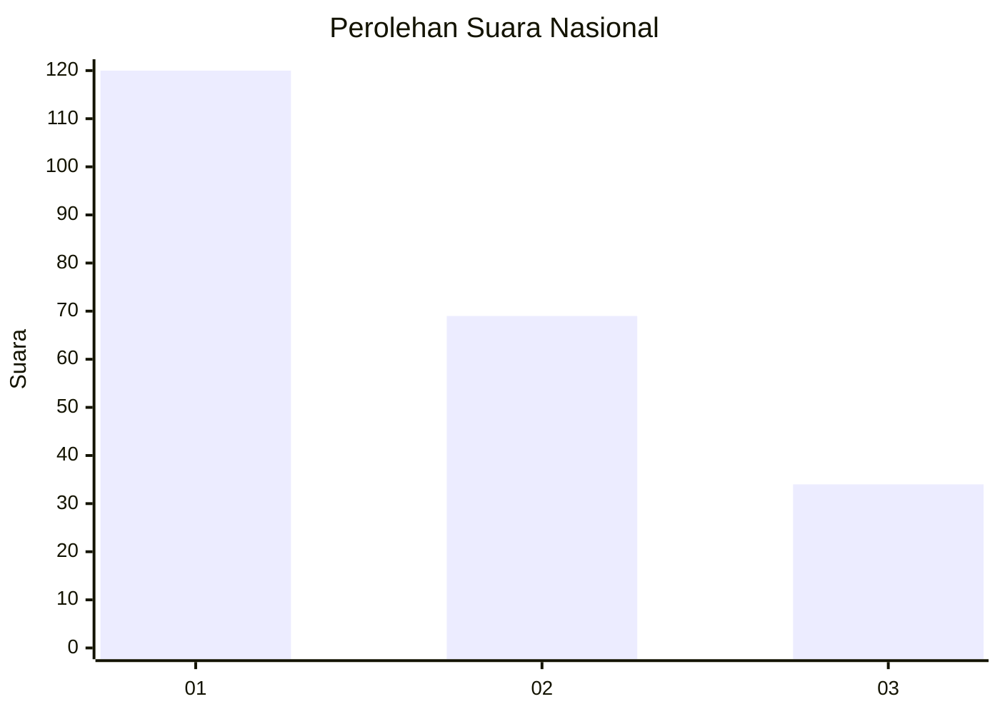
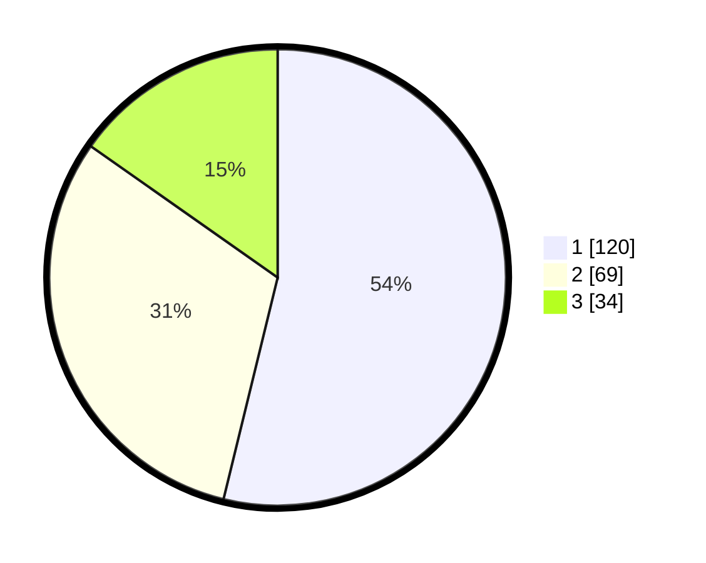

# Hasil

## Grafik

## Tabel

| No.    | Nama Paslon    | Suara | Suara (raw) | Persentase |
|:------ |:-------------- | -----:| -----------:| ----------:|
| 100025 | ANIES MUHAIMIN | 120   | [120][p-1]  | 53,81      |
| 100026 | PRABOWO GIBRAN | 69    | [69][p-2]   | 30,94      |
| 100027 | GANJAR MAHFUD  | 34    | [34][p-3]   | 15,25      |

[p-1]: https://github.com/gigit-pemilu/pemilu-2024/blob/main/pilpres/hitung-suara/sub/31-dki-jakarta/sub/75-jakarta-timur/sub/03-jatinegara/sub/1006-cipinang-muara/sub/061-tps/sub/paslon-1.txt
[p-2]: https://github.com/gigit-pemilu/pemilu-2024/blob/main/pilpres/hitung-suara/sub/31-dki-jakarta/sub/75-jakarta-timur/sub/03-jatinegara/sub/1006-cipinang-muara/sub/061-tps/sub/paslon-2.txt
[p-3]: https://github.com/gigit-pemilu/pemilu-2024/blob/main/pilpres/hitung-suara/sub/31-dki-jakarta/sub/75-jakarta-timur/sub/03-jatinegara/sub/1006-cipinang-muara/sub/061-tps/sub/paslon-3.txt

## Foto C Plano

https://sirekap-obj-formc.kpu.go.id/fb50/pemilu/ppwp/31/75/03/10/06/3175031006061-20240214-231003--e66909c9-a952-43b9-b422-19bfa14de7e3.jpg

https://sirekap-obj-formc.kpu.go.id/fb50/pemilu/ppwp/31/75/03/10/06/3175031006061-20240214-155029--6b75daf8-0492-44cd-87b4-b0b6e9fed8f0.jpg

https://sirekap-obj-formc.kpu.go.id/fb50/pemilu/ppwp/31/75/03/10/06/3175031006061-20240214-232722--bfbed1bf-dd7e-4e0c-bca0-78c1e75255e2.jpg

## Metadata

| Key        | Value               |
| ---------- | ------------------- |
| Time Stamp | 2024-02-15 07:00:44 |

