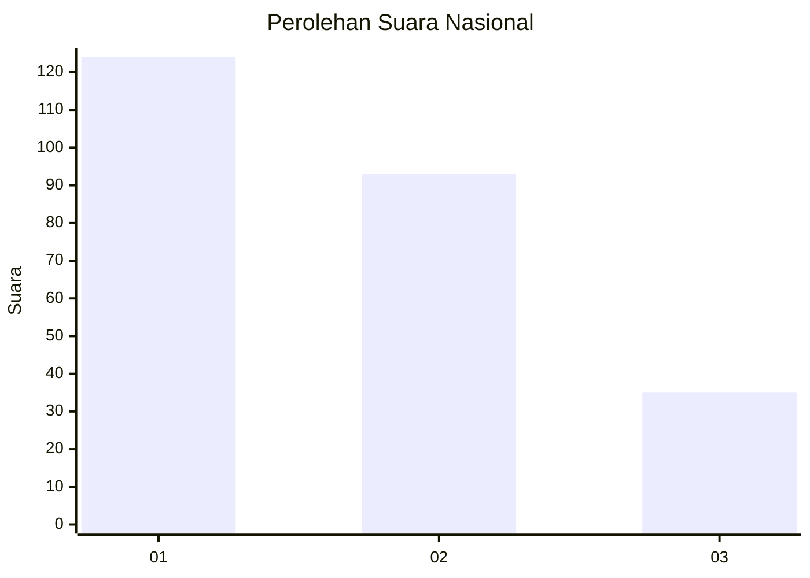
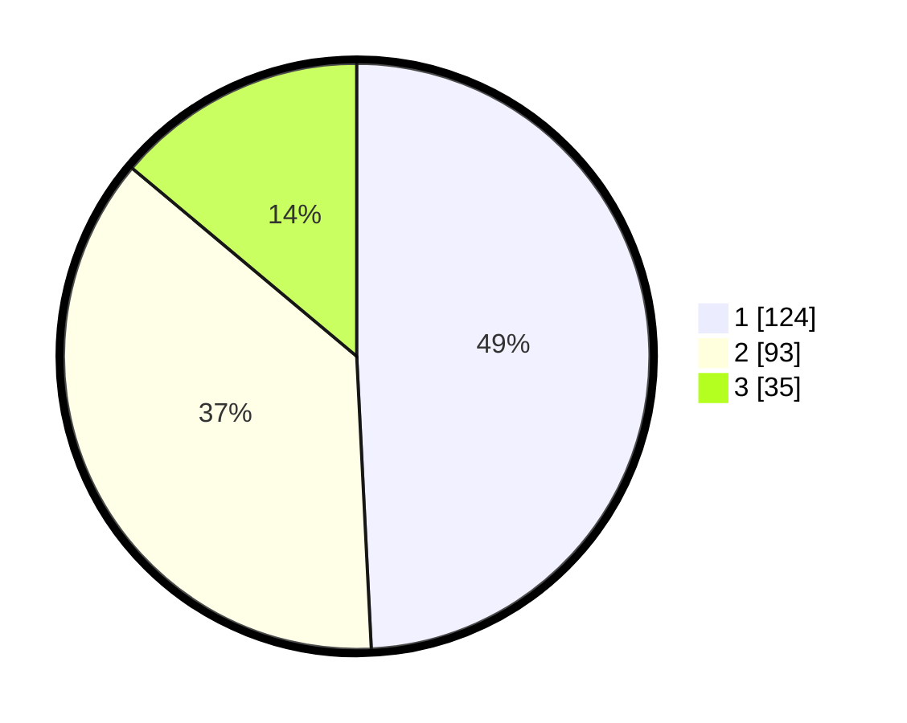

# Hasil

## Grafik

## Tabel

| No. | Nama Paslon    | Suara | Suara (raw) | Persentase |
|:--- |:-------------- | -----:| -----------:| ----------:|
| 1   | ANIES MUHAIMIN | 124   | [124][p-1]  | 49,21      |
| 2   | PRABOWO GIBRAN | 93    | [93][p-2]   | 36,90      |
| 3   | GANJAR MAHFUD  | 35    | [35][p-3]   | 13,89      |

[p-1]: https://github.com/gigit-pemilu/pemilu-2024/blob/main/pilpres/hitung-suara/sub/31-dki-jakarta/sub/75-jakarta-timur/sub/03-jatinegara/sub/1006-cipinang-muara/sub/066-tps/sub/paslon-1.txt
[p-2]: https://github.com/gigit-pemilu/pemilu-2024/blob/main/pilpres/hitung-suara/sub/31-dki-jakarta/sub/75-jakarta-timur/sub/03-jatinegara/sub/1006-cipinang-muara/sub/066-tps/sub/paslon-2.txt
[p-3]: https://github.com/gigit-pemilu/pemilu-2024/blob/main/pilpres/hitung-suara/sub/31-dki-jakarta/sub/75-jakarta-timur/sub/03-jatinegara/sub/1006-cipinang-muara/sub/066-tps/sub/paslon-3.txt

## Foto C Plano

https://sirekap-obj-formc.kpu.go.id/e895/pemilu/ppwp/31/75/03/10/06/3175031006066-20240215-003204--77cb3c42-0790-4dfe-aabf-3bd32eaad9eb.jpg

https://sirekap-obj-formc.kpu.go.id/e895/pemilu/ppwp/31/75/03/10/06/3175031006066-20240215-003320--bdcee04c-7391-4bd4-9a2a-847670d99ede.jpg

https://sirekap-obj-formc.kpu.go.id/e895/pemilu/ppwp/31/75/03/10/06/3175031006066-20240215-000503--d9a584f4-713c-441d-a8a2-0c8ef7fbdd54.jpg

## Metadata

| Key        | Value               |
| ---------- | ------------------- |
| Time Stamp | 2024-02-25 14:00:00 |

