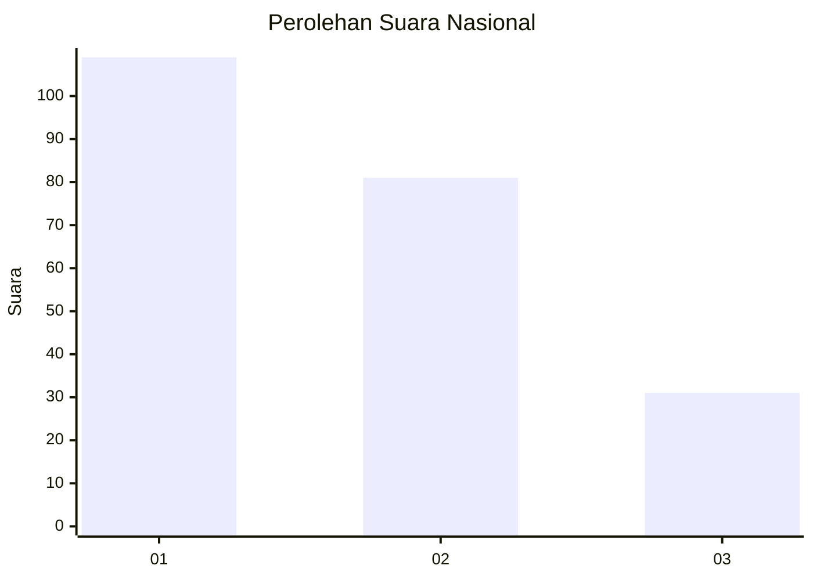
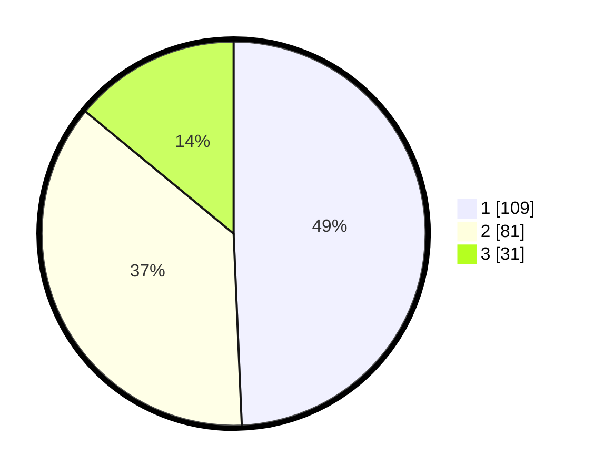

# Hasil

## Grafik

## Tabel

| No.    | Nama Paslon    | Suara | Suara (raw) | Persentase |
|:------ |:-------------- | -----:| -----------:| ----------:|
| 100025 | ANIES MUHAIMIN | 109   | [109][p-1]  | 49,32      |
| 100026 | PRABOWO GIBRAN | 81    | [81][p-2]   | 36,65      |
| 100027 | GANJAR MAHFUD  | 31    | [31][p-3]   | 14,03      |

[p-1]: https://github.com/gigit-pemilu/pemilu-2024/blob/main/pilpres/hitung-suara/sub/31-dki-jakarta/sub/75-jakarta-timur/sub/03-jatinegara/sub/1006-cipinang-muara/sub/070-tps/sub/paslon-1.txt
[p-2]: https://github.com/gigit-pemilu/pemilu-2024/blob/main/pilpres/hitung-suara/sub/31-dki-jakarta/sub/75-jakarta-timur/sub/03-jatinegara/sub/1006-cipinang-muara/sub/070-tps/sub/paslon-2.txt
[p-3]: https://github.com/gigit-pemilu/pemilu-2024/blob/main/pilpres/hitung-suara/sub/31-dki-jakarta/sub/75-jakarta-timur/sub/03-jatinegara/sub/1006-cipinang-muara/sub/070-tps/sub/paslon-3.txt

## Foto C Plano

https://sirekap-obj-formc.kpu.go.id/a2a6/pemilu/ppwp/31/75/03/10/06/3175031006070-20240214-230141--f8aa57c3-d2cf-4f2c-b938-f1dddf58b8f0.jpg

https://sirekap-obj-formc.kpu.go.id/a2a6/pemilu/ppwp/31/75/03/10/06/3175031006070-20240214-230230--3d9645d2-d8d8-4386-a2ed-7cb36f1a2cd9.jpg

https://sirekap-obj-formc.kpu.go.id/a2a6/pemilu/ppwp/31/75/03/10/06/3175031006070-20240214-230320--33fdb0d0-1c39-4dcb-b314-988cd3ef3391.jpg

## Metadata

| Key        | Value               |
| ---------- | ------------------- |
| Time Stamp | 2024-02-15 22:30:27 |

