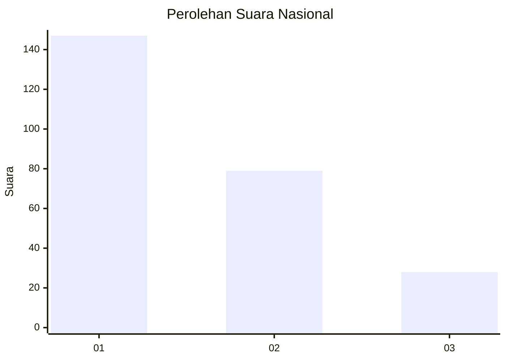
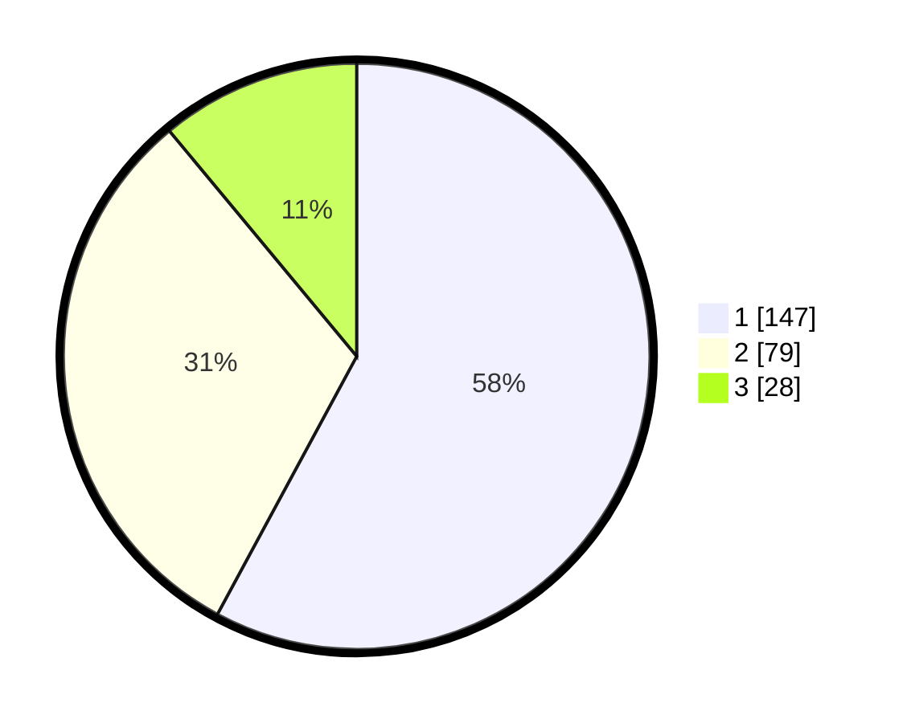

# Hasil

## Grafik

## Tabel

| No.    | Nama Paslon    | Suara | Suara (raw) | Persentase |
|:------ |:-------------- | -----:| -----------:| ----------:|
| 100025 | ANIES MUHAIMIN | 147   | [147][p-1]  | 57,87      |
| 100026 | PRABOWO GIBRAN | 79    | [79][p-2]   | 31,10      |
| 100027 | GANJAR MAHFUD  | 28    | [28][p-3]   | 11,02      |

[p-1]: https://github.com/gigit-pemilu/pemilu-2024/blob/main/pilpres/hitung-suara/sub/31-dki-jakarta/sub/75-jakarta-timur/sub/03-jatinegara/sub/1006-cipinang-muara/sub/093-tps/sub/paslon-1.txt
[p-2]: https://github.com/gigit-pemilu/pemilu-2024/blob/main/pilpres/hitung-suara/sub/31-dki-jakarta/sub/75-jakarta-timur/sub/03-jatinegara/sub/1006-cipinang-muara/sub/093-tps/sub/paslon-2.txt
[p-3]: https://github.com/gigit-pemilu/pemilu-2024/blob/main/pilpres/hitung-suara/sub/31-dki-jakarta/sub/75-jakarta-timur/sub/03-jatinegara/sub/1006-cipinang-muara/sub/093-tps/sub/paslon-3.txt

## Foto C Plano

https://sirekap-obj-formc.kpu.go.id/09b4/pemilu/ppwp/31/75/03/10/06/3175031006093-20240214-235731--44b5d5aa-9254-4a1c-93df-0570608c724b.jpg

https://sirekap-obj-formc.kpu.go.id/09b4/pemilu/ppwp/31/75/03/10/06/3175031006093-20240214-235625--d2930a07-6f88-4a6c-bdd2-18dcf58dd83b.jpg

https://sirekap-obj-formc.kpu.go.id/09b4/pemilu/ppwp/31/75/03/10/06/3175031006093-20240214-235655--67e1bf4e-f691-4fd9-9f52-5daa4168b4e8.jpg

## Metadata

| Key        | Value               |
| ---------- | ------------------- |
| Time Stamp | 2024-02-25 12:00:00 |

