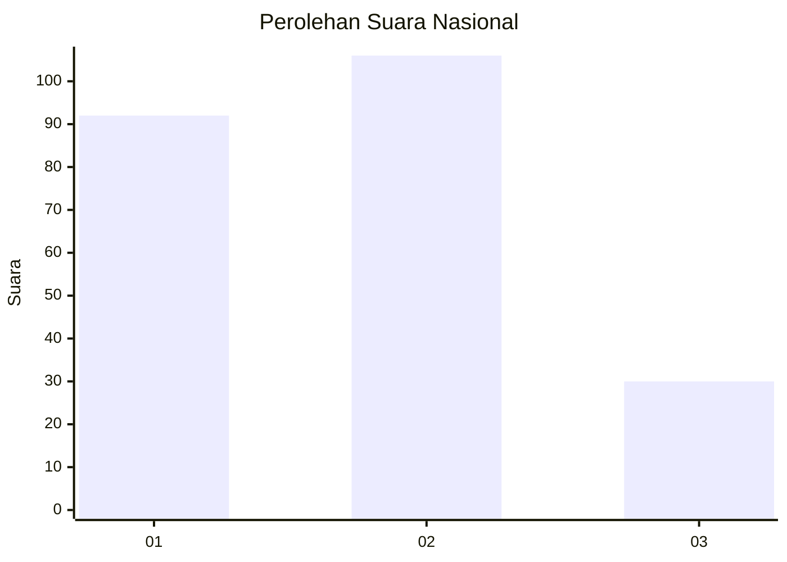
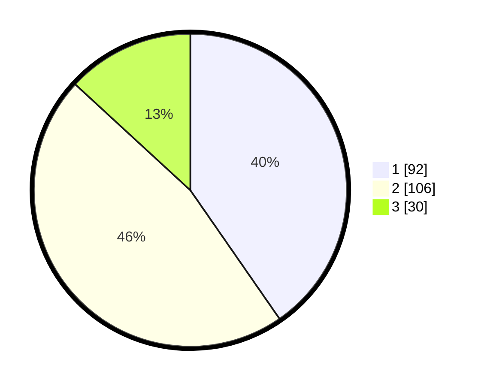

# Hasil

## Grafik

## Tabel

| No.    | Nama Paslon    | Suara | Suara (raw) | Persentase |
|:------ |:-------------- | -----:| -----------:| ----------:|
| 100025 | ANIES MUHAIMIN | 92    | [92][p-1]   | 40,35      |
| 100026 | PRABOWO GIBRAN | 106   | [106][p-2]  | 46,49      |
| 100027 | GANJAR MAHFUD  | 30    | [30][p-3]   | 13,16      |

[p-1]: https://github.com/gigit-pemilu/pemilu-2024/blob/main/pilpres/hitung-suara/sub/31-dki-jakarta/sub/75-jakarta-timur/sub/03-jatinegara/sub/1006-cipinang-muara/sub/096-tps/sub/paslon-1.txt
[p-2]: https://github.com/gigit-pemilu/pemilu-2024/blob/main/pilpres/hitung-suara/sub/31-dki-jakarta/sub/75-jakarta-timur/sub/03-jatinegara/sub/1006-cipinang-muara/sub/096-tps/sub/paslon-2.txt
[p-3]: https://github.com/gigit-pemilu/pemilu-2024/blob/main/pilpres/hitung-suara/sub/31-dki-jakarta/sub/75-jakarta-timur/sub/03-jatinegara/sub/1006-cipinang-muara/sub/096-tps/sub/paslon-3.txt

## Foto C Plano

https://sirekap-obj-formc.kpu.go.id/0236/pemilu/ppwp/31/75/03/10/06/3175031006096-20240214-220953--205ccaca-3b52-4dca-9b6a-5f1beae5dba7.jpg

https://sirekap-obj-formc.kpu.go.id/0236/pemilu/ppwp/31/75/03/10/06/3175031006096-20240214-192807--e1ee0e43-e88c-4d0b-a03e-b0c6ba4b2f4b.jpg

https://sirekap-obj-formc.kpu.go.id/0236/pemilu/ppwp/31/75/03/10/06/3175031006096-20240214-194328--0aa873a5-8049-4f18-8713-8e780a893973.jpg

## Metadata

| Key        | Value               |
| ---------- | ------------------- |
| Time Stamp | 2024-02-24 22:31:28 |

