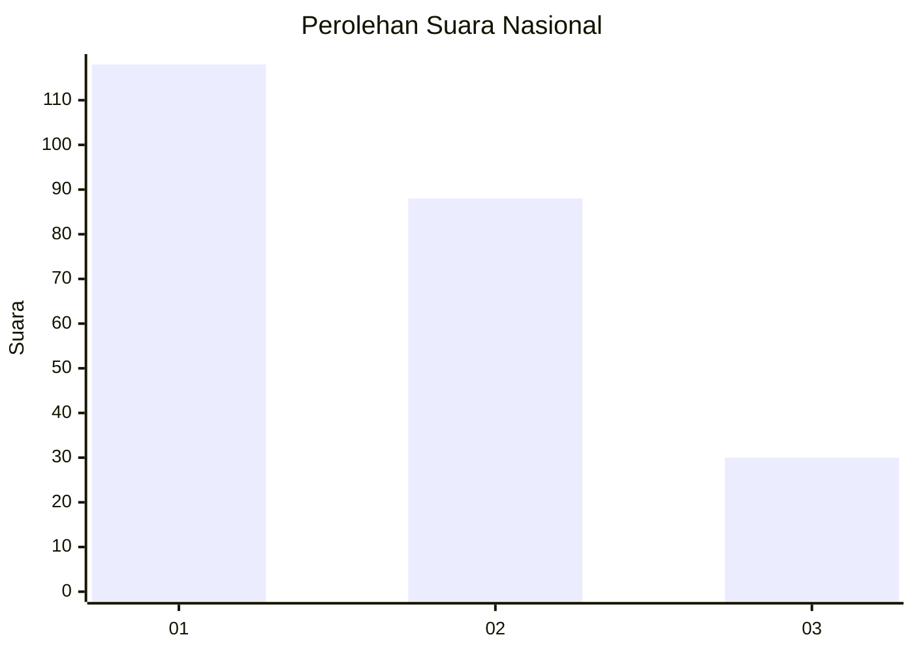
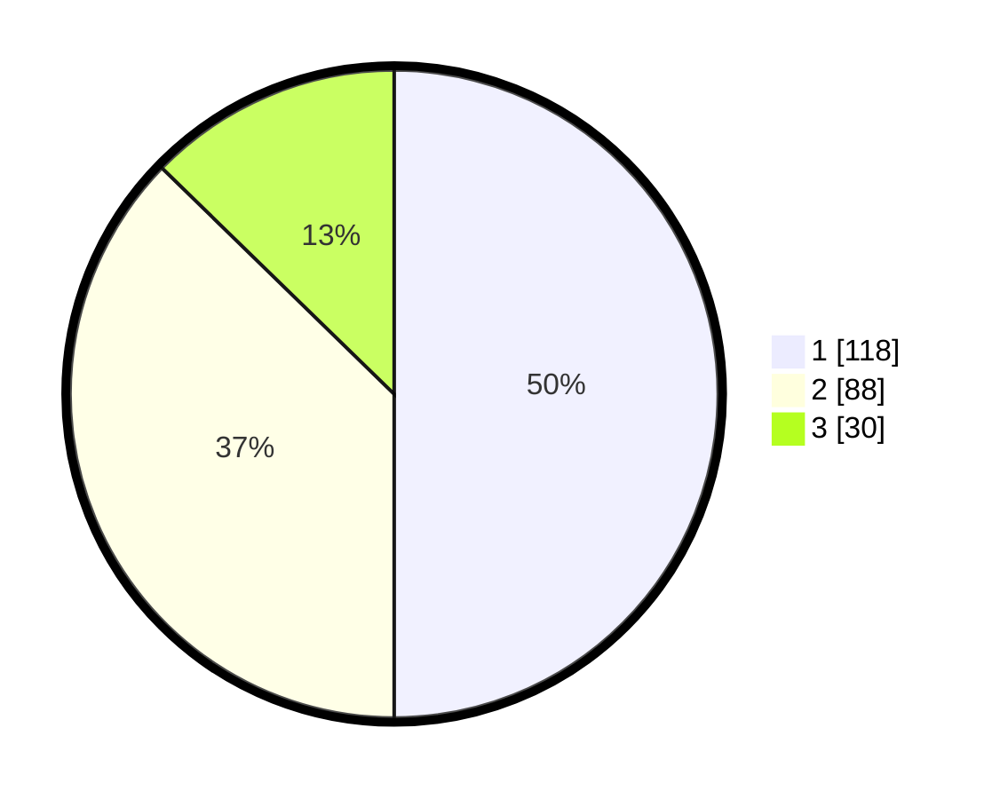

# Hasil

## Grafik

## Tabel

| No.    | Nama Paslon    | Suara | Suara (raw) | Persentase |
|:------ |:-------------- | -----:| -----------:| ----------:|
| 100025 | ANIES MUHAIMIN | 118   | [118][p-1]  | 50,00      |
| 100026 | PRABOWO GIBRAN | 88    | [88][p-2]   | 37,29      |
| 100027 | GANJAR MAHFUD  | 30    | [30][p-3]   | 12,71      |

[p-1]: https://github.com/gigit-pemilu/pemilu-2024/blob/main/pilpres/hitung-suara/sub/31-dki-jakarta/sub/75-jakarta-timur/sub/03-jatinegara/sub/1006-cipinang-muara/sub/112-tps/sub/paslon-1.txt
[p-2]: https://github.com/gigit-pemilu/pemilu-2024/blob/main/pilpres/hitung-suara/sub/31-dki-jakarta/sub/75-jakarta-timur/sub/03-jatinegara/sub/1006-cipinang-muara/sub/112-tps/sub/paslon-2.txt
[p-3]: https://github.com/gigit-pemilu/pemilu-2024/blob/main/pilpres/hitung-suara/sub/31-dki-jakarta/sub/75-jakarta-timur/sub/03-jatinegara/sub/1006-cipinang-muara/sub/112-tps/sub/paslon-3.txt

## Foto C Plano

https://sirekap-obj-formc.kpu.go.id/15c7/pemilu/ppwp/31/75/03/10/06/3175031006112-20240215-033730--fdf805de-cbd0-45d4-94ad-45c5f15c0bd8.jpg

https://sirekap-obj-formc.kpu.go.id/15c7/pemilu/ppwp/31/75/03/10/06/3175031006112-20240214-221039--2112e9d6-e548-409d-ac75-fc6bd7276b6f.jpg

https://sirekap-obj-formc.kpu.go.id/15c7/pemilu/ppwp/31/75/03/10/06/3175031006112-20240214-222022--5335ae31-c5e0-47f9-a070-4348c418bc10.jpg

## Metadata

| Key        | Value               |
| ---------- | ------------------- |
| Time Stamp | 2024-02-15 22:40:13 |

