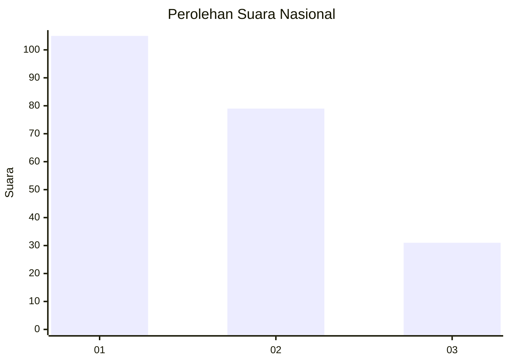
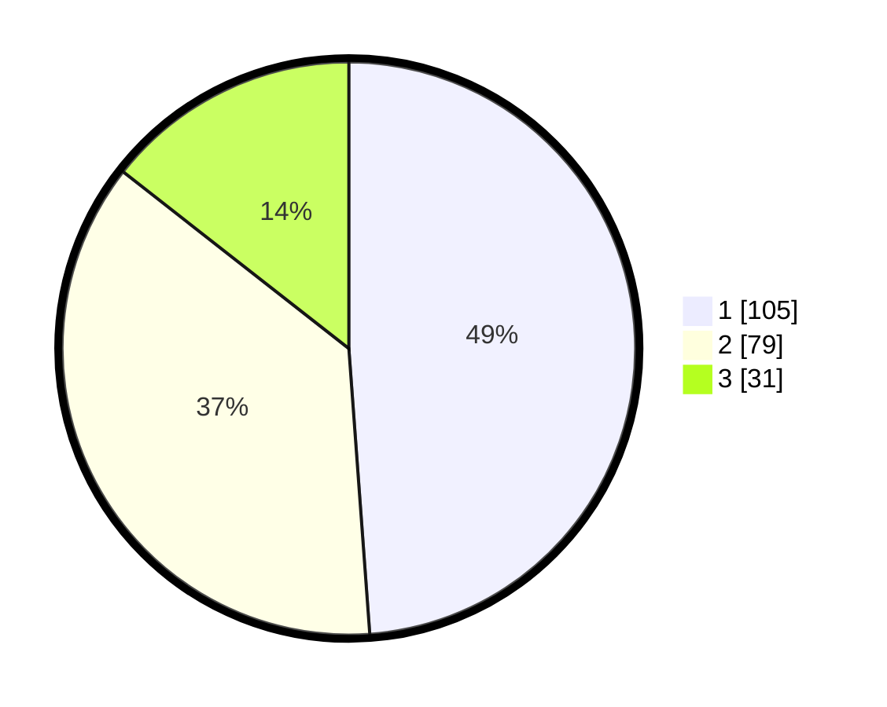

# Hasil

## Grafik

## Tabel

| No.    | Nama Paslon    | Suara | Suara (raw) | Persentase |
|:------ |:-------------- | -----:| -----------:| ----------:|
| 100025 | ANIES MUHAIMIN | 105   | [105][p-1]  | 48,84      |
| 100026 | PRABOWO GIBRAN | 79    | [79][p-2]   | 36,74      |
| 100027 | GANJAR MAHFUD  | 31    | [31][p-3]   | 14,42      |

[p-1]: https://github.com/gigit-pemilu/pemilu-2024/blob/main/pilpres/hitung-suara/sub/31-dki-jakarta/sub/75-jakarta-timur/sub/03-jatinegara/sub/1006-cipinang-muara/sub/128-tps/sub/paslon-1.txt
[p-2]: https://github.com/gigit-pemilu/pemilu-2024/blob/main/pilpres/hitung-suara/sub/31-dki-jakarta/sub/75-jakarta-timur/sub/03-jatinegara/sub/1006-cipinang-muara/sub/128-tps/sub/paslon-2.txt
[p-3]: https://github.com/gigit-pemilu/pemilu-2024/blob/main/pilpres/hitung-suara/sub/31-dki-jakarta/sub/75-jakarta-timur/sub/03-jatinegara/sub/1006-cipinang-muara/sub/128-tps/sub/paslon-3.txt

## Foto C Plano

https://sirekap-obj-formc.kpu.go.id/7e8f/pemilu/ppwp/31/75/03/10/06/3175031006128-20240214-222030--a953ecad-b460-442c-ba9d-b98cf928a085.jpg

https://sirekap-obj-formc.kpu.go.id/7e8f/pemilu/ppwp/31/75/03/10/06/3175031006128-20240214-222157--ba4b769d-82f0-4692-b99e-a477103e1ab5.jpg

https://sirekap-obj-formc.kpu.go.id/7e8f/pemilu/ppwp/31/75/03/10/06/3175031006128-20240214-222312--273bb40d-ecf9-490e-8a82-039041608dca.jpg

## Metadata

| Key        | Value               |
| ---------- | ------------------- |
| Time Stamp | 2024-02-15 22:40:13 |

