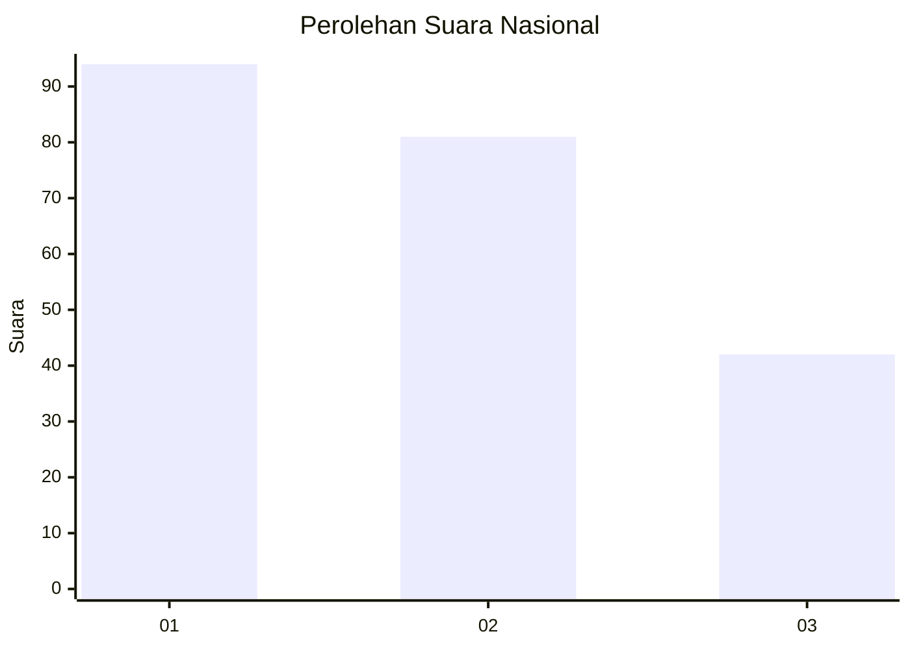
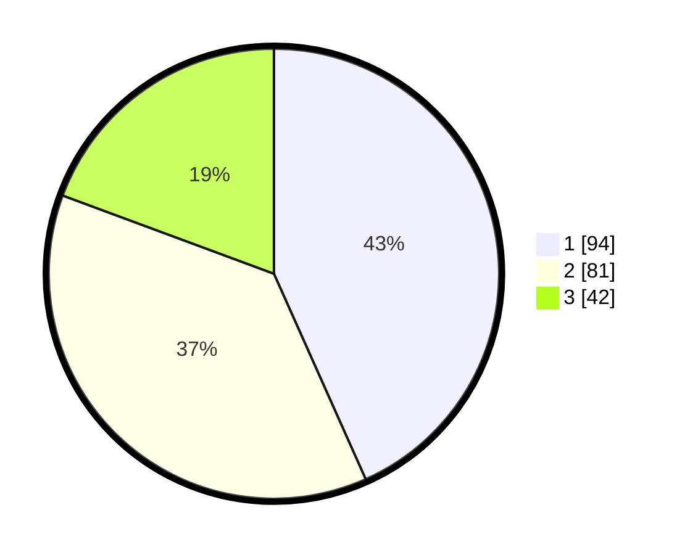

# Hasil

## Grafik

## Tabel

| No.    | Nama Paslon    | Suara | Suara (raw) | Persentase |
|:------ |:-------------- | -----:| -----------:| ----------:|
| 100025 | ANIES MUHAIMIN | 94    | [94][p-1]   | 43,32      |
| 100026 | PRABOWO GIBRAN | 81    | [81][p-2]   | 37,33      |
| 100027 | GANJAR MAHFUD  | 42    | [42][p-3]   | 19,35      |

[p-1]: https://github.com/gigit-pemilu/pemilu-2024/blob/main/pilpres/hitung-suara/sub/31-dki-jakarta/sub/75-jakarta-timur/sub/03-jatinegara/sub/1006-cipinang-muara/sub/132-tps/sub/paslon-1.txt
[p-2]: https://github.com/gigit-pemilu/pemilu-2024/blob/main/pilpres/hitung-suara/sub/31-dki-jakarta/sub/75-jakarta-timur/sub/03-jatinegara/sub/1006-cipinang-muara/sub/132-tps/sub/paslon-2.txt
[p-3]: https://github.com/gigit-pemilu/pemilu-2024/blob/main/pilpres/hitung-suara/sub/31-dki-jakarta/sub/75-jakarta-timur/sub/03-jatinegara/sub/1006-cipinang-muara/sub/132-tps/sub/paslon-3.txt

## Foto C Plano

https://sirekap-obj-formc.kpu.go.id/b2d5/pemilu/ppwp/31/75/03/10/06/3175031006132-20240215-002747--eb8f9f9e-657f-4c02-ad4a-4b80755691c9.jpg

https://sirekap-obj-formc.kpu.go.id/b2d5/pemilu/ppwp/31/75/03/10/06/3175031006132-20240214-214139--aed64a50-14d4-4f9d-b8a8-49c00d373a8c.jpg

https://sirekap-obj-formc.kpu.go.id/b2d5/pemilu/ppwp/31/75/03/10/06/3175031006132-20240214-214040--0549d250-3cb6-4843-84d8-a6c7f08792ec.jpg

## Metadata

| Key        | Value               |
| ---------- | ------------------- |
| Time Stamp | 2024-02-25 12:00:00 |

