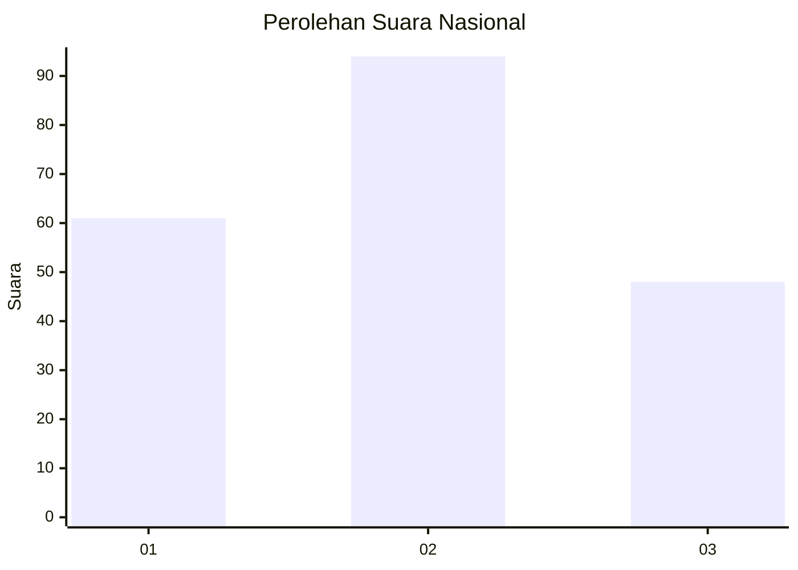
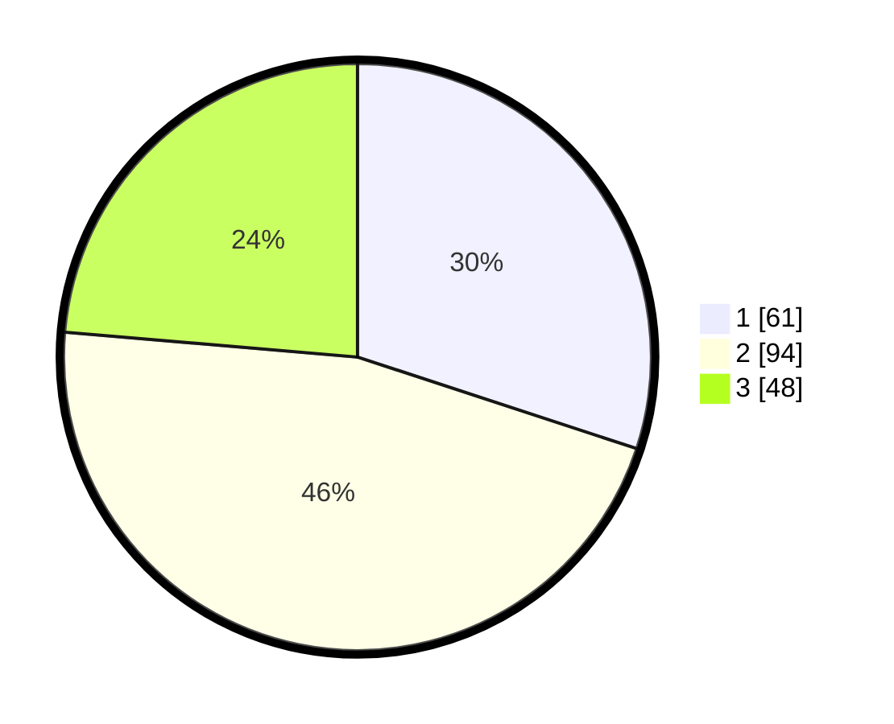

# Hasil

## Grafik

## Tabel

| No.    | Nama Paslon    | Suara | Suara (raw) | Persentase |
|:------ |:-------------- | -----:| -----------:| ----------:|
| 100025 | ANIES MUHAIMIN | 61    | [61][p-1]   | 30,05      |
| 100026 | PRABOWO GIBRAN | 94    | [94][p-2]   | 46,31      |
| 100027 | GANJAR MAHFUD  | 48    | [48][p-3]   | 23,65      |

[p-1]: https://github.com/gigit-pemilu/pemilu-2024/blob/main/pilpres/hitung-suara/sub/31-dki-jakarta/sub/75-jakarta-timur/sub/03-jatinegara/sub/1006-cipinang-muara/sub/142-tps/sub/paslon-1.txt
[p-2]: https://github.com/gigit-pemilu/pemilu-2024/blob/main/pilpres/hitung-suara/sub/31-dki-jakarta/sub/75-jakarta-timur/sub/03-jatinegara/sub/1006-cipinang-muara/sub/142-tps/sub/paslon-2.txt
[p-3]: https://github.com/gigit-pemilu/pemilu-2024/blob/main/pilpres/hitung-suara/sub/31-dki-jakarta/sub/75-jakarta-timur/sub/03-jatinegara/sub/1006-cipinang-muara/sub/142-tps/sub/paslon-3.txt

## Foto C Plano

https://sirekap-obj-formc.kpu.go.id/74f6/pemilu/ppwp/31/75/03/10/06/3175031006142-20240214-232209--7fc3643d-2c75-401f-9409-1013f4e8ca9e.jpg

https://sirekap-obj-formc.kpu.go.id/74f6/pemilu/ppwp/31/75/03/10/06/3175031006142-20240214-232542--c92d36e5-6c03-4863-8db3-287b16ba3ca2.jpg

https://sirekap-obj-formc.kpu.go.id/74f6/pemilu/ppwp/31/75/03/10/06/3175031006142-20240214-224812--2eb8562a-c4a5-47bd-8d3e-fcbfab7769c1.jpg

## Metadata

| Key        | Value               |
| ---------- | ------------------- |
| Time Stamp | 2024-02-24 22:31:28 |

