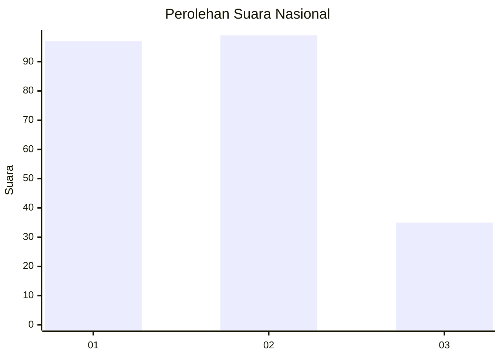
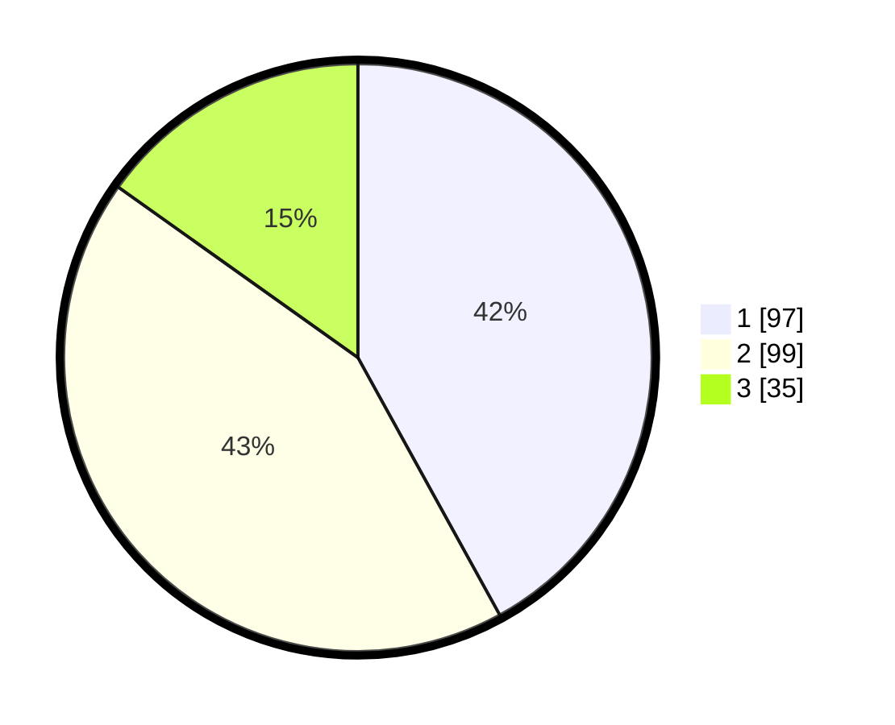

# Hasil

## Grafik

## Tabel

| No.    | Nama Paslon    | Suara | Suara (raw) | Persentase |
|:------ |:-------------- | -----:| -----------:| ----------:|
| 100025 | ANIES MUHAIMIN | 97    | [97][p-1]   | 41,99      |
| 100026 | PRABOWO GIBRAN | 99    | [99][p-2]   | 42,86      |
| 100027 | GANJAR MAHFUD  | 35    | [35][p-3]   | 15,15      |

[p-1]: https://github.com/gigit-pemilu/pemilu-2024/blob/main/pilpres/hitung-suara/sub/31-dki-jakarta/sub/75-jakarta-timur/sub/03-jatinegara/sub/1006-cipinang-muara/sub/154-tps/sub/paslon-1.txt
[p-2]: https://github.com/gigit-pemilu/pemilu-2024/blob/main/pilpres/hitung-suara/sub/31-dki-jakarta/sub/75-jakarta-timur/sub/03-jatinegara/sub/1006-cipinang-muara/sub/154-tps/sub/paslon-2.txt
[p-3]: https://github.com/gigit-pemilu/pemilu-2024/blob/main/pilpres/hitung-suara/sub/31-dki-jakarta/sub/75-jakarta-timur/sub/03-jatinegara/sub/1006-cipinang-muara/sub/154-tps/sub/paslon-3.txt

## Foto C Plano

https://sirekap-obj-formc.kpu.go.id/c80e/pemilu/ppwp/31/75/03/10/06/3175031006154-20240215-031420--8fa3d064-4de9-4763-843c-dee95a7b4974.jpg

https://sirekap-obj-formc.kpu.go.id/c80e/pemilu/ppwp/31/75/03/10/06/3175031006154-20240214-194254--e45f1f5c-b921-49af-870f-d5bdb5ccb040.jpg

https://sirekap-obj-formc.kpu.go.id/c80e/pemilu/ppwp/31/75/03/10/06/3175031006154-20240214-194330--472f3ae0-44ee-48ec-82de-64be281c647d.jpg

## Metadata

| Key        | Value               |
| ---------- | ------------------- |
| Time Stamp | 2024-02-15 04:00:24 |

