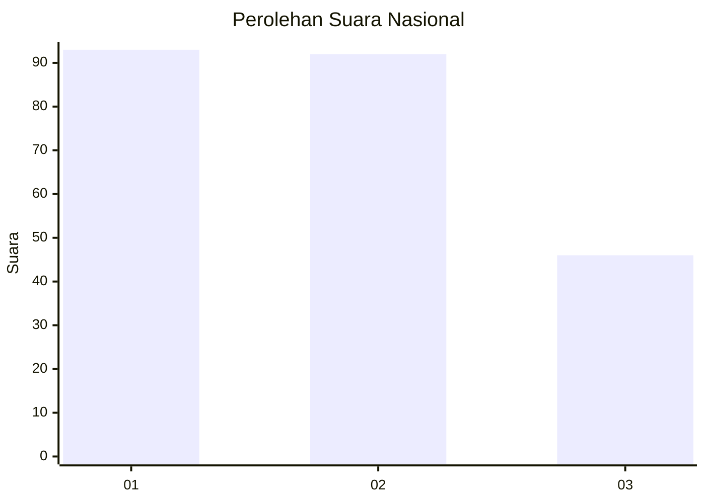
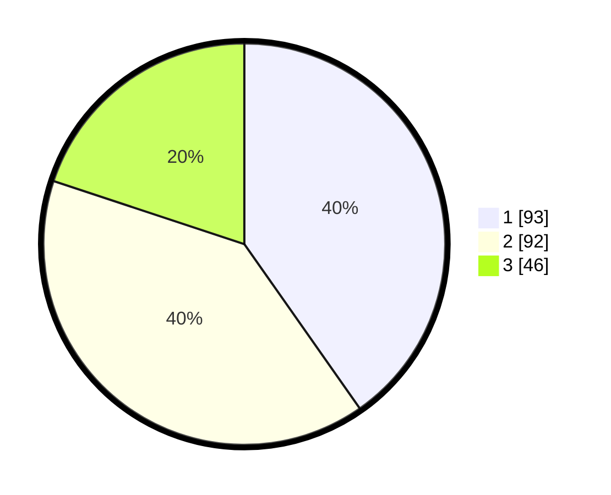

# Hasil

## Grafik

## Tabel

| No.    | Nama Paslon    | Suara | Suara (raw) | Persentase |
|:------ |:-------------- | -----:| -----------:| ----------:|
| 100025 | ANIES MUHAIMIN | 93    | [93][p-1]   | 40,26      |
| 100026 | PRABOWO GIBRAN | 92    | [92][p-2]   | 39,83      |
| 100027 | GANJAR MAHFUD  | 46    | [46][p-3]   | 19,91      |

[p-1]: https://github.com/gigit-pemilu/pemilu-2024/blob/main/pilpres/hitung-suara/sub/31-dki-jakarta/sub/75-jakarta-timur/sub/03-jatinegara/sub/1006-cipinang-muara/sub/170-tps/sub/paslon-1.txt
[p-2]: https://github.com/gigit-pemilu/pemilu-2024/blob/main/pilpres/hitung-suara/sub/31-dki-jakarta/sub/75-jakarta-timur/sub/03-jatinegara/sub/1006-cipinang-muara/sub/170-tps/sub/paslon-2.txt
[p-3]: https://github.com/gigit-pemilu/pemilu-2024/blob/main/pilpres/hitung-suara/sub/31-dki-jakarta/sub/75-jakarta-timur/sub/03-jatinegara/sub/1006-cipinang-muara/sub/170-tps/sub/paslon-3.txt

## Foto C Plano

https://sirekap-obj-formc.kpu.go.id/d3a2/pemilu/ppwp/31/75/03/10/06/3175031006170-20240214-220944--67c2092d-4246-4a4e-bbc0-3bd3f373f368.jpg

https://sirekap-obj-formc.kpu.go.id/d3a2/pemilu/ppwp/31/75/03/10/06/3175031006170-20240214-191917--f70e5607-3eec-40a2-9405-860afe64ffb2.jpg

https://sirekap-obj-formc.kpu.go.id/d3a2/pemilu/ppwp/31/75/03/10/06/3175031006170-20240214-191952--6dd65310-0690-4bb8-98c3-f21e30e0f61e.jpg

## Metadata

| Key        | Value               |
| ---------- | ------------------- |
| Time Stamp | 2024-02-15 12:00:28 |

