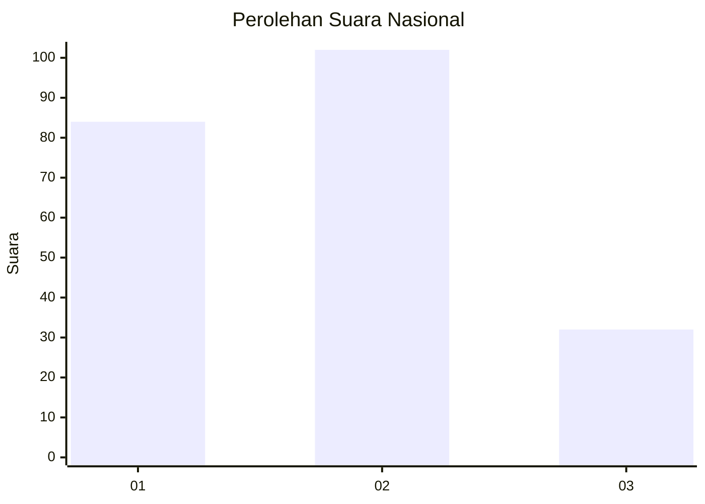
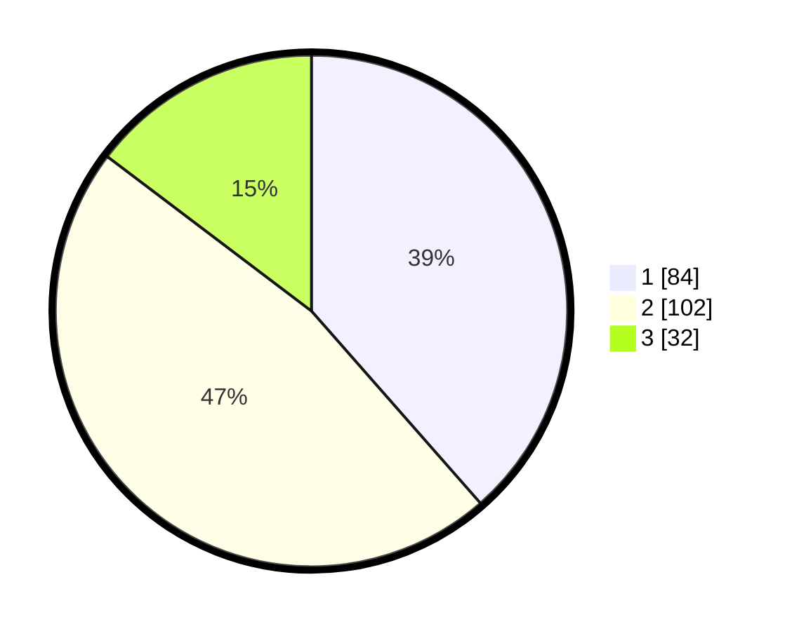

# Hasil

## Grafik

## Tabel

| No.    | Nama Paslon    | Suara | Suara (raw) | Persentase |
|:------ |:-------------- | -----:| -----------:| ----------:|
| 100025 | ANIES MUHAIMIN | 84    | [84][p-1]   | 38,53      |
| 100026 | PRABOWO GIBRAN | 102   | [102][p-2]  | 46,79      |
| 100027 | GANJAR MAHFUD  | 32    | [32][p-3]   | 14,68      |

[p-1]: https://github.com/gigit-pemilu/pemilu-2024/blob/main/pilpres/hitung-suara/sub/31-dki-jakarta/sub/75-jakarta-timur/sub/03-jatinegara/sub/1006-cipinang-muara/sub/175-tps/sub/paslon-1.txt
[p-2]: https://github.com/gigit-pemilu/pemilu-2024/blob/main/pilpres/hitung-suara/sub/31-dki-jakarta/sub/75-jakarta-timur/sub/03-jatinegara/sub/1006-cipinang-muara/sub/175-tps/sub/paslon-2.txt
[p-3]: https://github.com/gigit-pemilu/pemilu-2024/blob/main/pilpres/hitung-suara/sub/31-dki-jakarta/sub/75-jakarta-timur/sub/03-jatinegara/sub/1006-cipinang-muara/sub/175-tps/sub/paslon-3.txt

## Foto C Plano

https://sirekap-obj-formc.kpu.go.id/a84a/pemilu/ppwp/31/75/03/10/06/3175031006175-20240215-021432--f020243e-c40f-4dfc-814d-b26d728edf73.jpg

https://sirekap-obj-formc.kpu.go.id/a84a/pemilu/ppwp/31/75/03/10/06/3175031006175-20240215-021553--15c4bdc3-6e39-48b6-9a9c-81f731aa5695.jpg

https://sirekap-obj-formc.kpu.go.id/a84a/pemilu/ppwp/31/75/03/10/06/3175031006175-20240215-021656--97890670-ce5c-4ca7-8748-2e90199bf0e7.jpg

## Metadata

| Key        | Value               |
| ---------- | ------------------- |
| Time Stamp | 2024-02-15 23:29:50 |

