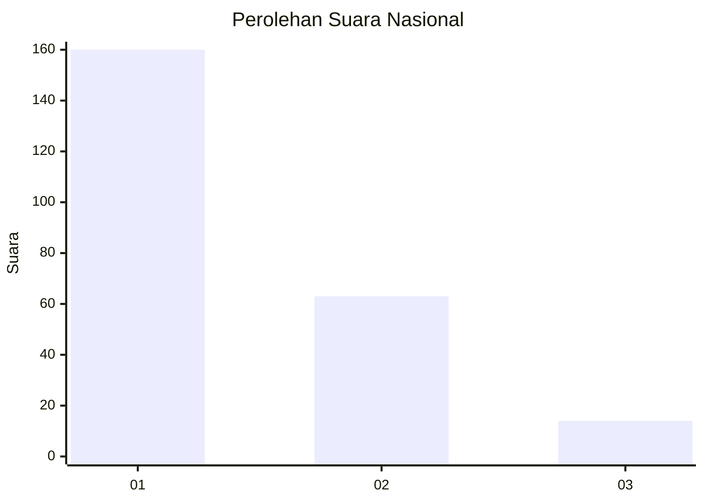
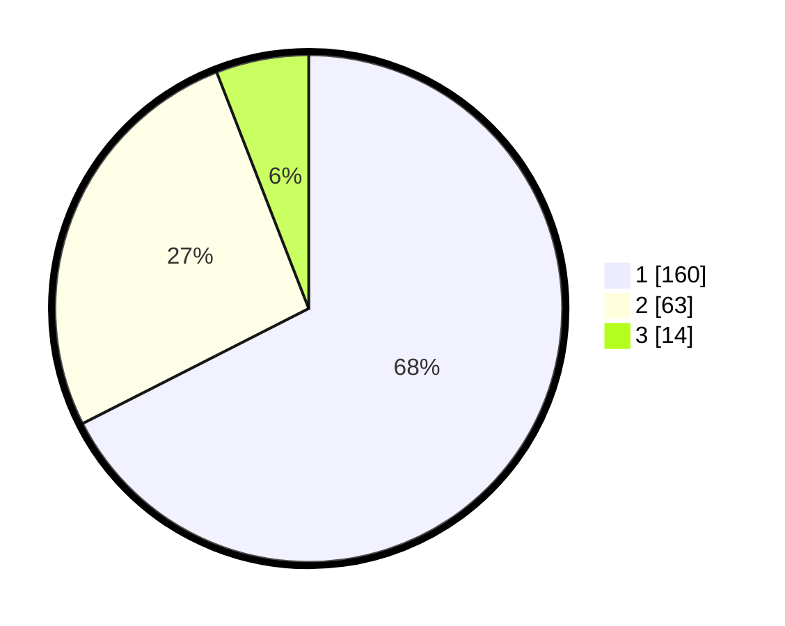

# Hasil

## Grafik

## Tabel

| No.    | Nama Paslon    | Suara | Suara (raw) | Persentase |
|:------ |:-------------- | -----:| -----------:| ----------:|
| 100025 | ANIES MUHAIMIN | 160   | [160][p-1]  | 67,51      |
| 100026 | PRABOWO GIBRAN | 63    | [63][p-2]   | 26,58      |
| 100027 | GANJAR MAHFUD  | 14    | [14][p-3]   | 5,91       |

[p-1]: https://github.com/gigit-pemilu/pemilu-2024/blob/main/pilpres/hitung-suara/sub/31-dki-jakarta/sub/75-jakarta-timur/sub/03-jatinegara/sub/1007-cipinang-besar-selatan/sub/047-tps/sub/paslon-1.txt
[p-2]: https://github.com/gigit-pemilu/pemilu-2024/blob/main/pilpres/hitung-suara/sub/31-dki-jakarta/sub/75-jakarta-timur/sub/03-jatinegara/sub/1007-cipinang-besar-selatan/sub/047-tps/sub/paslon-2.txt
[p-3]: https://github.com/gigit-pemilu/pemilu-2024/blob/main/pilpres/hitung-suara/sub/31-dki-jakarta/sub/75-jakarta-timur/sub/03-jatinegara/sub/1007-cipinang-besar-selatan/sub/047-tps/sub/paslon-3.txt

## Foto C Plano

https://sirekap-obj-formc.kpu.go.id/ed30/pemilu/ppwp/31/75/03/10/07/3175031007047-20240214-235446--0689ebbe-a478-4fdf-9b8e-48e75dd5764f.jpg

https://sirekap-obj-formc.kpu.go.id/ed30/pemilu/ppwp/31/75/03/10/07/3175031007047-20240214-235734--4dfeb83d-cfe9-4b47-ae17-81f837bc6d14.jpg

https://sirekap-obj-formc.kpu.go.id/ed30/pemilu/ppwp/31/75/03/10/07/3175031007047-20240214-235940--f39f8d7a-97c0-4c48-b104-a182ed03bc0e.jpg

## Metadata

| Key        | Value               |
| ---------- | ------------------- |
| Time Stamp | 2024-02-24 22:31:28 |

